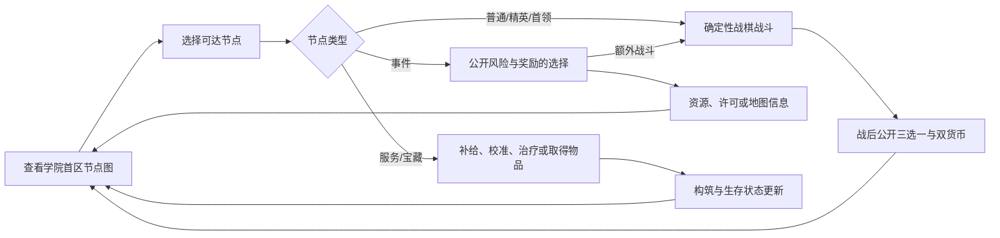

# OCC 肉鸽学院首区地图系统 v0.1

> 状态：策划定稿，待实现。
> 归属：仅肉鸽模式。首区表现角色人生的第一阶段——14 岁入学期的学院成长；它不是生活经营、关系养成或非战斗模拟系统。

## 1. 定位

肉鸽的核心仍然是**战斗、构筑和资源取舍**。地图的作用是组织一局战斗的风险、奖励、精英与事件，而不是让玩家安排课程、工作、社交或日程。

本次变化只有世界语义与地图内容：原本以战时/边境为背景的首区，改为学院成长背景。玩家通过演练、考核、封存事故、校园委托和学院周边调查逐步建立构筑，最后处理学院首区的核心危机。商店、工坊和休整仍是为下一场战斗服务的功能节点，不构成独立玩法循环。

## 2. 地图合同

- 地图为以撒式正交节点网络，不是半线性三选一路线树。
- 一局首区固定 **40 个节点**，完整拓扑从开局可见；未知节点仅隐藏精确内容，区域、连线和节点大类可读。
- 已访问节点可自由回访；完成的战斗节点永久安全；移动本身不消耗资源。
- 没有隐藏倒计时、追击、敌情推进、无预警关门或强制扣血。风险来自战斗后继承的生命、护盾、以太、消耗品、钥匙/许可、构筑状态与公开的学院时序。
- 节点、敌群、事件结果和奖励候选由种子确定；一旦展示或完成，不会在回访时重掷。
- 区域门可使用钥匙、权限卡或学院许可开启；它们是空间/资源门，不是时间门。
- 节点数量由玩家自由选择，不设置“实训名额”或地图选点上限。首次进入一个未访问节点会推进 1 格**学院时序**；已清节点回访、在地图上移动和查看信息不推进时序。
- 取得 2 枚核心许可且至少处理 12 个节点后，首领节点可进入。约 20 个节点是首区正常构筑节奏，不是门槛或上限。
- 学院时序是公开的世界时间压力：0--20 为正常入学期；第 21 个新节点后进入“学期收束”；第 25--28 个新节点显示明确的阶段转入倒计时；第 28 个新节点结算后，角色强制进入下一人生阶段。未完成的学院节点会以已显示的“未处理档案”记录转入下一阶段或归档，不能在无提示下消失。

### 2.1 首区门槛首轮调优决定（2026-08-14）

- 首领入口启用既定的“至少 12 个已探索节点 + 2 枚核心许可”双门槛；地图顶栏和首领详情必须分别显示当前值、目标值与缺口，不能只显示通用锁定。
- 固定拓扑求解已确认至少存在三类不同许可组合的首领路线；首轮实验不调整 `12/2` 数值，也不改地图连线、奖励或资源价格。
- 第 21 节点进入收束、第 28 节点进入“阶段转换就绪”的公开状态继续保留；在下一人生阶段尚无可进入运行时之前，不启用第 28 节点后的强制封图，避免玩家在缺少许可或目标内容时进入不可恢复死局。下一阶段接入时必须同时补齐转入结算、未处理档案和继续游戏合同，再启用强制转换。

### 2.2 首区节点配比

| 节点 | 数量 | 学院背景 | 玩法职责 |
| --- | ---: | --- | --- |
| 起点 | 1 | 学院中庭/宿舍入口 | 展示区域目标、初始补给与已知路线 |
| 普通战斗 | 18 | 演练场、旧校舍、工坊事故、校园巡查、郊野实训 | 构筑的主要奖励与双货币来源 |
| 精英战斗 | 6 | 高阶考核、封存库事故、失控导能设施 | 高风险、高价值奖励与区域门压力 |
| 事件 | 8 | 导师委托、学生求助、器材登记、异常传闻 | 公开取舍；可给资源/许可，或进入已预览额外战斗 |
| 服务节点 | 4 | 校内补给处、校准工坊、医务室/休整室 | 购买、替换/校准、治疗；只服务战斗循环 |
| 宝藏 | 2 | 封存器材库/遗失物库 | 稀有卷轴、法宝或钥匙 |
| 首领 | 1 | 学院封存塔核心 | 本区最终战斗与胜负结算 |

总数为 40。玩家可自由选择节点数量；通常约 20 个节点形成足够构筑并挑战首领，过度探索则以学院学期自然收束的设定压力推进到下一阶段。节点数量可在后续内容生产中替换同类节点，但不得以额外非战斗生活活动挤占普通、精英或首领战斗预算。

## 3. 首区叙事与战斗语义

首区的主线是：学院在入学期开放实战训练与设施见习；一条旧导能系统出现异常，局部事故、器材失控和封存库问题逐渐将玩家引向封存塔核心。角色不是战争老兵，也不需要背负固定主角的正史。

| 原战时语义 | 学院首区语义 | 战斗目标示例 |
| --- | --- | --- |
| 路线巡逻 | 校园巡查/演练 | 歼灭失控训练傀儡或通过实战考核 |
| 驿站/补给点 | 器材库/旧校舍 | 守住撤离路线、回收失控器材 |
| 野外导能目标 | 实训导能柱 | 破坏异常导能柱或清理护卫 |
| 关口/塔楼 | 封存库门厅/观测塔 | 突破登记封锁、处理警戒装置 |
| 区域监工 | 封存塔核心守卫 | 在维护链与环境压力下完成首领战 |

每场战斗必须符合当前 14 岁入学期的技术边界：石路、旧校舍、演练场、工坊、导能柱、封存库、校门、观测塔和学院周边郊野；不得出现成熟工业战争、铁路、现代枪械、狙击或爆破兵的玩家可见语义。

## 4. 事件合同

事件仍是肉鸽事件，不发展为课程、关系或生活模拟。每个事件只在地图战斗循环中提供一次公开取舍：

- **领取委托：** 获得下一场战斗的明确增益，或选择进入已预览的额外战斗换取钥匙/稀有奖励。
- **器材登记：** 交付零件/以太换取确定补给、卷轴或许可；余额不足不能选择。
- **异常传闻：** 支付侦测信标显示附近节点精确内容，或进入指定战斗获取宝藏线索。

事件确认框必须显示成本、奖励、是否开战、战斗目标与失败后果。禁止加入关系数值、日程、学段、毕业去向、随机扣血或无预览惩罚。

## 5. 玩家循环

普通战斗是奖励和构筑的主来源。精英、事件、服务与宝藏只改变“以何种状态进入下一场战斗”，不能取代战斗在一局中的比例和价值。

## 6. 数据、UI 与存档

- 地图数据须包含稳定 `node_id`、地理区域、节点类型、可见名称、相邻节点、区域门、战斗/事件/服务配置、已访问/已完成状态及种子。
- 战斗节点复用既有 `level_id`、敌群、目标、精英/首领标记与三选一合同；首区实现时优先替换玩家可见的背景、关卡名、目标文案和合时代编成，再扩展新关卡。
- 地图 UI 显示：40 节点拓扑、当前学院时序与下一阶段转入阈值、当前生命/护盾/补给/货币、已清安全状态、区域门、节点类型、风险等级及事件预览入口。首次进入新节点的确认页必须显示时序变化和当前学期状态；未选择节点始终保留为路线信息。保持 1920×1080 左图 75% / 右 HUD 25% 基准。
- 肉鸽独立存档必须恢复节点拓扑、访问/完成、区域门、资源、构筑、战斗间状态、已展示事件结果和首领身份；不得读写剧情存档。

## 7. 验收与实施顺序

40 节点的地区骨架、连线/环路约束、学院时序/阶段转入、信息揭示和内容生产顺序见 `OCC_学院首区地图拓扑与内容生产_v0.1.md`；该文件是本首区地图生成的直接数据合同。

1. 新局从学院首区节点图开始，而非直接进入战时首区；地图为 40 节点完整正交网络，玩家可自由选择节点数量，约 20 个节点为正常首领节奏。
2. 至少 18 普通战斗、6 精英、8 事件、4 服务、2 宝藏和 1 首领在真实流程中可达；玩家可自由回访已选且已清的节点，并满足既定三选一和资源继承合同。
3. 所有战斗、事件、节点名、敌群与场景符合入学期时代边界；战斗仍是主要资源和构筑来源。
4. 无追击、无预警关门、日程/学段、关系养成、毕业路线或非战斗人生属性；学院时序仅由首次处理新节点推进，阶段转入阈值和剩余时序必须始终公开。
5. 同种子可复现，存档/继续不改变已展示内容；EditMode、必要 PlayMode、Funplay 编译/Console 和双分辨率回归通过。

实施顺序：先将现有节点图的数据和正式入口扩展为 40 节点及学院时序/阶段转入状态；再将现有 9 个稳定战斗关卡定义重编为学院背景，并按种子在 18 普通、6 精英和 1 首领节点中复用/变体编成；最后补齐事件、服务、宝藏和首领的学院内容。不得先实现生活模拟层。
