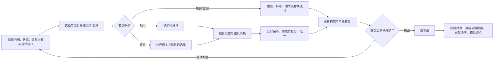

# OCC 肉鸽核心体验循环与资源系统 v0.1

> 状态：策划基线，2026-08-15；数值为首轮可回滚实验值，尚未授权运行时实现。
> 归属：仅肉鸽模式，学院第一阶段与后续人生阶段共用。
> 核心决定：货币只有 **金币** 与 **阶段贡献** 两种；金币跨人生阶段保留，阶段贡献在转入下一阶段时清零。武器、防具、导具和其他承担角色养成的装备不使用耐久；医疗品、卷轴、侦测器、钥匙和消耗型法宝等战术道具使用公开次数。当前生命与个人魔力跨战继承，并随确定、可见的游戏内时间自然恢复；普通护盾只存在于战斗内；生命归零立即结束整局。

## 1. 任务合同

- **目标：** 固定肉鸽核心体验循环，并建立只含两种货币、养成装备无耐久、战术消耗道具有公开次数的统一系统。
- **涉及系统：** 地图选点、游戏内恢复时间、战斗结算、生命／护盾／个人魔力继承、整局死亡、金币、阶段贡献、无耐久养成装备、消耗道具次数、背包、商店、机构服务、休整、许可、学院时序、首领与阶段转入。
- **验收标准：** UI 中不存在第三种货币；贡献不会跨阶段保留或由直接服务兑换为金币，贡献购入物进入下一阶段后可正常出售；生命与个人魔力按公开游戏时间恢复且不能靠挂机／无成本回访刷满；生命归零立即结束本局；养成装备永不因战斗使用损坏；每种战术消耗道具都有公开次数与消耗规则；回访不能恢复货币、道具次数或节点奖励；资源不足不制造地图软锁。
- **完成后解锁：** 战术道具次数数据合同、学院贡献商店／服务表、装备成长与金币经济表、固定种子经济与消耗验证、存档迁移计划。

## 2. 核心体验

肉鸽的核心体验确定为：

> **看懂风险并选择下一节点；用持续成长的武器与装备完成确定性战斗；在游戏时间中恢复部分生命与个人魔力，同时决定是否消耗有限次数的战术道具；取得金币、当前阶段贡献与新构筑；再判断强化、补给、继续探索或挑战首领。**

四个体验支柱：

1. **战术可计算：** 命中、伤害、敌人意图、环境、个人魔力与战术道具次数变化全部可预览。
2. **构筑改变解题方式：** 无耐久的武器、个人术式、护具与装备形成长期构筑；有限次数道具承担临场爆发与救急，不只是数值累加。
3. **状态与消耗共同改变路线：** 生命、个人魔力和战术道具剩余次数跨节点继承；生命与个人魔力按公开游戏时间恢复。普通护盾是每回合重建的战斗内防线，不跨节点，战损控制主要依靠站位、防御术式与防御法宝。
4. **阶段内取舍：** 贡献必须在当前阶段使用；金币与个人装备可以为后续阶段保留。玩家持续比较“现在变强”与“为以后保留”。

所有学院背景、人物档案和事件必须至少改变风险、构筑、金币、学院贡献、道具次数、许可或路线中的一项，否则不进入首版系统。

## 3. 完整单局循环

### 3.1 单次节奏

| 环节 | 目标时长 | 核心决定 |
| --- | ---: | --- |
| 地图阅读 | 20–60 秒 | 构筑、恢复、补给、贡献消费、许可或情报哪个最紧迫 |
| 战前确认 | 20–40 秒 | 当前生命、魔力和关键道具剩余次数是否值得承担这场战斗 |
| 普通战斗 | 5–8 分钟 | 行动顺序、位置、能力和道具使用 |
| 精英／首领 | 10–15 分钟 | 是否消耗次数有限的稀有道具换取胜率 |
| 战后结算 | 30–60 秒 | 三选一、道具次数变化、背包替换与资源规划 |
| 服务／事件 | 30–90 秒 | 使用金币还是当前阶段贡献，强化构筑还是购买满次数道具新实例 |

学院首区标准目标仍为 60–90 分钟、12–20 个已处理节点、约 7–11 场战斗、2 枚核心许可和 1 场首领战。超过 20 节点是主动延长探索。`21`／`28` 继续作为公开学院时序阈值，但单位改为由战斗与事件产生的时间，而不是已访问节点数。

## 4. 不是货币的角色状态

| 状态 | 职责 | 跨节点 | 恢复 |
| --- | --- | --- | --- |
| 生命 | 最终失败缓冲；归零立即结束整局 | 是 | 游戏时间自然恢复、个人术式、医疗道具、机构服务 |
| 护盾 | 战斗内临时先行防线；通常下个自己回合开始清除并重建 | 否 | 防御装备的回合开始效果、个人术式、法宝与明确战斗效果 |
| 个人魔力 | 个人术式使用节奏 | 是 | 游戏时间自然恢复、个人术式、道具、休整 |
| 行动点 | 单回合行动预算 | 否 | 每次获得回合时重置 |

这些数值不进入货币栏，也不使用“金币／贡献”图标。个人术式是角色掌握的能力，不是道具，不使用耐久；其成本由行动点、个人魔力、冷却与明确条件承担。

### 4.1 游戏时间恢复合同

- 当前生命与当前个人魔力写入肉鸽存档；下一场战斗从保存值开始，不自动补满。
- 自然恢复读取确定的 **游戏内恢复时间**，不读取现实时间、帧数或玩家停留菜单的时长。
- 学院时序与恢复时间使用同一个公开游戏时间值，不再维护第二套隐藏恢复时钟。
- **只有战斗和事件消耗游戏时间。** 地图移动、首次进入或回访普通地点、商店、工坊、休整、宝藏、整理背包、暂停和阅读说明均不消耗时间。
- 战斗节点在确认前显示固定时间成本；事件的每个选项分别显示自己的时间成本。事件转入追加战斗时，事件成本与该战斗成本相加并提前预览。
- 战斗或事件成功结算时才推进时间，并同时结算生命与个人魔力恢复；仅在地图上走到节点入口不会先扣时间或提前恢复。
- 进入战斗或确认事件选项前显示 `学院时序 N → N+成本`、结算后预计生命和个人魔力，以及是否跨过 21／28 阈值。
- 生命与个人魔力只恢复到各自上限；恢复公式和结算顺序固定，同一种子、读档和战术重开结果一致。
- 护盾不随时间自然恢复，也不写入跨节点状态；每场战斗默认从 0 护盾开始，除非明确的开战效果另有说明。战术道具次数不随时间自然补充，养成装备没有耐久值。
- 游戏内时间不触发隐藏敌情或无预警关门；达到 21 时进入公开收束期，达到或跨过 28 时在当前节点完整结算后立即进入首领阶段。
- 已确认的战斗／事件不截断时间成本，因此允许一次由该节点完整成本造成的自然超出；超出后不能再进入第二个耗时节点。确认页必须显示最终时序与“结算后进入首领阶段”。
- 首领阶段关闭普通战斗、精英和事件入口，保留地图移动、背包整理及已开放的零时间服务。玩家可直接进入首领；提前挑战所需的 `12 节点 + 2 许可` 不再在强制首领阶段形成阻塞。
- 生命在战斗中降到 0 时立即结束整局；不先等待战斗结算、节点时间或自然恢复，也没有负生命后的抢救窗口。

首轮时间成本实验暂用：普通战斗 `2`、精英战斗 `3`、事件基础选项 `1`、首领战 `3`；事件追加战斗再叠加对应战斗成本。服务、商店、工坊、休整、宝藏与地图移动均为 `0`。这些数值和每单位时间的生命／个人魔力恢复率必须共同验证，当前不作为最终平衡值。

## 5. 两种货币

### 5.1 金币

金币是整局通用货币。

- **保留范围：** 在同一局的不同人生阶段之间保留；本局结束后不作为永久数值继承。
- **主要来源：** 战斗委托报酬、事件交易、出售或拆解个人物品、宝藏。
- **主要去向：** 购买装备与道具、装备强化／校准／重铸、替换战术道具实例、通用医疗／住宿／交易服务。
- **优势：** 使用范围广，买到的个人物品可按阶段继承合同进入下一阶段。
- **代价：** 当前花掉就减少后续阶段的储备；金币购买不提供阶段机构的专属权限。

### 5.2 阶段贡献

阶段贡献是当前人生阶段所属机构对角色表现的认可。显示名称随阶段改变：学院阶段为 **学院贡献**，后续可为军方功勋、工坊信誉或其他已确认名称，但底层同一时间只存在一个 `StageContribution`。

- **保留范围：** 只在当前阶段有效；阶段转入结算时强制清零。
- **主要来源：** 首次完成战斗节点、精英任务、公开附加目标、学院委托与少量事件。
- **主要去向：** 当前机构提供的装备、强化／校准、医疗、训练设施、侦测服务、战术道具新实例和许可办理。
- **不可直接兑换：** 不提供“贡献换金币”的直接服务，也不可在阶段末折算为局外资源、永久属性或下一阶段贡献。玩家用贡献购买可继承物品，并在进入下一阶段后按正常规则出售，是允许且有背包机会成本的合法运营路线。
- **不可刷取：** 已清节点回访不再提供贡献；重复训练不产出贡献。
- **清零提示：** 学院时序达到 21 时提示“学院贡献将在阶段转入时清零”；时序 25–28 持续显示余额与可用服务；首领胜利后、正式转入前再提供一次明确提醒和消费机会。

阶段贡献的设计目的就是鼓励在当前阶段使用，不要求阶段末仍保有价值。

## 6. 贡献与跨阶段资产的边界

物品不因购买货币或来源而在阶段转入时到期。金币购买物、贡献购买物、战利品和首领奖励只要实例仍存在且符合背包容量，都可以跨阶段保留；养成装备始终存在且无耐久，一次性物品耗尽后则不再是可继承实例。

- 贡献购买物保留来源标记，但该标记只用于叙事、价格规则与审计，不降低下一阶段的正常出售价格，也不用于强制回收或失效。
- 当前阶段可以用贡献购买物品、强化／校准、满次数战术道具新实例或即时服务；不能给已有实例购买单次次数。进入后续阶段后，旧阶段贡献已清零，后续服务改用金币或新阶段明确提供的贡献。
- 贡献购买物不能在阶段转入消费窗口出售、拆解或折算金币；进入下一阶段后按同类物品的正常金币规则出售，不因贡献来源打折。该间接转换是已确认的合法策略，成本是占用当期贡献、背包空间与下一阶段交易机会。
- 所有物品跨阶段仍受背包容量约束；容量不足时由玩家主动保留、替换或放弃，不自动销毁。

金币承担更广的购买、强化与新实例获取能力，贡献承担当前阶段的限定库存和服务机会；差异来自用途与清零时点，而不是物品强制到期。

## 7. 养成装备与战术消耗道具

武器、防具、护盾器、战斗导具、饰品及其他占用装备位并承担角色成长的物品，统一属于 **养成装备**：不保存耐久、不因出战或使用损坏，也不需要维修。防具不提供常驻护甲值或固定减伤；常规无条件回合盾主要由胸部防具提供，少数非胸部装备可独立提供并与其相加，没有装备盾全局上限。其成长来自获得新装备、强化、校准、重铸、附加能力与构筑替换，具体预算见 `OCC_肉鸽装备系统_v0.1.md`。

只有会被主动消耗的战术道具实例保存以下字段：

| 字段 | 含义 |
| --- | --- |
| `instance_id` | 本局唯一实例 |
| `item_id` | 内容定义 |
| `charges_current/max` | 当前／最大使用次数 |
| `consume_rule` | 哪个明确指令消耗 1 次 |
| `empty_rule` | 0 次时销毁、保留空容器或暂时不可用 |
| `replacement_rule` | 耗尽或主动替换时如何获得全新实例、使用金币还是阶段贡献、整件成本；首版不允许给已有实例补单次次数 |
| `source_type` | 金币购买、贡献购买、战利品、事件或首领奖励 |
| `source_stage_id` | 取得物品的阶段，用于价格、叙事与防套利审计 |

次数消耗完全确定，不使用随机磨损。任何会消耗次数的指令在确认前显示变化。

### 7.1 养成装备无耐久合同

- 主手／副手武器、防具、护盾器、战斗导具、饰品和装备位法宝不会因攻击、受击、格挡、施术、战败或跨阶段降低耐久。
- 养成装备没有损坏、报废或维修状态；任何界面都不显示装备耐久条。
- 装备强化消耗金币、当前阶段贡献或明确服务机会，但这是成长投入，不是恢复损耗。
- 同一名称的物品若既存在装备版又存在消耗版，必须使用不同内容 ID、图标角标和说明；装备版无耐久，快捷栏消耗版有次数。

### 7.2 战术道具次数

| 类别 | 次数语义 | 耗尽／替换 |
| --- | --- | --- |
| 医疗包／护盾单元 | 每次使用消耗 1 次；常规容器默认 `3–4` 次 | 不能补次数；归零销毁，需要时购买或获得满次数新实例 |
| 侦测器 | 每揭示一个节点或一项首领机制消耗 1 | 不能补次数；可在服务节点购买或换取满次数新实例 |
| 卷轴 | 通常 `1/1`，施放后销毁 | 不可补充 |
| 消耗型法宝 | 条目规定的有限次数，沿用轻型 4／标准 3／强力 2／决定性 1 | 次数耗尽不可普通补充，只能封存、拆解或放弃 |
| 钥匙／通行印记 | 每开启一个明确门扣 1 | 通常不可补充；可跨阶段保留，但离开对应区域后可能没有可用目标 |

卷轴与消耗型法宝继续遵守世界观合同：次数耗尽不能靠金币、贡献、换石或普通服务恢复。占用装备位、承担长期构筑的法宝属于养成装备，不使用次数。

核心许可属于阶段进度，不是背包物品，也不伪装成次数 `1` 的道具；它在当前阶段记录资格并于阶段转入时清除。钥匙与通行印记才是有使用次数的可携带物品。

## 8. 背包与替换规则

- 本模式沿用总策划与现有运行时的类《逃离塔科夫》网格合同：基础背包固定为 **6 列×10 行（60 格）**；物品按矩形宽高占格并允许 90° 旋转。该规则已经存在，不是待决定项。
- 所有未装备的实体物品都必须位于背包网格；已经穿戴或装入正式装备位的物品不占背包格。卸下装备前必须存在合法背包落点，否则不能卸下。
- 首版不允许容器嵌套；背包装备或挂载袋若扩容，只能建立策划明确的独立子容器，不能把容器放入容器形成递归容量。
- 不存在抽象“补给”数字；医疗、护盾、侦测、钥匙、卷轴与法宝都以道具实例存在。
- 背包对养成装备显示属性、成长路径和来源阶段，不显示耐久；对战术道具显示当前／最大次数、消耗规则与满次数新实例的获得方式。
- 获得新物品但空间不足时，先比较新旧物品，再选择替换、拆解或放弃；不自动销毁。
- 首版战术消耗品在次数归零时直接销毁并释放占格，不保留空容器。
- 同名消耗品也保留独立实例和次数，不自动合并次数，也不合并成无法追踪的总次数。
- 换装只允许在工坊或其他明确安全节点进行；在已拥有物品之间换装不额外收费。

## 9. 节点在循环中的资源职责

| 节点 | 金币 | 阶段贡献 | 装备／战术道具 | 主要职责 |
| --- | --- | --- | --- | --- |
| 普通战斗 | 稳定少量 | 稳定少量 | 三选一、战利品；装备不损耗 | 核心成长与消耗品使用场景 |
| 精英战斗 | 较高 | 较高 | 稀有道具、核心许可 | 高风险构筑跃迁 |
| 事件 | 交易或代价 | 委托奖励或消费 | 钥匙、侦测器、恢复品、追加战斗奖励 | 转换路线与资源 |
| 市集／商店 | 主要消费 | 不使用或只用机构专柜 | 个人所有物 | 长期规划 |
| 学院服务 | 少量或不用 | 主要消费 | 贡献限定物、强化、满次数道具新实例和即时服务 | 当前阶段效率 |
| 工坊 | 装备强化／重铸 | 当前阶段限定校准 | 换装、强化、重铸、拆解 | 发展构筑 |
| 休整 | 可购买额外服务 | 可兑换阶段服务 | 恢复品或直接恢复 | 修复战斗状态 |
| 宝藏 | 少量或无 | 少量或无 | 高价值个人物品或许可 | 低即时风险、高路线成本 |
| 首领 | 阶段奖金 | 不再发放可消费贡献 | 可继承奖励 | 检验全阶段决策 |

## 10. 首版服务与价格实验

具体数值需在固定种子验证后调整，首轮只建立量级。

### 10.1 金币服务

| 服务／物品 | 实验价格 |
| --- | ---: |
| 普通装备一次基础强化／校准 | 4 金币 |
| 紫色装备整组重铸 | 6 金币；同实例每次递增 2 |
| 金色装备整组重铸 | 9 金币；同实例每次递增 2 |
| 普通医疗道具 | 4 金币 |
| 普通护盾道具 | 3 金币 |
| 个人侦测器（3 次） | 5 金币 |
| 普通卷轴 | 5–7 金币 |

### 10.2 学院贡献服务

学院贡献商店采用 **固定通用服务 + 随种子轮换商品**。固定栏始终提供生命恢复、个人魔力恢复、战术道具新实例三类兜底服务；已有实例不能购买单次次数或局部补满，玩家购买的是按正式 `charges_max` 生成的完整新实例。装备、卷轴、特殊工具与其他具体商品随本局种子轮换。固定服务保证贡献始终有合理消费出口，但不保证每局出现同一构筑商品。

| 服务／物品 | 实验价格 |
| --- | ---: |
| 学院装备一次基础校准 | 1 学院贡献；普通强化服务可按事件另定 |
| 一次基础治疗或护盾／魔力整备 | 2 学院贡献 |
| 揭示一个节点精确信息 | 1 学院贡献 |
| 学院库存医疗／护盾道具 | 2 学院贡献 |
| 学院库存特殊工具或卷轴 | 3–5 学院贡献 |

贡献服务不能直接产出金币。贡献购买物可以跨阶段保留；阶段转入消费窗口禁止出售或拆解，进入下一阶段后则可按正常金币规则出售。

## 11. 战斗与道具次数结算顺序

1. 任意时点生命归零：立即结束整局，不进入后续恢复或奖励步骤。
2. 主角存活并完成战斗：记录生命、个人魔力和战斗内已消耗的战术道具次数；普通护盾在离开战斗时清零，武器与装备不产生损耗。
3. 按实际指令扣除战术道具次数，不额外追加战后磨损。
4. 增加本场公开的游戏内恢复时间，并结算生命与个人魔力自然恢复。
5. 显示生命／个人魔力恢复和已使用道具的 `旧次数 → 新次数`。
6. 结算金币和当前阶段贡献。
7. 发放核心许可、道具战利品与固定种子三选一。
8. 处理背包替换、拆解或放弃，记录学院时序并保存。
9. 返回地图后显示金币、学院贡献、生命／个人魔力、当前装备构筑、快捷栏道具次数、核心许可、首领缺口和下一节点恢复预估；地图状态不显示可继承护盾。

生命归零的失败不发放金币、贡献、自然恢复或战利品，并且不能从本场战斗快照重开、读档或继续本局；玩家只能开始一局新的游戏。固定种子与战斗快照仍可用于开发验证，但不提供绕过整局死亡的正式玩家入口。

主角存活但未完成战斗目标时，不结束整局：时间、生命／魔力变化和已经消耗的道具次数照常保留，装备不受损；节点关闭并按失败档减少收益。首轮实验为基础金币与贡献各结算 `50%`（向下取整），取消三选一、附加目标奖励、核心许可与唯一物品；具体任务可以公开声明更低收益，但不能临时隐藏改判。该节点不可重复挑战，避免通过反复失败刷时间恢复。

## 12. 阶段转入

学院阶段结束时按固定顺序结算：

1. 首领胜利后显示阶段转入提醒、学院贡献余额、可购买库存和背包容量。
2. 允许一次最后的消费与整理机会；可以买入可跨阶段物品、使用即时服务、强化装备或购买满次数道具新实例，但贡献购买物在此窗口不能出售、拆解或换成金币。
3. 玩家明确确认转入后，学院贡献设为 0。
4. 核心许可等阶段进度到期；物品不因来源或购买货币而到期。
5. 金币完整保留。
6. 所有装备与仍存在的道具实例按背包容量继承；养成装备无耐久，战术道具保留当前次数。超出容量时由玩家主动处理后才能确认转入。
7. 下一阶段创建新的阶段贡献类型和初始值；不得沿用学院贡献余额。

阶段胜利后的额外继承奖励暂不进入学院首阶段制作范围。未来启用时，使用“三项特殊改造选一项”的形式，只改变构筑规则，不直接增加生命、伤害、法术槽或其他裸数值；具体内容随下一阶段一并设计。

未使用贡献不会换成金币、经验、档案分数或局外资源。结算档案可以记录“获得／使用过多少贡献”，但记录不提供战力。

## 13. 数值验证模型

首轮模型假设：开局 `8 金币／0 学院贡献`；普通战 `+3 金币／+1 贡献`；精英战 `+5 金币／+2 贡献`。这些值只为验证消费密度。

| 路线 | 战斗假设 | 金币基础收入 | 学院贡献基础收入 | 目标体验 |
| --- | --- | ---: | ---: | --- |
| 12 节点快速路线 | 6 普通 + 1 精英 | 31 | 8 | 能进行一次装备成长并购买 2–4 件普通道具；贡献只够有限整备 |
| 20 节点标准路线 | 9 普通 + 2 精英 | 45 | 13 | 能在装备成长、消耗品和金币储备间形成至少 4 次真实取舍 |
| 27 节点延长路线 | 12 普通 + 3 精英 | 59 | 18 | 当前阶段更富裕，但战术道具和状态消耗持续存在、阶段贡献将清零 |

验证目标：

- 标准路线首领前金币应保留约总收入的 20%–40%，既能消费也能为下一阶段储备。
- 标准路线学院贡献应使用 70% 以上；若大量剩余，说明机构服务无吸引力。
- 每条标准路线至少发生一次“强化装备”与“购买战术道具新实例”之间的真实消费竞争。
- 不允许通过“贡献买物 → 拆解 → 金币”或任意购买／拆解组合获得正收益。
- 延长探索带来更多金币与个人物品，但多场战斗造成的道具次数与状态消耗必须真实存在。

## 14. 防软锁与优势解

| 风险 | 约束 |
| --- | --- |
| 金币比贡献用途广，玩家忽视贡献 | 学院专属服务和贡献限定库存只收贡献，且在当前阶段有明确效率优势 |
| 阶段末贡献集中购买跨阶段物品 | 这是允许的阶段末规划；用限定库存、背包容量和禁售窗口控制，不把贡献无损换成金币 |
| 装备损耗惩罚角色养成 | 所有武器与养成装备无耐久，不因使用、受击、失败或跨阶段损坏 |
| 单一武器从头用到底 | 用敌群机制、装备侧向能力与新构筑机会鼓励替换，不通过损坏强迫换装 |
| 消耗品用尽造成无解 | 基础攻击和个人术式不依赖消耗品；地图保证首领前可达至少一个满次数新实例购买服务 |
| 贡献花光后无法取得核心许可 | 核心许可由任务／节点奖励取得，不以贡献购买作为唯一来源 |
| 首领失败后的重复扣除 | 生命归零已结束整局，不再保存失败后的扣除状态；新局重新生成。核心许可本身不因进入首领房消耗 |
| 金币长期滚雪球 | 装备强化、购买道具新实例和背包容量形成持续去向；阶段难度不按金币余额动态作弊加价 |
| 战术道具只是囤积品 | 常规容器与工具通常只有 3–4 次使用，快捷栏和背包容量迫使玩家选择使用时机 |
| 故意失败刷自然恢复 | 失败节点关闭且奖励降档，时间、生命、魔力和已消耗道具次数全部保留，不能重复进入 |

## 15. 最小可逆验证

**假设：** “养成装备无耐久 + 战术道具有限次数 + 金币跨阶段 + 贡献阶段清零”能同时形成长期构筑和当前阶段消费，而不会让装备维修惩罚角色成长。

**方法：** 使用 6 个固定种子，分别跑 12、20、27 节点路线，并覆盖近战热压、武器热载、远程导能三种开局；共 54 条路线。记录金币收入／消费／结余、贡献收入／使用／清零、装备获得／强化／替换、战术道具取得／使用／购买新实例、累计恢复时间、自然恢复量和首领前状态。

**通过：**

- 54 条路线均不因金币、贡献、许可或战术道具耗尽进入地图软锁；
- 标准路线至少发生 4 次有竞争关系的装备成长／道具新实例／服务消费选择；
- 学院贡献平均使用率不低于 70%，阶段末消费窗口不存在即时贡献转金币路径；
- 常规战术容器或工具通常只能支持 3–4 次有效使用，玩家每 2–4 场战斗需要处理一次关键消耗决定；
- 生命与个人魔力恢复均来自可追踪的游戏时间；挂机、暂停和已清节点往返的恢复量为 0；
- 生命归零的 54 条相关边界测试均直接进入整局失败，不产生战后恢复或奖励；
- 三种开局没有一种同时在金币结余、贡献效率、道具余量和首领胜率上全面领先；
- 玩家能在 10 秒内说明金币、学院贡献、无耐久养成装备和有限次数战术道具的差别。

**回滚：** 若战术道具处理过于频繁，提高常规容器次数或降低关键战斗的道具需求；若贡献服务总是必买同一项，拆分库存并让不同构筑需要不同服务；若金币完全不愿消费，降低装备强化或新实例购买成本并增加侧向价值物品，不动态抬高敌人数值。

## 16. 一致性结论与实施边界

当前非独立审查结论为 **PLAYTEST REQUIRED**：两货币、养成装备无耐久、战术道具有限次数、物品跨阶段、阶段末消费、失败降档与强制首领阶段已经按产品决定固定；具体收入、价格、恢复率和各消耗道具次数仍需固定种子验证。

本稿明确废弃上一版目标中的：零件、地图层以太／以太样本、抽象补给计数、独立侦测次数计数、普通权限卡计数和无用途的经验／等级资源栏。

当前只更新策划。不得在完成 54 路线经济／消耗验证前修改 `RogueliteMapRun`、存档版本、正式 UI 或现有测试基线。
