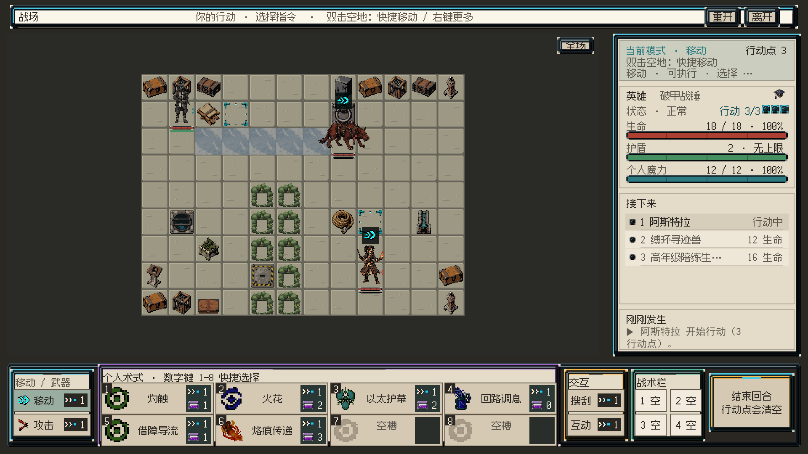
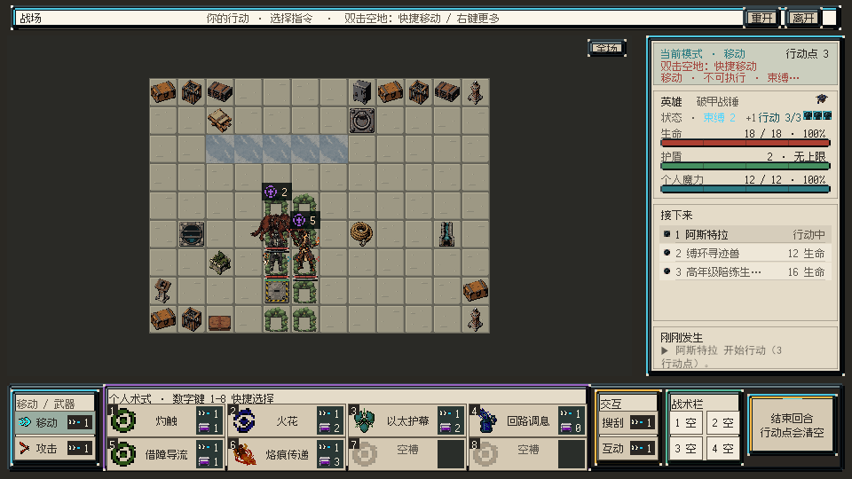

# 行动摘要字形与邻格遮挡检查

2026-09-05 · `codex/art-visual-iteration-20260905` · VISUAL-INTEGRATION-01，继续进行。

## 本轮目标与结果

核对前轮截图中右栏摘要的实际边界，并检查三名单位位于灯藤相邻格时的可读性。涉及两模式共用 FormalCombatHud、规格表、机器合同；临时渲染使用当前生产首战状态和 UI，未改变正式地图、单位资产或玩法规则。

行动摘要已修复；相邻单位视觉拥挤仍未通过；战斗记录字体冲突待用户裁决。三项分开记录，不用局部通过替代整体验收。

## 行动摘要：已修复并测量

原摘要指定高度48px，但 ConfigureParagraph 的最小两行槽位将其扩为72px；薄框模块不受 KeepInsideParentFrame 的厚皮肤边框约束。最终在96px高模块中，字形范围为Y=-40到-99，越界3px。

现在使用380×52的明确两行摘要，位置(16,40)、字体24px FusionPixel12、参考行距26px。两行各限制最多15个字符，关闭自动换行；Unity采用Overflow保证不会因为字体行度量把第二行删掉，但实际字形边界另行测量并落在模块内。去掉重复的“左键：”前缀，原点击指令本身已说明操作。未改变点击绑定、玩法或字号。

| 样本 | 1920×1080 | 960×540 |
|---|---|---|
| 移动、攻击、技能1、技能6、搜刮、互动 | 均为2行，底部留白6参考px | 均为2行，底部留白4参考px（2物理px） |
| 每行15个全宽中文字符 | 字形X=16–376，Y=-40至-90 | 字形X=16–378，Y=-40至-92 |

实际网格由 CanvasRenderer.GetMesh 获取，在父模块坐标系测量。小分辨率字体栅格边界较参考宽2px，仍在限制内；未用1920的结果推断960。只缩小槽位的临时探测曾使第二行消失，因此未采用该做法。

## 邻格灯藤：仍不通过

在临时内存首战中将主角置于E3，另两单位置于E4、F3，并给主角施加已有束缚和破势状态，用于拥挤与状态读数样本。这是表现检查样本，不是新地图配置、通关路线或修改后的出身状态。通过公开 CombatEffectExecutor 设置，仅存在于临时场景，未写入存档。

观察：各单位脚底与血条位置仍可分辨，但灰黑主角上半身与兽类、藤叶、敌情徽记混在一起；活动角色身份不能认为足够清楚。现有灯藤逐格小环的重复感也仍明显。右栏文字修复不解决这些问题。

后续处理入口：CombatBattlefieldCellPresenter 的单位显示信息、FormalBattlefieldView 的单位/信息层、CombatUnitHudLayout 的敌情徽记与状态位置。下一步应先比较当前行动者的轻量身份提示与拥挤时徽记避让，保持真实足底排序、64px角色世界倍率和逻辑格占用。检验应覆盖E3/E4/F3、首战默认位置、128px放大档、移动与状态随行。任何探索都不能将未重新批准的水面/灯藤v3晋级，也不能用缩小角色来回避遮挡问题。以上为后续候选处理方向，尚未实现或视为批准的美术规范。

## 字体冲突：待用户决定

总案第12.2节要求中文使用FusionPixel12正常字形。当前 FormalUiKit.cs:229/232 定义并加载 Fonts/SimHei，ConfigureReadingParagraph 在第496行替换字体；当前运行时代码中唯一直接调用位于 FormalCombatHud.cs:189 的战斗记录。实际渲染确认 eventLabel.font=SimHei。

已根据项目AGENTS.md的冲突处理规则询问用户：统一按总案改回FusionPixel12，或在总案明确长篇阅读例外。问题仍待答复，本轮未修改该调用或静默接受例外。战斗记录字形距模块底仅2参考px，也需结合字体决定继续收口。

## 其他验证与范围

- 82/82相关EditMode检查通过，1.67秒；job `e69c1f72-71bc-41ed-a462-7b53e1956b07`。
- 编译无错误或警告，Console缓存未发现error。一次探测脚本使用旧GetMesh签名编译失败，改为当前Editor的无参接口后完成测量；不属于生产脚本编译错误。
- 机器合同审计PASS，当前HUD/规格/合同差异检查通过。
- 飞书总案rev342全文回读并同步本地镜像；实施合同先于代码写入第12.11节。字体冲突与邻格视觉未通过状态明确保留。
- 主工作树Application.dataPath匹配；最终仅CombatPrototype一个场景，dirty=False，playing=False。未保存场景、未替换资产，未重复全量784项测试。

渲染机制沿用前轮临时未保存加法场景和离屏Camera；由生产UI创建与首次刷新生成，没有运行实际输入、范围淡入、动作时钟或整场战斗。实机、性能、人工审美及完整游戏目标均未完成。Play Mode授权问题仍待答复。水面/灯藤v3继续QA_PENDING、批准0/2。

原始证据：glyph_before.json、glyph_after.json、glyph_cases_1920.json、glyph_cases_960.json、focused_tests.json、compilation.json、console.json、unity_identity.json、master_final.json。AuditDecisionCases.cs 与 RenderCrowdedReview.cs 仅为归档检查脚本。
