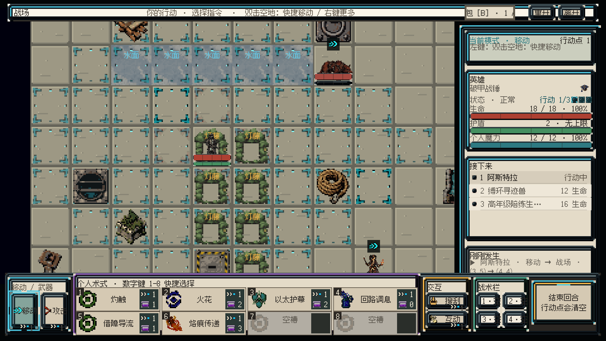

# OCC 美术优化与视觉迭代方案

日期：2026-09-05 · 分支：`codex/art-visual-iteration-20260905`

这份方案的目标，是把“雨后灯庭”做成能够指导后续生产的完整视觉样板：静止时看懂空间与威胁，行动时看懂原因与结果，关闭动画仍能正确决策。审美质量需要实机与人工检验，本案不把“完美”当作已经达到的结论。

**文档效力：评审提案与调查归档，不是第二份活动美术规范。** 已确认的规则以飞书总案为准；以下新布局、节奏、排期和质量目标均为建议，采纳后先进入总案及规格表，再进入实施。文中的历史截图不是本次运行或效果承诺。

## 1. 本次主任务与交付

| 项目 | 内容 |
|---|---|
| 唯一主任务 | ART-PLAN-20260905：调查项目、建立分支、交付美术优化与视觉迭代方案 |
| 涉及范围 | 总案、相关数据表、机器美术合同、首战归档截图、UGUI 战场与反馈实现 |
| 模式 | 首战样板属于肉鸽；通用像素、文字、交互与反馈规范供两模式共用 |
| 验收 | 每项建议有证据、改法、实施入口、验收条件和前置依赖；提供可浏览评审页与任务表 |
| 本次实际产出 | 方案、执行清单、评审页面、母版读取与同步证据；新增正式美术资产 0 项 |
| 解锁下一步 | 先复审现有水面／灯藤 v3，再确认首战可读性样板的实施范围 |

仓库根目录已验证为 `E:/数据库/OCC_Codex`。分支从 `codex/core-integrity-01` 建立，原有未提交工作随工作树保留；没有创建其他 worktree、仓库副本或提交其他人的改动。Unity 只读身份检查得到 `Application.dataPath=E:/数据库/OCC_Codex/UnityProject/Assets`、场景 `Assets/Scenes/CombatPrototype.unity`、`dirty=False`、`isPlaying=False`。

## 2. 项目理解与资料权重

OCC 是 PC、正交 2D 像素、单主角、确定性回合制战棋 Roguelite。魔法来自以太素，是可测量、有维护需求和代价的能量工程。当前重心是学院首次固定体验，最终指向约十分钟的三场普通战、事件、工坊、医务室、精英与精英后商店。

现阶段流程骨架与首战已有实现；战斗2、战斗3、精英、奖励等仍有冻结前置条件。美术计划不能借机定义第三种特色地块、敌人技能、新奖励或额外玩法。剧情探索不引入倒计时、拖延惩罚或关门机制。

| 来源 | 本次用途 | 局限 |
|---|---|---|
| 飞书母版 rev320，全篇读取快照见 evidence | 当前规则与本次用户裁决基准 | 部分进度段落内部也有先后记录差异，应保留历史并补充当日裁决 |
| 本地总案，原版已备份 | 定位本地与母版差异 | 不能用其 v3 晋级结论覆盖飞书 |
| 美术规格、首次体验战斗规格、下一套 Build、学院敌人数据表 | 资产尺寸、首战地点、角色身份、范围依赖 | 个别表仍有“待冻结”旧状态，纳入同步清单 |
| `Tools/OCCArt/occ_art_contract_v1.json` 与验证脚本 | 尺寸、色数、证据、状态机 | 机器镜像，不替代审美与产品决定 |
| 2026-09-04 首战 v3 运行截图与 QA | 观察已有文件的实际接触情况、定位争抢层次 | 本次用户要求重新审核，不能沿用旧 PASS 当作新批准 |
| 2026-09-02 学院入口、路线地图截图 | 了解旧 UI 语言与潜在继承问题 | 入口仍展示训练方向，不能作为当前首轮流程设计依据 |
| 当前 Presentation 与 Campaign 源码 | 判断复用能力、比例、反馈时序和静态风险 | 本次没有重编译或进入 Play Mode，不代表当前所有分支均运行验证 |

## 3. 冲突与本次裁决

**用户于本轮明确选择：“以飞书 rev320 为准，v3 状态需重新审核”。** 水面／灯藤 v3 的当前审查结论因此是“待重新审核”，批准数量按 0/2 处理。已有原料、Unity 文件、GUID、旧 manifest 和截图保留为历史证据；“文件已接入”与“当前审核通过”必须分开记录。

| ID | 冲突位置与内容 | 处理 |
|---|---|---|
| C01 | 飞书 §6.5、§10.7、§10.10 记载 v3 未完成；原本地对应节记载 v3 FORMAL 2/2 | 按用户裁决同步母版，保留本地备份；已有 v3 进入复审，不重新宣称 FORMAL |
| C02 | 旧 v3 QA／manifest 与现有 Unity 正式目录仍包含历史晋级记录 | 不篡改旧证据，不删除或替换资产；新复审记录明确旧结论不能作当前放行依据，复审通过前禁止扩散复用 |
| C03 | `occ-art-direction/references/brief-contract.md`、`occ-pixel-contract.md` 写脚底 Y56；当前 CSV 与 JSON 写 Y58 | 旧技能引用不可直接用于生产；首轮复审核对总案、规格与机器镜像后统一。本文单位示例按当前 CSV 的 Y58 描述，并显式保留这一待收口项 |
| C04 | `occ-art-direction/SKILL.md` 要求先读 `Worldbuilding/05_美术与音频/OCC_美术规范_v0.1.md`，现活动层已不存在；brief 还出现 service/treasure 旧节点用语 | 不恢复旧规范、不引入旧节点；个人技能修订作为独立维护建议，未擅自修改 |
| C05 | 总案没有独立“美术方向”完整章节，而规格表与 JSON 含大量尺寸、字体和管线细则 | 建议把已确认规则补回唯一总案；本案不把提案数值直接提升为正式规范 |
| C06 | `OCC_下一套Build内容表_v1.0.csv` 的 B1／出身能力仍写待冻结，而母版 §10.4.1 已冻结具体效果 | 同步已确认的 B1 与出身状态；B2/B3/精英继续待冻结，不外推机制槽 A/B 的命名映射 |
| C07 | 总案“悬停分层说明”与当前逐格常驻“水面／灯藤”标签存在表达方向差异；源文件 `CombatBattlefieldCellPresenter.cs` | 作为明确的可读性修改提案提交，未静默改代码 |
| C08 | 同步母版后，发现 rev320 没有原本地总案的“2px 细框”等后补界面条款；JSON 一致性检查仍要求此字串 | 最终合同审计为 FAIL（1 项）。保留真实缺口，不弱化验证器、不用旧本地条款反向覆盖飞书；采纳 UI 细则前先收口总案与规格镜像 |

## 4. 画面诊断：按收益排序

图：2026-09-04 归档运行画面。v3 本轮待复审；截图用于说明问题，不是最终方向图。

| 优先级 | 已观察证据 | 玩家影响 | 建议 |
|---|---|---|---|
| P0 | 默认格宽 128；12×9 棋盘需 1536×1152，而适配器视口仅 1440×876，且还有顶部与底栏覆盖风险 | 首次进入难以同时看全敌人和路线 | 默认全场适配，保留主动缩放；先计算真实无遮挡区域再选整数倍率 |
| P0 | 地面高频边线、移动范围四角和逐格文字同时出现 | 地形、范围、焦点混在一起 | 地面低对比；仅当前操作范围明显；常驻地形名称改为悬停，保留必要规则入口 |
| P0 | 主角在灯藤中视觉密集，单位血条接近占满一格，外观身份被淹没 | 看不清脚底、朝向和“站入藤中” | 先验证正确的前后遮挡和像素比例；血条在统一安全带内，不减掉必要信息 |
| P0 | VFX 32px 帧当前显示为 58×58；倍率为 1.8125 | 像素块宽度不均，动态时闪烁风险 | 基于原生帧与物理屏幕倍率绘制；避免任意 58px 拉伸 |
| P1 | `PlayFormalVfx` 每格仅保留一个特效，较高优先级覆盖原特效；`NotifyFireSpell` 同次调用发射多个模块 | 起手、飞行、命中可能只剩最后一段 | 按已结算命令组织演出阶段；维持必要状态层与临时动作层分工 |
| P1 | `FormalVfxFrames` 固定读取 6 帧、每帧 0.07s，而合同允许 4–10 帧 | 所有效果节奏近似、难表现轻重 | 每个序列配置实际帧数与各阶段停留时间，不先批量重画 |
| P1 | `FormalUiEffects.PlayPageWipe` 2300px 宽擦除、连续位移；反馈含 .84/.94 等起始缩放 | 动效期间文字与像素边缘可能变形 | 文字不缩放，位移终值和绘制位置对齐像素；转场范围与时长按页面用途区分 |
| P1 | `CombatFeedbackPublisher.PublishFireExecutions` 将首个受术目标位置作为部分 source 参数来源 | 施法起点与实际施法者可能不一致 | 先核对调用链并以明确施法者 ID 修复；这是静态风险，尚未实机复现 |
| P2 | 旧入口与地图截图包含过时流程；边框、标题、状态条具有相近重量 | 容易把旧样式继续套入新内容 | 用当前固定出身与固定地图逐页重拍，再做外观一致化 |

已有能力应保留：严格资源注册、独立反馈发布器、VFX 帧缓存与优先级、局部伤害反馈、动作强度开关、地形悬停、正式尺寸合同和双分辨率检查。优化优先补足这些接点，不引入新渲染管线。

## 5. 统一美术方向

**推荐方向：雨后学院的维护秩序。** 日常材质安静、结实且能维修；人的动作、威胁与能量变化集中在小范围。玩家先认出一处旧校区外庭，再读懂它如何参与战斗。

下面三种是探索侧重点，不是新世界设定；优先选择 A 作为首战样板。

| 方向 | 具体表现 | 适用与取舍 |
|---|---|---|
| A 雨后维护庭院（推荐） | 低饱和石板、湿面断光、修补痕迹、旧木与锻铁、暖纸 UI | 最贴近已冻结首战；材质安静，突出寻迹与灭火 |
| B 学院实验记录 | 相同环境，加强档案、量测刻度与清晰编号，仅出现在合理设备和 UI 中 | 更强调规则透明；容易过度工具化，不能把地面画成仪表盘 |
| C 黄昏执勤场 | 相同物件，以大片暗部和局部灯光强调执勤感 | 气氛强，但改变首战照明假设、削弱单位可见性；仅远期探索，不在首轮实施 |

### 5.1 材质、轮廓和色彩

石材以单块大形和少量修补面表达重量；旧木以端面与连接件表达制造；铁铜以接头、护套、维修盖表达用途。每个物件先有可辨认轮廓，再允许一处材料细节。齿轮、魔法纹路和灯点不能只为“更复杂”而增加。

界面沿用暖纸档案主题，优先使用当前配置中的纸面 `#F2EBDD`、面板 `#E4DBC8`、炭墨 `#2A2823`。冷青 `#2E7B82` 用于主动以太、选择和可执行；红 `#A4493F` 用于敌对、伤害与非法；黄铜 `#A86F22` 用于维护、交互、物资；绿 `#4F785B` 用于治疗、安全与成功。天然植物可以有材质绿，水使用低饱和自然材质色，不能把整片水画成可操作的冷青按钮。

建议审美排序：**当前焦点与即时危险 > 人与朝向 > 玩法物块 > 普通地面 > 装饰。** 色彩之外加稳定轮廓：选中角标、敌方意图图标、不可用原因、已完成勾记；区域归属继续由地图色块加文字图例表达。

### 5.2 资产分档，禁止统一缩成 32px

| 类型 | 当前规格基准 | 优化重点 |
|---|---|---|
| 语义图标 | 16×16，最多 4 色 | 只画一个功能符号，灰阶下也能区分 |
| 材质拾取物 | 原生 24×24，约 5–8 色，(4,4) 居中到 32×32 | 保留原生构图，不把 24px 拉伸成 32px |
| 装备、法宝、术式、单格物块 | 32×32，各角色按 JSON 的色数与留白 | 轮廓与用途一致；先处理首发四术式与借障导流，不一次重画 60 个火术 |
| 地板 | 32×32，最多 6 色 | 每格一块物理石板，细节稀疏、不触边，不画嵌套砖格 |
| 多格物件 | (W×32)×(H×32) | 画布、占格与阻挡对应；有方向光时不旋转复用 |
| 战棋单位 | 64×64，最多 24 色；人形高 44–48、头 12–14；CSV 基线 Y58/X32 | 原生比例不变，验证脚底、武器、朝向与邻格遮挡；Y56 旧引用待收口 |
| 周边背景 | 480×270，最多 24 色，2×/4×显示 | 文字区留安静材质，不能把 AI 文字烘焙入背景 |
| 单帧 VFX | 32×32，最多 12 色，4–10 独立帧 | 硬边色块、明确起止；面积由真实作用格决定 |

新物件采用批准的独立原料流程。既有 v3 只复审，不从高分辨率拼版切出新正式图。不使用本地生图工作台、localhost API、私有 relay 或自动回退。

## 6. 首战整体优化

### 6.1 先解决全场视口与真实像素倍率

建议在 1920×1080 上保留地图 75%、HUD 25%，底栏仍为 1888×200、外边距 16。默认总览使用 64px 屏幕格：棋盘 768×576，留出顶部信息、边界与单位越格空间。960×540 对应格宽 32，棋盘 384×288。所有数值是待实测的布局候选，不能仅以纸面放得下判定通过。

**必须联合处理单位倍率。** 当前单位 `UnitPresentationRect` 在 64px 格给 64px 画布，经过半屏缩放会把 64px 源图压成 32px。建议改为统一世界像素倍率：1080p 地面 2×、64px 单位 2×（128px 画布）；540p 地面 1×、单位 1×（64px 画布）。单位仍只占一个逻辑格，画布允许越格，用脚底排序与足下标记维持读法。这会改变现有视觉相对大小，须以主角／两敌相邻及藤内接触图审美确认后才能采纳。

若越格导致遮挡，先调整空白、状态带与局部前景遮挡；不得直接压缩源图或偷偷改单位原生尺寸。保留放大观察与回到总览的既有操作入口；非 16:9 窗口以整数倍率和安全留边评审，不用不等比拉伸。96px 参考格在 540p 形成 48px、160px 格形成 80px，需额外验证物理倍率；初轮优先提供经过双分辨率验证的倍率档位。

### 6.2 地面、水、灯藤与掩体

地面先降低高频边线与细碎裂纹的存在感，保留单块石板的物理缝。四种低差异变体固定映射到坐标，不以持续随机噪声制造变化。普通石材不发光；没有跨格连续纹理的假设。

水面复审必须同时看单格、C7-G7 五连格、单位站入、燃烧解除四种状态。薄水膜能看到石板底材；没有金属外框，没有深渊感，没有电流与治疗暗示。未燃烧单位踏水只需轻微水花；只有真实清除燃烧才显示灭火反馈。

灯藤复审必须看空腔、主角站入和 2×5 连铺。北高、侧围、南低的中空树篱保持不变。若单张树篱无法表现前后关系，先在复审分支样板评估后景／前缘两层绘制；派生遮罩需记录母图与处理过程，不能算作新批准原料。前缘只能遮住脚底附近，不能抹掉武器、脸、朝向或生命状态。

焚藤后只移除该格物块、露出原地面并留视觉焦痕。当前用花坛残骸代替焦痕容易误读为仍有物块，列为高收益专项。不得增加持续伤害、烟雾遮挡、爆炸范围或同格新阻挡。

轻掩体必须读成可站入的低体量；重掩体必须读成不可进入的实体。先检查已注册资源与雨后外庭的材质一致性，确有不适配才开新料单。首轮不增加会改变路径的装饰或物块，不用室内档案堆的随机外观代替未经确认的庭院内容。

### 6.3 三个角色的视觉身份

主角突出护障检修户的实用衣着与维修经验；工具、护套、接线细节仅作为探索提案，不新加正式装备。专属能力触发时，让附近掩体与施法单元之间出现短促导流，再呈现护盾／魔力变化；没有邻接条件时不播放成功导流。

寻迹兽先读出低伏四足、清晰朝向与缚环装置，嗅探通过停步、压低头部与微转身表达；不显示最后目击点、搜寻路线、灰脚印或透视高亮主角。缚环熄灭表现训练结束，不追加爆炸伤害。

火矢陪练生先读出“学生陪练＋远程施法”，避免怪物化或普通烈焰法师剪影。抬手、对准、投射、收势的方向与意图一致；认输要能与主角死亡区别。B1 的火矢和焚藤是两个不同目标语义，不能复用同一段无差别爆炸。

## 7. UI 美术优化与状态设计

UI 建议沿用现有规格表中的布局与中文像素字规范，但母版缺失的后补条款必须先收口（见 C08），不能直接视作已获本轮确认。正文 24px、标题 48px、强反馈 72px 均指 1920 参考画布，960 对应 12/24/36 物理像素；使用 FusionPixel12 的正常字形，不用 BestFit、描边或假粗体。九宫格厚框内至少 12px 安全区；装不下改细框或无框分隔。

| 页面／状态 | 玩家目标 | 优化方案与反馈 | 验收重点 |
|---|---|---|---|
| 战斗默认 | 确定轮到谁、还有多少资源 | 主模式、主角、行动条、日志保留；普通分隔降对比，焦点只在当前操作 | 不同时强调所有边框；状态只展开一项＋N |
| 移动／攻击预览 | 知道能否执行及代价 | 当前操作范围显著，其他覆盖层退去；终点与朝向分开读；非法原因就地显示 | 范围与真实合法格一致；无需只靠颜色判断 |
| 术式选中／不可用 | 比较目标、费用与结果 | 8 张 4×2、268×76；64px 图标、60×64 费用区、名称最多两行 | 悬停按当前状态／消耗／循环／目标／效果；长中文不进边框 |
| 地形／敌人悬停 | 阅读公开规则 | 短标题＋主要效果＋必要解释；地形不重复逐格常驻标名 | 单位站在水／藤中仍能访问地形规则；不泄露搜索内部目标 |
| 出身与出发准备 | 知道我是谁、为何有能力、敌人会做什么 | 同屏串起固定三件套；摘要显示任务、敌人、地形 | 不恢复旧训练方向选择；不编造新出身 |
| 固定地图与常驻地图 | 判断可达与节点结果 | 固定地图用已冻结拓扑；常驻地图继续区域色块＋左上图例 | 区域色不替代节点状态；不制作新地图建筑来改变路线含义 |
| 工坊／医务室／商店 | 看清费用与唯一结果 | 同一档案纸面；确认前后用局部反馈；已使用／售罄永久可见 | 金币、贡献和使用次数不靠动画完成结算；未冻结内容不补文本 |
| 奖励／背包 | 看清获得物与剩余空间 | 强调可领取项与实际占格；已领取项收束；整理入口清楚 | 不删去确认步骤；空间不足先整理再领取 |
| 确认框／失败 | 理解不可逆操作或失败原因 | 结果与操作明确，背景停下装饰性运动 | 覆盖存档、丢弃、离开战斗等沿用既有规则 |

底栏五组仍为 200/1100/152/176/204，合计 1832px；1888px 中余下 56px 用于组间间隔等现有布局空间，不另塞新按钮。首轮先清理信息争抢，不能凭美术偏好删行动条、伤害预览或费用。

## 8. 视觉效果迭代：建立可读的动作因果

### 8.1 规则先完成，演出消费结果

沿用“预览→合法性→提交→结算→统一刷新”的领域逻辑。演出只消费已结算事实与位置快照，不修改生命、魔力、AP、冷却、AI、存档或随机状态。

建议在现有 `CombatFeedbackPublisher` 后增加轻量演出序列：以命令序号和命中序号关联施法者、目标、路径、结算量、状态变化。起手、飞行、命中、状态呈现依次播放；多次命中保留其顺序。若动画期间阻止继续提交，只短暂锁住提交入口，保留悬停、跳过和设置入口；跳过须立即落到真实末态，不能漏结算或重发命令。

底层位置与视觉插值分开；移动路径的拐点来自实际结算路径，不能从起点直线滑过墙。人物移动和投射以原生像素步进绘制，数值面板无需等完整余韵才更新。动画关闭时保留伤害数值、状态图标、意图和日志。

### 8.2 关键动作的起手、命中与收束

以下毫秒与帧数均为调试起始建议，不是已测结果或新玩法时间。

| 动作 | 画面因果 | 建议节奏 | 禁止误导 |
|---|---|---|---|
| 移动 | 朝向→逐段位移→脚底落稳 | 总时长约 120–350ms，随实际格数有界增长 | 不飞过障碍、不缩放身体、不改变移动成本 |
| 普通武器命中 | 蓄势→接触处短打击→回位 | 80＋70＋100ms；4–6 帧 | 不伪造暴击、闪避或命中率 |
| 火矢 | 导能亮起→沿施法者到目标方向投射→命中→燃烧状态 | 80＋120–220＋100＋100ms；6–8 帧模块 | 焚藤不能顺便对藤内角色播伤害反馈 |
| 借障导流 | 合法邻接掩体→短导流→护盾成形→魔力扣除与移动增益显示 | 总计 300–450ms；6–8 帧 | 不显示恢复生命，不添加导流连锁目标 |
| 就地接线 | 首次移动落点确认→邻接来源提示→实际护盾与魔力变化 | 总计 250–400ms；可与落脚收势重叠 | 未触发时不播成功效果；不可重复触发 |
| 入水灭火 | 脚底水花→火簇熄灭→燃烧图标撤去 | 180–300ms；4–6 帧 | 无燃烧时不假播净化；不增加视线烟雾 |
| 焚藤开线 | 命中指定物块→叶团收缩／炭化→露出石板和薄焦痕 | 250–400ms；6–8 帧 | 不爆炸、不伤藤内主角、不留下新玩法层 |
| 寻迹嗅探 | 抵达入口→低头→短嗅探→静止等待 | 4–6 个单位关键帧；对应整次自身回合的行为语义 | 不用动画秒数替换“停留一回合”，不画搜索路线 |
| 护盾受击／破裂 | 接触点硬边反馈→实际吸收量→破裂或保留盾 | 180–300ms；4–6 帧 | 护盾吸收与生命损失分别可读，避免合并成假生命伤害 |
| 对手退场 | 兽环熄灭／学生收杖认输→退出行动条 | 350–600ms；6–8 帧 | 不把陪练死亡表现成血腥爆炸；不延迟胜负判断 |

### 8.3 层次、并发和可访问性

绘制顺序建议为：底材→纯视觉焦痕→地形环境→物块后部→按脚底排序的单位→低矮前缘→动作反馈→必要战术标记与数值。持续场地效果保留为单独环境层；临时动作层最多同时保留一个主要效果，次要效果延后或收束。主角脚底、朝向、敌人意图与目标格边界不得在演出中完全消失。

现有 VFX 优先级可继续用作竞争裁决，但不能把“起手、命中、状态”在同一帧依次创建然后覆盖掉。首轮只为 B1 已冻结动作建立序列，不把所有火系技能同步升级。

沿用动画强度设置，建议提供普通／弱化／关闭三档：弱化去掉位移抖动与大面积擦除，保留局部关键帧；关闭直接呈现最终数值、状态和日志。默认不增加全屏闪白、Bloom、景深、色差、全场震屏。VFX 源帧保持硬 Alpha；UI 现有运行时透明合成与源图硬 Alpha 是不同约束，需单独评审，不能据源码出现透明度就断言源图不合格。

## 9. 首批资产与生成简报

| 批次 | 交付范围 | 数量策略 | 启动条件 |
|---|---|---|---|
| R0 | 水面 v3、灯藤 v3 复审包 | 现有 2 项；新增原料 0 | 当前即可整理证据，人工审美重新判定 |
| R1 | 普通石板与必要掩体外观复核 | 先审已有 4 地面变体与首战用到的掩体；仅失败项另立单 | R0＋画面方向确认 |
| R2 | 三单位身份、朝向、藤内接触与关键动作 | 3 身份卡；每个动作独立帧清单，先复用合格旧帧 | 世界像素倍率／Y58 口径收口 |
| R3 | B1 动作反馈序列与纯视觉焦痕 | 先接现有帧；灭火／焚藤／认输等缺项按差额生产 | 演出时序原型验收后 |
| R4 | 首发基础术式与借障导流图标 | 先审 5 图标的语义区分；不承诺全部重画 | B1 总览与底栏接触通过 |

每份简报均写：玩家一秒读法、材质原因、三个主要形体、色彩语义、光向、原生尺寸、边界、排除项、应用场景。以下是复审失败后可用的独立原料提示词草案，不代表已启动生成：

**水面原料：**“OCC 雨后学院首战的单格浅水地面原料。正交俯视，一整块完整方形石板被无框薄水膜覆盖，底材清晰，少量断裂冷灰反光，边缘只是克制的物理石缝。以原生32×32像素构图，最多6种离散颜色，连接的大色块，低对比细节不触边。全不透明硬边，单独一格，无文字。排除金属面板、按钮外框、深水洞口、电流、发光符文、渐变、柔影、拼版。” 生成原料仍需规范化与尺寸核验，提示词不能保证模型直接输出合格像素。

**灯藤原料：**“OCC 雨后旧校区外庭的单格中空灯藤树篱，正交俯视，方格内北侧较高、左右侧臂围合、南侧前缘低矮，中间透明空腔能容纳战棋人物脚底。植物是可维护庭院设施的一部分，三个主要叶团，不靠多条细枝塑形；自然低饱和绿、少量暖灯色，不使用敌对红或整圈冷青。原生32×32构图，最多10色，至少2px透明安全边，硬Alpha。排除圆徽章、篱笆墙、门架、封闭实心灌木、人物、文字、柔光、拼版。”

**火矢命中单帧原料：**“OCC 火焰术式命中的单独第[编号]帧，原生32×32构图、透明安全边至少1px、最多12离散色。热核与外焰形成有方向的短促楔形，冲击方向与上帧一致，目标格中心锚点不漂移。手工方形像素簇，硬Alpha；无文字、无圆形魔法阵、无全屏爆炸、无Bloom、无附带环境伤害。仅生成这一帧，并保留与前后帧一致的构图和色表。” 每帧独立记录来源，帧间修整不改变素材追溯关系。

## 10. 实施路线、工作量与退出条件

按一个主任务顺序执行。以下工作量是单人有效工作日的粗估，包含技术与美术接触验证，不含等待审批、服务不可用与多轮审美返修。先用第一轮实际耗时校准，不作交付日期承诺。

| 阶段 | 主要结果 | 粗估 | 验收后解锁 |
|---|---|---|---|
| V0 事实与复审 | 母版同步、v3 两项重新审核、基准截图清单、规范冲突清单 | 0.5–1.5 日＋人工审核等待 | V1 |
| V1 全场可读性样板 | 正确安全区、总览倍率、范围层次、标签策略、单位越格接触 | 2–3 日 | V2；若倍率失败先返修 V1 |
| V2 材质与身份 | 仅首战必要地面、物块、三角色的失败项修正 | 3–5 日 | V3；每项按 manifest 单独审 |
| V3 动作因果 | B1 移动、火矢、导流、灭火、烧藤、嗅探、认输串联 | 3–5 日 | V4 |
| V4 UI 一致化 | 战斗状态、固定出身、摘要与已冻结功能页；全量内容页只做模板 | 2–3 日 | V5 |
| V5 实机收口 | 双分辨率、弱化／关闭动画、三路线、事件一致性与性能证据 | 1–2 日 | B1 样板冻结，按内容顺序扩到 B2 |

合计约 11.5–19.5 有效工作日；若需要重画大量单位动作或重复生图，不在此估计内，应重新估算。最小可评审交付是 V0＋V1：约 2.5–4.5 日＋等待，先看到整场可读性改善，不等待全部美术完成。

B2、B3、精英的正式资源生产必须等各自内容冻结。最终 30 秒世界观动画、B/C 层全套立绘、学院 40 节点扩图和全部 60 火术精修均不进入首轮。

## 11. 实施入口与技术约束

路径均相对仓库根目录，完整任务表另见 CSV。

| 系统 | 已有入口 | 建议改动与验证 |
|---|---|---|
| 视口 | `UnityProject/Assets/Game/Runtime/Campaign/BattlefieldPresentationAdapter.cs` | 初始格宽、安全区和离散倍率；验证默认12×9完整显示及缩放焦点 |
| 单位与状态布局 | `UnityProject/Assets/Game/Runtime/Presentation/CombatUnitHudLayout.cs` | 统一物理像素倍率、足底、血条和意图安全带；相邻单位压力测试 |
| 地形读法 | `UnityProject/Assets/Game/Runtime/Presentation/CombatBattlefieldCellPresenter.cs` | 地形标签、焦痕、范围语义与悬停；不改变 `TileState` 玩法值 |
| 物块与前后层 | `UnityProject/Assets/Game/Runtime/Presentation/FormalBattlefieldView.cs` | 审视前缘／后缘、单位排序、场地与战术叠层；不手改场景 YAML |
| 外观映射 | `UnityProject/Assets/Game/Runtime/Presentation/AcademyBattlefieldLayoutCatalog.cs` | 首战稳定材质与可通行性读法；不生成新地图机制 |
| 结算反馈 | `UnityProject/Assets/Game/Runtime/Presentation/CombatFeedbackPublisher.cs` | 施法者与目标分离、消费真实结果、命令序号去重；不从动画回写领域 |
| 战斗演出 | `UnityProject/Assets/Game/Runtime/Presentation/CombatVisualFeedback.cs` | 序列时序、帧配置、正确像素尺寸、跳过与生命周期、局部对象复用 |
| 页面与控件 | `UnityProject/Assets/Game/Runtime/Presentation/FormalUiEffects.cs`、`FormalUiKit.cs`、`FormalCombatHud.cs` | 文字不缩放、局部反馈、薄框层次；具体规格同步到 `OccPixelUiV02.json` |
| 正式资源 | `UnityProject/Assets/Game/Runtime/Combat/FormalArtRegistry.cs`、`Tools/OCCArt/` | 只引用当前获准资源；旧 manifest 与本轮审查登记不得混同 |

先测量 Canvas 重建，再按更新频率隔离静态底图、动态单位与战术层；不要机械地给每格建立 Canvas。Unity 官方建议减少不必要的 Canvas 重建、关闭装饰的 Raycast Target，并按需要拆分 Canvas，作为此处的技术参考：[Unity UI optimization](https://unity.com/how-to/unity-ui-optimization-tips)。

性能记录使用 UI Profiler 的布局、渲染与批次数，而不是只看平均 FPS：[Unity UI Profiler](https://docs.unity.cn/Manual/ProfilerUI.html)。DOTween 动画在目标销毁／退出战斗时清理，独立更新时间只服务表现，不控制玩法：[DOTween 支持说明](https://dotween.demigiant.com/support.php/supportdotween.php)。这些资料支持技术手段，不证明本工程已完成性能优化。

## 12. 验收与回滚

### 12.1 每次迭代的固定证据

同一首轮版本、相同命令序列、相同镜头、相同 UI 开关保留前后截图；原始截图和标注层分开。截图矩阵：1920×1080／960×540 × 默认／选中／预览／非法／藤内／水中／受击／结果；动画另留短录屏，记录普通、弱化、关闭三档。历史截图必须保留日期。

首战至少覆盖：初始全场、三单位相邻、藤内站位、寻迹嗅探、火矢命中、焚毁关键藤格、入水灭火、出身天赋与术式、对手认输、主角失败。三条已冻结路线分别完整通关并保存日志；路标不是已完成战术验证的证明。

### 12.2 建议的通过线

| 维度 | 必须通过 | 如何记录 |
|---|---|---|
| 规则一致 | 每条实际反馈有真实结算事件；关闭／跳过动画后资源、状态、位置、胜负和存档相同 | 比对序列前后快照；重复命令无重复反馈 |
| 全场阅读 | 默认可见 12×9 全场与两名敌人；单位、意图、交互不会被顶栏／底栏盖住 | 双分辨率截图与边缘点击验证 |
| 像素 | 尺寸、色数、硬Alpha、原生留白、PPU与Importer按角色合同通过 | 单项 validator＋Importer 读回；1×／4×／灰阶／棋盘格／应用接触 |
| 文字 | 长名称与高数值不越界；禁用原因可读；缩小不依靠 BestFit | 8术式、费用不足、多个状态、长敌名压力状态 |
| 色彩与形状 | 去色后仍区分选中、敌人意图、轻重掩体和水／石材 | 灰阶人工检查；颜色不作唯一编码 |
| 动作因果 | 能分清谁施法、击中谁、为何扣资源、何时去掉状态 | 邀请3–5位未参与制作的评审；建议至少80%无需解释正确回答，未达则返修 |
| 性能 | 在记录型号的目标PC上，建议60fps目标；预热后表现更新尽量0B常驻GC | 相同10秒静止＋重复动作采样，记主线程/GPU/p95/GC/批次；本次未测 |
| 无退步 | 同设备与同测试序列中，表现层开销增加超过10%需说明或返修 | 相对基线比较；不能以低负载平均FPS掩盖尖峰 |

性能数字是候选预算，硬件基线未知前不能承诺达到。机器 PASS、人工审美、运行时接触分别记录，任一缺失都不晋级。资产状态沿 `CONCEPT→PROTOTYPE→QA_PENDING→REVIEW_READY→FORMAL_CANDIDATE→FORMAL` 流转；v3 本轮复审登记为 QA_PENDING，旧 FORMAL 记录只保留历史意义。

每个阶段独立提交并记录资产 GUID 与配置差异；回滚仅撤销该阶段新增改动，禁止重置整个脏工作树。历史正式资产不删除、不原位覆盖；候选失败保持旧文件，当前复审决定优先于旧放行记录。任何脚本改动后通过 Funplay 重编译并查 Console；Play Mode 与场景保存只在用户明确授权时执行。

## 13. 本次验证边界

本次已完成仓库与 Unity 身份核对、母版 rev320 全文读取、三张历史截图目视检查及相关实现静态检查。用户裁决与本次进度已局部写回飞书，最终读取版本为 rev322；本地镜像与这一全文逐字核对一致，修改前备份见 `evidence/before_sync/`。

`validate_occ_art_asset.py --audit-contract` 在同步前为 PASS；严格同步飞书后为 FAIL，唯一失败项是母版缺少机器镜像要求的“2px 细框”条款（C08）。这揭示现有规范缺口，未修改验证器来掩盖。该检查不审核 v3 图片审美或运行效果。交互评审页则已通过 Headless Edge 检查：108 个格与冻结坐标、图片加载、热点、三种图层开关、阶段切换、时间轴播放／跳过／关闭反馈均通过；1440／960／540px 浏览器宽度无横向溢出、无脚本错误。

本次未生成图片、未新建正式美术候选、未修改游戏脚本、未进入 Play Mode、未保存场景；735/735 等数字仅为历史记录，不能写成本次通过。方案中的新倍率、演出节奏、可读性与性能目标均等待样板验证。

详细执行顺序见 [迭代执行清单.csv](迭代执行清单.csv)，交互评审见 [视觉迭代评审.html](视觉迭代评审.html)。
