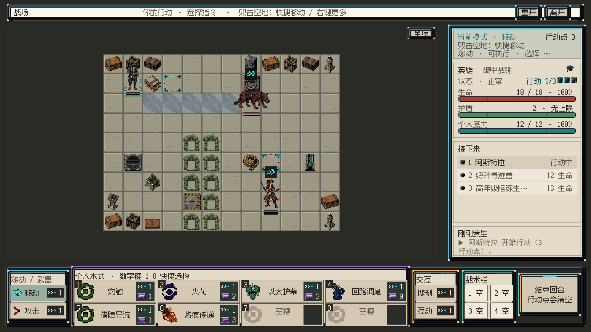
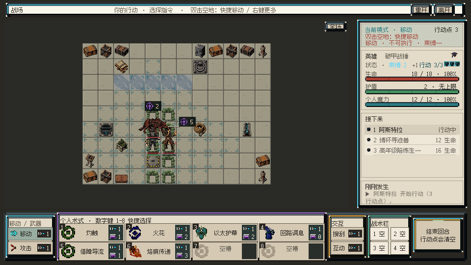
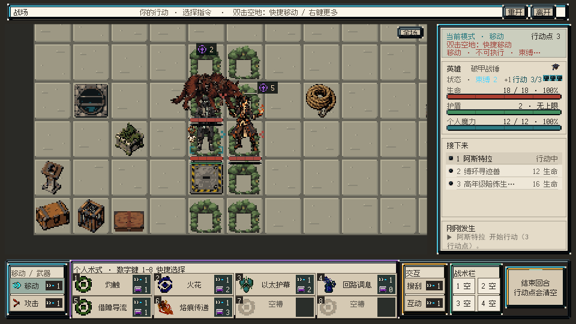

# 当前行动者定位与敌情避让

2026-09-05 · `codex/art-visual-iteration-20260905` · VISUAL-INTEGRATION-01继续进行。

## 目标、范围和结果

改善邻格战斗中当前行动者与敌情的辨识，范围属于两模式共用的FormalBattlefieldView、CombatIntentLayout和美术规格。验收覆盖默认、E3/E4/F3灯藤邻格、视口边缘、128px放大、行动者切换、移动足底与拥挤降级；实机和人工审美继续保留。

已经落实：

- 当前行动者脚下显示单个角标，64px格内为56×12，线宽2、角长8；128px档倍增。友方冷青、敌方封存红，随视觉足底而非结算终点移动，离屏时隐藏。
- 敌情徽记保留原图标和伤害值；布局按固定顺序、最多25个候选保护角色主体、血盾、状态区和其他徽记，优先减少遮挡，再选择较近位置。默认无碰撞位置保持不动。
- 移动后的徽记用短正交引线指回原挂接点；完全离屏的角色不把徽记拉进视口。引线按需创建与复用，拥挤样本只创建4个线段Image，避免给108个空/有单位格预置432个隐藏Image。
- 位移徽记接收原单位格位的悬停、左键和右键入口。实际离屏Canvas射线命中后，显示位置下方为G4，事件仍路由到对应敌人的F3；主角保持E3，未触发下方空格移动。

未改变角色64px画布世界倍率、身体足底排序、地形贴图、单位属性、指令数值或正式资产状态。角标/引线是界面几何，不是新生成美术。

## 画面

邻格样本中，右侧施法者徽记向右避让，短引线保留归属；主角足下增加角标。求解器对其保护矩形报告剩余遮挡0。角色肩部与兽类、藤叶仍较密集，不能将该计数解释为全部轮廓问题或审美已通过。

临时场景使用生产B1状态和UI。拥挤样本将主角置E3、敌人置E4/F3并添加既有束缚/破势状态，仅存在于临时内存。渲染沿用前轮离屏Camera方法，未进入Play Mode。范围淡入依赖Editor当前时间步，截图中的范围显隐不作动画时序证据。

## 验证证据

| 项目 | 结果 |
|---|---|
| 新增布局检查 | 8项，覆盖默认不移动、邻格避让、血盾/徽记共同保护、两方向视口边界、完全拥挤的确定性降级、64/128足底随行 |
| 初次定向检查 | 35/35通过 |
| 布局、离屏补修与按需创建后的全量检查 | 792/792通过，25.14秒，job `11c5a8e5-f3bf-499b-a30c-cd687fd438bc` |
| 最后点击绑定补修后的相关检查 | 47/47通过，1.39秒，job `b7131145-6323-454a-8715-55ad1ecb93bb`；此后未重复全量 |
| 位移徽记点击探测 | badgeRaycast=True；clickedSource=(5,2)等于敌人位置；屏幕下方格=(6,3)；主角仍(4,2) |
| 离屏检查 | 放大并聚焦主角时，离屏enemy_1徽记隐藏，仍可见enemy_0徽记保留 |
| 行动者切换 | EndTurn后的真实ActiveUnitId=enemy_0，角标转至该单位并采用Danger色 |
| 单位数据比较 | UI构建前后单位位置、生命、护盾、魔力、AP与状态一致 |
| 编译/Console | 无脚本编译错误或警告；Console缓存未发现error |

代码使用角色主体的保守矩形，不是逐像素透明轮廓；极密集画面仍可能找不到无遮挡位置，此时保留信息并增加CrowdedIntentCount。候选数量有界不等于实机帧耗已达标。

本轮全量回归分别在初版、离屏补修和按需创建之后执行；每次由新改动触发，最后保存完整792项结果。最终追加点击绑定后用47项相关回归和生产Canvas射线/回调探测验证。

## 新发现与下一步

束缚样本右栏显示“不可执行”，但移动范围仍会出现。已核对到 BattlefieldPresentationAdapter.cs 的IsInMoveRange：它只检查英雄是否行动、曼哈顿距离、终格阻挡与占位，没有纳入束缚或真实绕障碍路径。下一步应将显示范围与真实移动合法性统一，并检查行动点、缓慢/地形代价、阻挡与可达路径，避免蓝色范围误导玩家。该问题未在本轮改动，已同步总案后续顺序。

角色轮廓与灯藤材质仍需进一步打磨；不将脚下角标作为角色美术完成的替代。战斗记录SimHei/FusionPixel12冲突仍待用户裁决。Play Mode授权问题仍待答复；实际输入循环、动态演出、性能与完整流程尚未验收。水面/灯藤v3保持QA_PENDING、批准0/2。

本轮在主工作树执行，无新worktree、场景保存或正式资产替换。最终主场景仍dirty=False、playing=False；总案回读同步至rev345，机器合同和规格同步。

主要原始证据：full_tests.json、focused_tests.json、click_tests.json、placement_final.json、offscreen_audit.json、actor_transfer_audit.json、click_identity.json、compilation.json、console.json、unity_identity.json、master_final.json。归档C#为临时检查脚本，不进入Assets编译。
