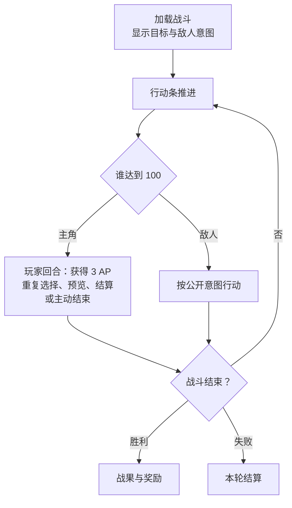
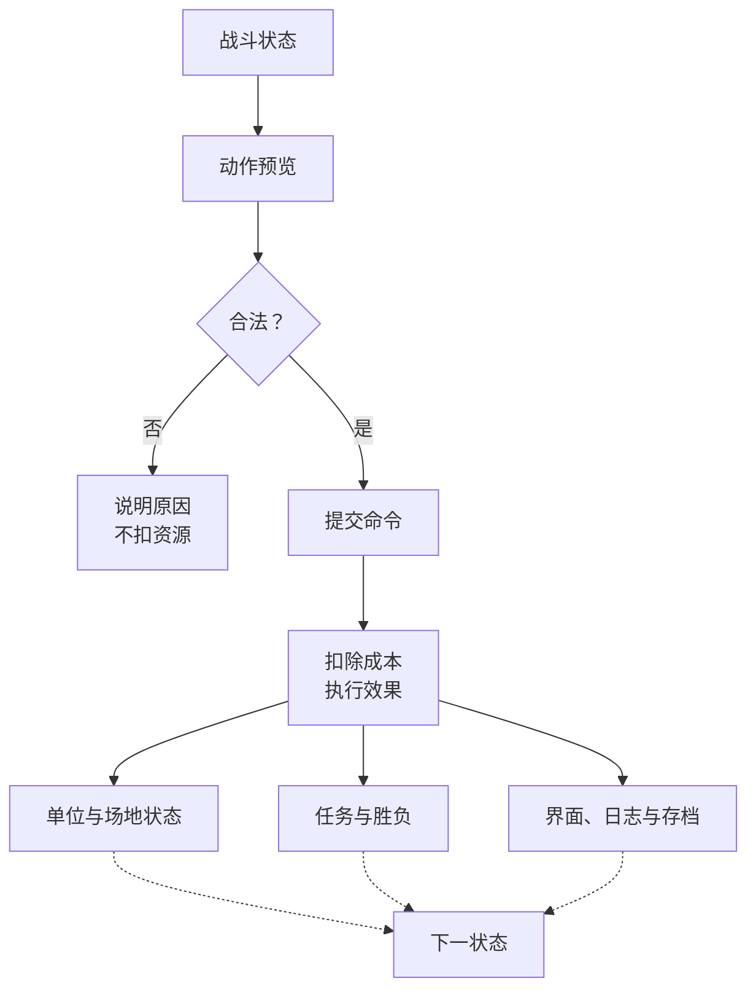

<title>OCC 游戏策划案</title>

| 项目 | 内容 |
|-|-|
| 类型 | 单主角确定性回合制战棋、Roguelite、角色扮演 |
| 平台 | PC |
| 画面 | 正交 2D 像素 |
| 当前内容 | 学院第一阶段 |
| 文档地位 | 项目第一参考、第一准则、唯一活动策划源 |
| 更新时间 | 2026-09-07 |

<callout emoji="💡">
**文档导航**
- 游戏框架系统：第1章
- 地图推进系统：第2章
- 战斗系统：第3章
- 构筑与资源系统：第4章
- 界面与表现系统：第5章
- 首次体验系统：第6章
- 数据索引：第7章
- 美术规范与视觉反馈：附录 A
</callout>

# 1. 游戏框架系统

## 1.1 模式与核心流程

每个新存档先进行一次固定体验：从固定出身三件套开始，到第一场精英战后的商店首次展开，或以精英战死亡结束。之后进入常驻学院轮次，内容池由版本配置决定。

> 固定出身 → 进入首次地图 → 战斗或处理事件 → 领取奖励 → 工坊与医务室 → 第一场精英战 → 商店首次展开 → 常驻学院体验

进入节点前显示危险度、耗时、敌人、任务目标和奖励类型。完成节点后保留生命、魔力、道具消耗和获得的物品。

### 1.1.1 游戏模式

肉鸽模式：地图、敌群和奖励由种子生成。同一种子生成相同内容。生命归零后结束本轮。

剧情模式：使用固定主角与章节。允许回访、补支线、调整装备和重复挑战。不设倒计时、拖延惩罚和永久错过。剧情存档与肉鸽存档分开保存。

## 1.2 完整一局边界

### 1.2.2 一局边界

| 边界 | 定义 |
|-|-|
| 创建 | 确定模式、单轮种子、内容版本与初始状态；生成结果写入存档，读档不重新抽取。 |
| 开始 | 玩家确认出发配置并取得学院地图控制权。新存档固定首次体验属于同一存档的引导段，不替代常规轮次。 |
| 推进 | 选择可达节点，完成战斗、事件或服务，结算资源与奖励，再返回地图。已完成节点可回访但不重复结算。 |
| 首领进入 | 现行基准为学院时序达到 28 后进入首领阶段；完成 12 个节点后允许提前挑战。 |
| 胜利 | 完成首领战及其奖励结算，生成本轮总结并结束单轮状态。 |
| 失败 | 肉鸽模式中主角生命归零，完成当前失败结算后结束单轮状态；不得继续开放未获得的节点或奖励。 |
| 中断恢复 | 只从已确认的保存点恢复。写入失败保留原存档；候选、事件结果、商店库存和节点内容不得因退出或读档刷新。 |

## 1.3 流程状态机

### 1.3.1 总体阶段

> 启动与存档选择 → 新存档固定引导（仅首次） → 单轮创建与出发整备 → 常规学院地图循环 → 首领门槛 → 首领战 → 胜利结算；任一战斗失败或主动放弃 → 失败／放弃结算。

| 阶段 | 进入条件 | 阶段职责 | 唯一正常出口 |
|-|-|-|-|
| P0 存档入口 | 启动完成 | 新建、继续、设置、存档异常处理 | 固定引导或单轮创建 |
| P1 固定引导 | 新存档且未完成引导 | 固定出身、短图、三战、事件、服务、精英与商店 | 标记引导完成并进入单轮创建 |
| P2 单轮创建 | 引导已完成且当前无活动单轮 | 写入模式、种子、版本、40 节点内容和初始资源 | 出发整备 |
| P3 地图循环 | 单轮有效且未进入首领阶段 | 预览路线并处理战斗、事件和服务节点 | 继续循环、进入首领或失败 |
| P4 首领阶段 | 主动提前挑战或学院时序达到门槛 | 锁定普通路线，完成首领准备与战斗 | 胜利或失败结算 |
| P5 单轮结算 | 首领胜利、生命归零或主动放弃 | 生成总结，关闭活动单轮并保存最终结果 | 返回学院入口 |

### 1.3.2 状态清单

| ID | 状态 | 玩家可执行动作 | 离开条件 |
|-|-|-|-|
| F00 | 学院入口 | 开始新游戏、继续、查看行程与行囊、辅助设置 | 选择有效存档动作 |
| F01 | 新存档确认 | 确认覆盖、取消 | 创建成功或返回 F00 |
| F02 | 固定引导 | 按第 6.2 节完成固定流程 | 精英后商店结算完成或引导中死亡 |
| F03 | 单轮创建 | 确认开始、取消返回入口 | 完整单轮状态写入成功 |
| F04 | 出发整备 | 查看并调整装备、术式、战术栏和背包；确认出发 | 配置合法且保存成功 |
| F10 | 学院地图 | 查看资源、路线与节点；选择可达节点；申请提前挑战首领 | 确认前往节点或首领 |
| F11 | 节点预览 | 查看危险、时序成本、敌人／事件性质、目标和奖励类型；前往或取消 | 确认前往后更新当前位置并保存；取消返回 F10 |
| F20 | 战前准备 | 查看任务、敌人、地形和公开意图；调整允许的战前配置；出发或暂不挑战 | 确认出发创建战斗状态；暂不挑战返回 F10 |
| F21 | 战斗 | 提交合法命令、结束回合、暂停、返回标题、放弃本轮 | 任务完成、主角死亡或放弃 |
| F22 | 战斗结果 | 查看任务结果、战损、资源变化和奖励资格；确认结算 | 成功保存节点结果后进入 F40；死亡进入 F61 |
| F30 | 事件 | 查看公开选项、条件、成本和结果；确认一项或离开 | 选项原子结算后进入 F40 或 F10；未选择可返回 F10 |
| F31 | 工坊 | 锻造、专精、查看结果、退出 | 每次交易单独保存；退出返回 F10 |
| F32 | 医务室 | 治疗、购买餐食、查看持续效果、退出 | 每次交易单独保存；退出返回 F10 |
| F33 | 商店 | 购买、比较、整理背包、退出 | 每次交易单独保存；退出返回 F10 |
| F40 | 奖励领取 | 查看来源和候选；选择奖励；确认领取或明确放弃 | 奖励写入或放弃记录保存成功 |
| F41 | 背包处理 | 移动、装备、调整战术栏、丢弃或放弃待领奖励 | 所有待处理物品有合法去向并保存成功 |
| F50 | 首领门槛 | 查看进入原因、当前资源与不可逆后果；确认或取消提前挑战 | 主动确认，或强制阶段完成所有待结算后进入 F51 |
| F51 | 首领准备 | 查看首领目标与公开阶段信息；完成最后整备；确认挑战 | 配置合法后创建首领战斗状态 |
| F52 | 首领战 | 沿用 F21 战斗命令 | 首领目标完成进入 F60；主角死亡或放弃进入 F61 |
| F60 | 胜利结算 | 领取首领奖励、处理背包、查看本轮总结、返回入口 | 结算保存并关闭活动单轮 |
| F61 | 失败／放弃结算 | 查看失败原因、本轮路线、战斗和资源记录；返回入口 | 结算保存并关闭活动单轮 |
| F70 | 确认弹窗 | 确认或取消覆盖、放弃、丢弃、退出和不可逆进入 | 返回来源状态或执行唯一确认命令 |
| F71 | 保存／版本异常 | 重试、读取安全备份、返回入口 | 完整性校验通过；失败时不得覆盖原存档 |

### 1.3.3 核心状态转换

| 来源 | 动作或条件 | 目标 | 原子结果 |
|-|-|-|-|
| F00 | 新游戏确认 | F02 | 创建新存档并写入固定引导版本；失败留在 F01 |
| F02 | 精英后商店完成 | F03 | 标记固定引导永久完成；不自动生成第二次固定短图 |
| F00 | 继续且存在活动战斗 | F21／F52 | 恢复最后一个完整命令后的战斗状态 |
| F00 | 继续且存在待领奖励 | F40／F41 | 先解决阻塞状态，不允许绕回地图 |
| F00 | 继续且存在普通活动单轮 | F10 | 由单轮与节点状态重建地图界面 |
| F03 | 确认创建 | F04 | 一次性生成地图、内容池、节点状态和库存并保存 |
| F10 | 选择节点 | F11 | 只生成预览，不移动、不扣除资源 |
| F11 | 确认前往 | F20／F30／F31／F32／F33 | 更新当前位置并保存；节点内容不重新抽取 |
| F21 | 战斗任务完成 | F22 | 停止接受战斗命令，生成只读结果，不提前发奖 |
| F22 | 确认成功结算 | F40 | 一次性写入战损、节点完成、学院时序和待领奖励 |
| F30 | 确认事件选项 | F40／F10 | 先检查条件，再一次写入成本、结果、节点完成和待领奖励 |
| F31／F32／F33 | 确认一次交易 | 原状态 | 合法性、成本、物品去向和库存变化一次保存；失败不扣费 |
| F40 | 奖励确认 | F41／F10／F60 | 空间不足进入 F41；写入成功后才清除待领奖励 |
| 任一节点结果 | 学院时序达到强制门槛 | F50 | 先完成结果、奖励和背包处理，再设置强制首领阶段 |
| F10 | 满足节点数并申请提前挑战 | F50 | 只显示确认；取消不改变状态，确认后不可返回普通路线 |
| F52 | 首领目标完成 | F60 | 写入首领结果与待领奖励；奖励处理后关闭单轮 |
| F21／F52 | 生命归零 | F61 | 记录失败战斗，不结算成功节点、学院时序或胜利奖励 |

### 1.3.4 保存与恢复规则

- 持久状态包括单轮种子与内容版本、完整地图和节点内容、当前位置、节点状态、学院时序、资源、构筑、库存、事件选项与结果、服务使用记录、待领奖励、首领阶段标记和活动战斗状态。
- 界面页签、悬停、滚动、临时预览和未确认选择不作为玩法存档。继续游戏时，由活动战斗、待领奖励、强制首领或普通单轮等权威阻塞状态决定恢复页面。
- 战斗在创建时保存入口快照，并在每个完整命令结算后保存活动战斗状态。中途返回标题或进程关闭后恢复当前战斗，不把退出当作免费重开。
- 肉鸽模式不提供“重开本战”。原重开入口在肉鸽模式禁用并显示原因；剧情模式是否允许重试由任务配置决定。主动放弃肉鸽战斗等同放弃本轮，进入 F61。
- 节点确认前、节点结果确认后、事件选择、每次服务交易、奖励领取或放弃、背包处理、首领阶段切换及最终结算后保存。任何命令只有在玩法结果与对应保存同时成功后才离开当前阻塞状态。
- 保存失败时保留上一份有效存档和当前内存状态，显示 F71。玩家可以重试；不能通过返回地图绕过未保存的成本、结果或奖励。
- 加载时先验证内容版本和完整性。能够迁移时先建立安全副本再迁移；不能迁移时保留原文件并说明原因，不静默重建地图、刷新内容或覆盖单轮。

### 1.3.5 节点完成合同

| 节点 | 完成条件 | 学院时序 | 回访 |
|-|-|-|-|
| 普通战斗 | 任务目标完成且结果确认 | +2 | 只显示结果摘要并作为通路，不重开战斗或再领奖 |
| 精英战斗 | 任务目标完成且结果确认 | +3 | 只显示结果摘要，不刷新精英奖励 |
| 首领 | 首领任务完成且胜利结算 | 记录 +3 后结束单轮 | 不可在活动单轮内回访 |
| 事件 | 确认一个合法结束选项 | +1 | 显示已选结果，不再选择或领奖 |
| 工坊 | 首次到达即标记访问；交易分别结算 | 0 | 可回访；已用次数和库存不刷新 |
| 医务室 | 首次到达即标记访问；治疗与餐食分别结算 | 0 | 可回访；治疗、餐食选项与次数不刷新 |
| 商店 | 首次到达即标记访问；购买分别结算 | 0 | 可回访；库存、价格与售罄状态不刷新 |

在地图中单击节点只打开 F11。只有确认“前往”才改变当前位置。到达战斗节点后可以在 F20 暂不挑战并返回地图，但角色仍停留在该节点；再次进入不重抽敌人、地形或奖励。

### 1.3.6 阻塞与异常恢复

| 情况 | 必须提供的恢复路径 | 禁止行为 |
|-|-|-|
| 背包空间不足 | 奖励留在待领取区；允许整理、装备、调整战术栏、确认丢弃或明确放弃奖励 | 自动丢弃、自动替换装备、退出后清除奖励 |
| 事件无力支付 | 至少保留一个不产生负余额的合法结束选项，可为空手离开 | 所有选项同时非法形成死路 |
| 服务货币不足 | 保留项目并显示不足原因，允许退出 | 负数资源、部分购买或隐藏价格 |
| 学院时序到达 28 | 先完成当前节点、奖励和背包，再进入 F50；普通节点随后锁定 | 在结算中途打断、吞掉奖励或允许再刷零时序收益 |
| 提前挑战首领 | 显示不可逆确认和当前未完成路线；取消仍可继续 | 误触直接锁图、确认后返回普通路线 |
| 战斗中退出 | 保存最后完整命令后的战斗并返回标题；继续时恢复 | 把退出当重开、结算未发生结果或刷新敌人 |
| 保存失败 | 停留在当前阻塞状态并重试；原存档可用 | 显示成功、继续跳转或覆盖原存档 |
| 版本不兼容 | 安全迁移或拒绝加载并保留原存档 | 静默重置、刷新单轮或删除内容 |

# 2. 地图推进系统

## 2.1 学院地图与节点

学院地图共 40 个节点，分为 6 个区域。

地图使用固定的学院区域结构，每个节点都有明确的区域归属。生成节点内容时，区域特色敌人和区域特色事件的出现概率高于通用内容，但不完全排除其他内容。抽取结果由单轮种子决定并写入存档。

区域只规定内容权重，不把敌人和事件锁死在单一区域。后续世界冒险继续使用同一规则：不同地区配置自己的敌人、事件和奖励权重，地图生成器按所在地区抽取内容。

- 只能前往与当前位置相连的节点。
- 地图显示区域、连线、当前位置、已完成节点和可达节点。
- 单击节点后打开摘要，不立即进入。
- 摘要显示名称、类型、危险度、耗时、奖励和进入按钮。
- 完成节点后更新当前位置和可达节点。
- 顶部显示生命、魔力、金币、学院贡献、阶段进度和已完成节点。

### 2.1.1 节点类型

| 类型 | 内容 | 完成后 |
|-|-|-|
| 普通战斗 | 标准敌群与任务目标 | 发放基础奖励 |
| 精英战斗 | 强敌与复合场地规则 | 发放精英奖励 |
| Boss | 固定首领与阶段规则 | 进入阶段结算 |
| 工坊 | 装备锻造、术式专精 | 消耗材料并保存结果 |
| 医务室 | 按最大生命比例恢复生命；购买随机餐食 | 扣除费用并恢复或获得餐食增益 |
| 商店 | 购买装备、法宝和材料 | 扣除费用并获得内容 |
| 事件 | 选择公开选项 | 修改资源、物品或路线 |

不存在“服务”和“宝藏”节点。原服务按功能拆入工坊、医务室或商店；原宝藏内容拆入事件或商店。

### 2.1.2 首次存档固定地图节点数量

| 内容 | 数量 |
|-|-|
| 普通战斗 | 3 |
| 事件 | 3 |
| 工坊 | 1 |
| 医务室 | 1 |
| 精英战斗 | 1 |
| 精英后商店 | 1 |
| Boss | 0 |

开始节点不计入内容节点。首次存档固定地图共有 10 个内容节点，范围到第一场精英胜利后的商店首次展开；精英前为 8 个内容节点。该固定短图是 40 节点常规学院地图之前的首次体验，不使用随机生成，也不包含首领战。

### 2.1.3 战前餐食

医务室同时提供恢复和战前餐食。每次进入医务室节点时，从餐食池中无重复抽取 3 种。玩家支付金币、材料或学院贡献，选择一种持续 3 场战斗的临时增益。

| 餐食 | 费用 | 持续效果 |
|-|-|-|
| 强攻炖肉 | 3 金币 | 武器直接伤害 +2 |
| 导能热饮 | 1 学院贡献 | [个人魔力](https://jcnlgassfnsm.feishu.cn/docx/Y1KydFPjMocJjYxMmFEcTblcnLf#doxcnA9XrJJNmEP7gSZsoCursUb)上限 +2；进入战斗时恢复满 |
| 岩盐浓汤 | 1 份学院食材 | 每场战斗开始获得 6 护盾 |
| 疾行烤串 | 3 金币 | 每个自己回合第一次移动的[步数](https://jcnlgassfnsm.feishu.cn/docx/Y1KydFPjMocJjYxMmFEcTblcnLf#doxcnPG7pIeIZWtLBO8Rikv69mb) +1 |
| 节流茶 | 1 学院贡献 | 每场战斗第一次施放术式时魔力成本 -1，最低为 0 |
| 坚韧面包 | 1 份学院食材 | 最大生命 +4；每场战斗开始恢复 4 生命 |
| 猎团香汤 | 4 金币 | 每场战斗第一次武器命中额外造成 4 伤害 |
| 清醒粥 | 1 份学院食材 | 每场战斗第一次受到负面状态时，持续时间 -1 回合，最低为 1 回合 |

- 餐食选项由单轮种子和医务室节点决定，生成后写入节点状态。
- 同一医务室节点重新打开或读档时不重新抽取。
- 恢复和购买餐食互不排斥，每个医务室节点各可执行一次。
- 同时只能存在一种餐食增益。
- 有餐食增益时不能购买新餐食。
- 每完成一场战斗，剩余场数减 1。未进入战斗不减少。
- 剩余场数为 0 时移除增益。
- 餐食不是装备、术式或法宝，不占槽位。

## 2.2 奖励、失败与存档

### 2.2.1 奖励

- 节点达到成功条件并完成结果确认后，才创建该节点的奖励状态。进入节点、打开战果或仅完成部分目标都不能提前发放奖励。
- 奖励来源包括金币、学院贡献、装备、术式、卷轴、法宝及节点配置声明的其他内容；普通战、精英、事件和 Boss 分别读取自己的奖励表，不能互相回退抽取。
- 需要抽取的候选由单轮种子、节点 ID、奖励表版本和既有抽取状态决定，生成后立即写入节点状态。重新打开页面或读档必须返回同一组候选，不能重抽。
- 奖励页必须显示来源、全部候选、精确效果、数量或使用次数、占用空间或栏位、与当前构筑的差异，以及不可领取的唯一原因。未冻结的内容必须明确标记待定，不能用临时条目代替。
- 玩家完成配置要求的选择并确认后，系统一次性写入所得内容、奖励已领取状态与相关解锁。写入成功前不能清除候选或离开奖励流程；写入失败时保留原状态并允许重试。
- 背包或栏位不足时，奖励保留在待领取区并进入 F41。玩家必须为每项内容选择合法去向，或在该奖励允许放弃时明确确认放弃；不能自动丢弃、自动替换装备或因退出清除奖励。
- 下一套 Build 三场普通战后的固定三选一属于必选奖励，不能直接关闭或放弃。其他奖励是否允许放弃由节点配置声明。
- 已完成节点回访时只显示历史结果，不重复生成或发放奖励。

### 2.2.2 失败与放弃

- 战斗命令结算后若主角生命降至 0，立即锁定战斗输入并进入失败流程；不再推进其他单位、行动条或未发生的触发，也不生成未获得的胜利奖励。
- 肉鸽模式的战败会进入 F61：保留本轮已发生的路线、战斗、资源和构筑记录，生成失败总结，保存后关闭当前单轮状态。失败页只提供结束本轮并返回入口。
- 玩家主动放弃战斗或单轮与战败进入同一结算出口，但总结必须分别记录“死亡”或“主动放弃”及发生位置，不能把两者混为同一原因。
- 剧情模式的失败出口由战前简报明确声明，可以是重伤、撤离或重试；剧情探索不得因失败附加未公开的倒计时、地点永久错过或拖延惩罚。
- 返回标题、暂停或正常关闭游戏只保存并中断当前流程，不等同于主动放弃。继续游戏必须从最近一个成功保存点恢复。
- 主动放弃、覆盖存档、放弃奖励和丢弃高价值物品必须先显示对象、不可逆后果及确认／取消；取消不改变状态。

### 2.2.3 阶段结算

- 阶段结算的输入是已锁定的节点或单轮结果；战斗、事件或服务仍有未完成命令、待领取奖励、待处理物品或保存请求时，不得提前结束阶段。
- 节点结算依次完成：锁定结果→结算节点耗时与资源变化→生成或确认奖励资格→处理奖励去向→写入节点完成状态与解锁→保存→返回地图或进入下一阶段。任何一步失败都保留当前阻塞状态，不重复扣费或重复发奖。
- 单轮结算记录模式、种子与版本、起始和最终路线、完成节点、战斗结果、最终装备与术式、资源变化、剩余物资、人物标签、胜利／死亡／放弃原因和未解锁内容。
- 结算页只读取已保存结果，不再修改玩法数值。玩家确认离开后才关闭活动单轮并返回学院入口；保存失败时保留原单轮与结算页，允许重试。
- 同一结算请求必须幂等：重复点击、网络重试、重新打开或读档不能重复消耗学院时序、服务次数、货币、道具，也不能重复获得奖励或解锁。

# 3. 战斗系统

## 3.1 战斗规则与执行模型

### 3.1.1 运行原则

- 游戏结果只由当前状态、配置数据和玩家或 AI 提交的命令决定。
- 相同状态执行相同命令，必须得到相同结果。
- 肉鸽内容在创建单轮时由种子生成并写入存档。读取存档不重新生成地图、敌群、事件和奖励。
- 战斗不使用命中、闪避和暴击随机。允许效果从一个或多个合法目标中按种子抽取；抽取所需状态写入战斗存档，确保相同存档状态提交相同命令时得到相同目标与结果。
- 界面只读取状态、提交命令和显示结果，不直接修改游戏数值。

### 3.1.2 状态层级

| 层级 | 保存内容 | 规则 |
|-|-|-|
| 单轮状态 | 模式、种子、训练路线、当前位置、已访问节点、已完成节点、资源、生命、魔力、装备、术式、背包、待领奖励 | 贯穿本轮，节点之间持续保存 |
| 节点状态 | 节点类型、进入条件、敌群或事件、玩家选择、完成结果、奖励状态 | 每个节点只完成一次；回访不重复结算 |
| 战斗状态 | 地图、单位、位置、[行动点](https://jcnlgassfnsm.feishu.cn/docx/Y1KydFPjMocJjYxMmFEcTblcnLf#doxcnotsNJZwSylkCxvyvE2c5Qd)、行动条、状态、冷却、任务目标、战斗日志 | 进入战斗时创建，战斗结束后按继承规则写回单轮状态 |
| 界面状态 | 当前页面、选中目标、预览、提示、弹窗 | 由前三层生成，不作为玩法结果来源 |

### 3.1.3 战斗流程与命令结算

#### 3.1.3.1 战斗进行流程

一场战斗按下图循环：



#### 3.1.3.2 命令结算流程



- 确认前状态变化时，旧预览失效，须重新预览。
- 命令通过全部检查后一次性写入，不允许部分执行；多段命中逐段结算。
- 效果按配置顺序处理；伤害后结算附带状态、位移与场地，最后检查胜负并刷新界面、日志和存档。

### 3.1.4 行动合法性

| 检查 | 通过条件 |
|-|-|
| 行动单位 | 单位存活，轮到该单位行动，战斗尚未结束 |
| 资源 | [行动点](https://jcnlgassfnsm.feishu.cn/docx/Y1KydFPjMocJjYxMmFEcTblcnLf#doxcnotsNJZwSylkCxvyvE2c5Qd)、魔力、冷却和使用次数满足配置 |
| 空间 | 目标格在地图内，可到达，未被阻挡或占用 |
| 目标 | 阵营、目标类型、射程和视线满足配置 |
| 状态 | 束缚、破势等状态没有禁止该动作 |
| 内容 | 对应装备、术式、道具或交互物存在且可用 |

任何一项不通过，界面保留原按钮并直接显示原因。

### 3.1.5 行动条与回合推进

- 行动条范围 0～199；每个时间单位增加有效速度值，达到 100 获得回合。
- 单位行动时，战斗时间和其他单位的行动条暂停。
- 回合结束扣 100；溢出保留，但不能超过 199。
- 同时达到阈值时，依次比较行动条、有效速度和固定顺序。
- 加速／减速改变增长；行动提前／延后直接改变当前值，最低为 0。
- 回合开始：清旧护盾→结算新护盾与装备→状态→冷却→死亡／胜负→重置行动点。
- 主角可连续行动或主动结束；敌人执行一次公开意图后结束。结束时清空行动点。
- 死亡或退出的单位移出行动条；目标达成后立即结束战斗。

#### 示例图

<whiteboard token="U5RUwJFnghU0mIbeuQ9c0tO4nle"></whiteboard>

速度决定充能快慢；行动后扣 100，溢出保留。

### 3.1.6 单位、属性与可用动作

单位是战斗状态中的行动主体。每个单位必须具有稳定单位 ID、阵营、所在格、存活状态、属性、可用动作和当前战斗内效果；界面、AI、预览与结算必须读取同一份单位状态，不能各自维护另一套数值。

#### 3.1.6.1 基础属性

| 属性 | 定义与边界 |
|-|-|
| 生命 | 分为当前生命与生命上限。当前生命降至 0 时单位死亡，立即失去占位、目标资格和后续回合。治疗不能超过当前生命上限。 |
| 个人魔力 | 分为当前值与当前上限，用于支付术式成本。进入战斗时恢复到当前上限；战斗中不足时对应术式不可提交。统一称为“个人魔力”，不使用“蓝量”。 |
| 护盾 | 只在当前战斗内存在，按伤害结算顺序先于生命承受伤害；生命周期与回合刷新见 3.1.10。 |
| 行动点 | 单位在当前自身回合内支付动作费用的资源。获得回合时重置为 3，结束回合时清空；不能跨回合储存。 |
| 行动条 | 当前战斗中的行动进度，范围为 0～199；达到 100 时进入待行动状态。增长、溢出、排序和移除规则见 3.1.5。 |
| 速度 | 决定行动条随战斗时间增长的速率。有效速度由基础值和当前修正共同得到，排序与增长均读取有效速度。 |
| 步数 | 一次移动行动最多可经过的路径格数。基础为 5 格；迟缓时为 3 格；临时加成只影响其声明的移动行动。 |

- 生命、个人魔力、行动点和行动条均不得低于 0；有上限的属性不得超过当前上限。
- 动作结算、状态变化或装备变化导致属性改变时，先完成该命令的全部结算，再统一刷新单位状态、可选动作和界面。
- 装备改变生命上限时，当前生命如何变化尚未冻结。在该规则确认前，不投放会在战斗中改变生命上限的装备效果。

#### 3.1.6.2 玩家可提交的动作

| 动作 | 合法性与费用 | 结算结果 |
|-|-|-|
| 移动 | 当前单位可行动、至少有 1 行动点、目标格可达；消耗 1 行动点 | 沿预览路径移动至目标格，逐格处理进入、经过与邻接触发；实际路径不得超过当前步数。 |
| 武器动作 | 满足武器配置的行动点、射程、视线、目标和装备条件；不消耗个人魔力 | 按当前装备武器的动作配置结算。没有统一的“四格范围”或固定伤害。 |
| 术式 | 满足术式配置的行动点、个人魔力、冷却、射程、视线和目标条件 | 一次性扣除已预览费用，再按配置结算伤害、护盾、位移、状态或场地效果。 |
| 战术道具 | 道具已装入战术栏，使用次数、行动点、射程、视线和目标均满足该道具配置 | 扣除配置费用与一次使用次数并结算效果；战术道具不统一设为零行动点。 |
| 搜刮／互动 | 目标是正交相邻且可交互的容器、设备或任务物；满足其配置费用 | 搜索容器默认消耗 1 行动点；揭示内容后，拿取本次已揭示物品不再重复扣行动点。空间不足时进入待处理状态。其他互动按对象配置结算。 |
| 战斗中整理 | 当前规则允许进入且至少有 1 行动点 | 消耗 1 行动点后打开整理界面，可调整装备与战术栏；关闭界面不返还费用。 |
| 结束回合 | 当前单位拥有回合且没有未完成的命令或阻塞结算 | 清空剩余行动点，执行回合结束流程并交还行动权。 |

- 玩家只控制主角。临时友军与敌人由 AI 控制，但使用与玩家相同的移动、目标、费用、场地和伤害规则，不获得隐藏豁免。

#### 3.1.6.3 敌人与友军 AI

- 每个 AI 单位在获得回合前公开本回合的一条完整意图，包括动作类型、目标或目标规则、主要效果和可见费用。
- AI 只从当前合法动作中选择，并按该单位配置的确定性优先级裁决；相同战斗状态与随机种子必须得到相同选择。
- 敌人任一动作结算后耗尽全部剩余行动点并结束自身回合，因此不能先移动再追加攻击。临时友军按已预览意图执行；其每回合动作次数必须由友军配置明确声明，不能沿用敌人规则或由运行时猜测。
- 原意图变得不合法时，AI 按公开的备用优先级重新选择；不存在合法动作时执行停留并结束回合。AI 不得读取玩家未公开的信息，也不能绕过阻挡、射程、视线、资源或目标检查。

### 3.1.7 战场、格子与空间

战场由遭遇配置决定尺寸、边界、初始单位、目标、地形与交互物。12×9 格是下一套 Build 首次战斗的当前规格，不是所有战场的全局固定尺寸。

#### 3.1.7.1 空间与坐标合同

- 战场使用正交方格。移动只连接上、下、左、右相邻格；路径长度与无特殊说明的射程均按横纵格距离计算，斜向不视为相邻。
- 边界外坐标始终无效，不能成为移动、放置、生成或目标格。
- 每格固定包含 1 个瓦片层、至多 1 个玩法物块、至多 1 个单位和独立的可见效果层。
- 瓦片层表示地表材料，例如普通地面、水面及其他可进入代价；玩法物块表示轻掩体、重掩体、灯藤、水晶、容器、设备和任务物；单位层只保存主角、友军或敌人的占位；效果层显示火场、警示区等效果，不能替代瓦片或物块。
- 本 Build 不允许同格叠放多个玩法物块。一个格子最多一个单位；被阻挡或已被单位占用的格不能穿过，也不能成为主动移动终点。
- 移动与视线先读取瓦片，再读取玩法物块并合并结果。轻掩体可进入且不阻挡视线；重掩体不可进入并阻挡移动和视线。其他对象是否阻挡、可破坏或可互动由其配置明确声明。

#### 3.1.7.2 创建与运行边界

- 遭遇开始前必须验证地图尺寸、出生格、单位占位、目标格和必需交互物。出生格不得越界、阻挡或重叠；配置无合法落点时不得进入战斗，并报告具体对象与原因。
- 初始位置、任务目标、敌群和地形由任务配置。开战后显示全部敌人、任务目标、地形、交互物和敌方公开意图；本规则不引入战争迷雾或隐藏陷阱。
- 玩家只控制主角；临时友军由 AI 控制，其预定目标、路径和主要结果在结算前可预览。
- 地形或物块被创建、破坏、点燃、熄灭或改变后，移动、视线、目标合法性、掩体与交互查询立即读取新状态；已经失效的旧高亮和旧预览必须清除。
- 目标格、撤离格与出生格是配置语义，不额外占用单位层；若需要实体物件，必须另以玩法物块配置，并同时满足占位规则。

<grid>
<column width-ratio="0.453051">

</column>
<column width-ratio="0.546949">

</column>
</grid>

#### 3.1.7.3 首次体验特色地块与关卡路径

- 首次体验使用三种特色地块机制槽 `A`、`B`、`C`。三场普通战依次使用 `A+B`、`B+C`、`A+C`；精英战的特色地块组合待定。
- 特色地块可以由攻击、单位靠近、单位进入、移动经过、消耗行动点交互、受击或被破坏等公开条件触发。触发条件与结果必须由配置定义，不在命令执行过程中临时猜测。
- 特色地块对所有单位遵循同一套规则。玩家可以主动利用，也可以引诱敌人触发；系统不得只对主角生效或为敌人提供隐藏豁免。
- 特色地块不是通关钥匙。忽略特色地块时关卡仍须可完成；利用机制只提供更优解、资源优势或更低战损。
- 每张首次体验战场至少配置 3 条可验证的理想通关路径。路径需要说明入口、关键决策点、利用的机制、风险和预期收益，而不是只记录一条最短路。
- 第二、第三场普通战必须让玩家立即试用刚获得的术式或装备；具体术式、地图位置与数值待定。
- 首次体验地图保持低复杂度：每张普通战只组合两种特色机制，触发条件必须一看就懂，规则说明默认隐藏并可通过悬停查看。
- 悬停说明采用“短标题＋主要效果＋必要关键词解释”的分层结构。敌人公开意图、状态、特色地块和资源术语使用相同的信息密度，不长期占用战斗 HUD。
- 敌人的意图、人设、外观、技能表现与技能效果必须由同一内容身份关联；允许配置战斗台词增强代入感，但台词不得代替公开意图或规则提示。

#### 3.1.7.4 关卡场地设计

- 先确定场地是什么地方、原本做什么、材料从哪里来，再设计敌人和玩法。不能先放一个效果再替它补故事。
- 每种特色材料先只给一条最容易凭常识理解的规则。材料的流动、燃烧、脆裂、遮挡或重量变化必须有可见来源和结果。
- 敌人必须因场地而改变行动：创造、寻找、穿行、改变、利用或避开材料都可以；把材料移走后，其优先路线、攻击几何或威胁时机应发生变化。
- 玩家和敌人使用同一套场地规则。玩家的反制必须能说清楚物理理由，例如绕开、引开、烧掉、灭火、打碎、隔断或利用同一条路线。
- 首次体验不使用隐藏陷阱、随机战斗结果或敌人全知来制造压力。失去视线后的敌人按固定脚本搜索；通过移动、停顿与动画传达其判断，不额外显示最后目击点或搜索路线。

### 3.1.8 行动提前与行动延后

- 行动提前与行动延后都直接修改目标当前行动条：提前增加，延后减少；数值由动作、术式、装备或状态配置给出，不设统一的“轻延时／重延时”固定值。
- 修改后行动条始终限制在 0～199。普通动作不会隐式改变行动条；只有配置明确写出的提前或延后效果才会修改。
- 单位已经获得当前回合后，行动延后不会中断或撤销这个回合，只影响回合结束后的剩余进度；结束回合仍按 3.1.5 扣除 100，结果最低为 0。
- 当前单位行动期间战斗时间暂停。其他单位若因直接提前效果达到 100，只进入待行动队列，必须等当前回合及其全部结算完成后再按行动条、有效速度、固定顺序裁决。
- 同一命令含有多个行动条效果时，严格按配置顺序逐项结算，每一步都执行 0～199 截断；预览必须显示最终行动条、是否进入待行动状态和预计顺序变化。
- 死亡或退出战斗的单位不再接受行动条效果，并立即从待行动队列移除。

### 3.1.9 命中与伤害

- 攻击默认命中。
- 不使用命中率、闪避率和暴击率。
- 同一次命中的伤害合并成一个伤害包。
- 多次命中分别结算。
- 百分比减伤先于护盾结算。同类取最高，异类相乘，总上限 50%，结果向上取整。
- 伤害默认先扣护盾，再扣生命。
- 确认攻击前显示目标、伤害、状态、消耗和行动顺序变化。

### 3.1.10 护盾与掩体

- 普通护盾只在当前战斗有效。
- 自身回合开始时清除旧护盾，再结算新护盾。
- 不同来源的护盾可以叠加。
- 同一来源每回合只触发一次。
- 轻掩体可进入，不阻挡视线，每回合结束时提供 2 点护盾。
- 重掩体不可进入，阻挡移动和视线。位于正交相邻格时，每回合结束时提供 4 点护盾。
- 同一回合内，换位和折返不会重复触发掩体护盾。
- 破势会清空护盾，并阻止目标获得新护盾，持续到目标下一回合结束。

### 3.1.11 状态

当前有效的单位状态只有燃烧、迟缓、束缚和破势；眩目与显形已删除。火场、烟尘、水面、冰面、强光、暗区、导电路径和任务地形属于瓦片、玩法物块或效果层机制，不是单位状态，但可以按配置施加或移除状态。

| 状态 | 固定语义 | 仍由来源配置的字段 |
|-|-|-|
| 燃烧 | 在声明的触发窗口对单位造成伤害 | 每次伤害、触发窗口、持续时间、重复施加规则 |
| 迟缓 | 生效期间步数变为 3 格 | 持续时间、重复施加规则 |
| 束缚 | 生效期间不能主动移动 | 持续时间、重复施加规则；是否限制特定强制位移必须由效果另行声明 |
| 破势 | 施加时清空护盾，并禁止获得新护盾，持续到目标下一次自身回合结束 | 来源与施加条件 |

- 每个状态实例必须记录状态类型、来源单位或场地、来源内容 ID、施加时机、剩余持续量、触发窗口和重复施加规则。缺少其中任何会影响结果的字段时，该内容配置无效，不能在运行时猜测。
- 重复施加必须明确选择刷新持续时间、增加持续时间、替换、独立并存或无效之一。没有显式规则时不默认叠层，也不默认刷新。
- 持续量只在状态声明的窗口扣减。触发效果、扣减持续量、移除状态与死亡检查的先后顺序必须固定，并同时用于预览和实际结算。
- 状态施加、触发、移除和抵抗结果都写入战斗日志。单位信息与动作预览显示状态名称、主要效果、剩余持续量、来源以及会阻止当前动作的原因。
- 普通状态在战斗结束时清除，不带入下一场战斗。需要跨战斗持续的餐食或其他效果属于单轮增益，必须使用独立数据，不伪装成普通战斗状态。

### 3.1.12 战斗结束

- 达成任务目标后结算，不要求默认清场。
- 肉鸽模式中，主角生命归零后结束本轮。
- 剧情模式按任务配置进入重伤、撤离或重试。

### 3.1.13 节点结算与存档

- 选择节点只更新当前位置。节点耗时、奖励和进度在节点结果确认后统一结算。
- 学院时序是肉鸽模式记录节点推进程度的进度值。普通战斗消耗 2，精英战斗和首领战消耗 3，事件消耗 1，其他节点不消耗。
- 学院时序不提供生命自然恢复；生命只能通过治疗、餐食或其他明确公开的效果恢复。
- [学院时序](https://jcnlgassfnsm.feishu.cn/docx/Y1KydFPjMocJjYxMmFEcTblcnLf#doxcnttYlL4FS4wO15V6AQkYiSf)达到 28 时，完整结算当前节点后进入首领阶段。提前挑战首领需要完成 12 个节点。地图通行与首领进入不再检查额外进度凭证；普通节点按连通关系开放。
- 已完成节点可以回访，但不重复消耗[学院时序](https://jcnlgassfnsm.feishu.cn/docx/Y1KydFPjMocJjYxMmFEcTblcnLf#doxcnttYlL4FS4wO15V6AQkYiSf)，不重复获得奖励。
- 战斗结束后保存生命、魔力、道具消耗、背包、装备、术式和战利品；下一场战斗开始时魔力恢复到当前上限。[行动点](https://jcnlgassfnsm.feishu.cn/docx/Y1KydFPjMocJjYxMmFEcTblcnLf#doxcnotsNJZwSylkCxvyvE2c5Qd)、行动条、冷却、普通状态和护盾不带入下一场战斗。
- 创建单轮、选择节点、确认事件选择、战斗结算、领取奖励和修改装备或背包后自动保存。
- 存档写入前必须通过完整性检查。写入失败时保留原存档并提示玩家。

# 4. 构筑与资源系统

## 4.1 局内资源

| 资源 | 规则 |
|-|-|
| 生命 | 战斗间保留；归零后本轮结束 |
| 个人魔力 | 施放术式时消耗；每次进入战斗恢复满 |
| 行动点（行动资源） | 单位在自身回合内使用的行动资源；回合开始时重置为 3 点。主角的移动、攻击、术式、换弹、道具和互动按配置消耗；敌人任一已结算动作会耗尽本回合全部剩余行动点；回合结束时清空未使用点数 |
| 金币 | 商店购买、医务室治疗和餐食消费 |
| 学院贡献 | 用于学院成长与节点服务 |
| 节点耗时 | 计算路线成本 |
| 道具次数 | 使用后扣除；战斗结束不自动补充 |
| 背包 | 下一套 Build 固定为 6×10 格；后续版本由所装备的背包决定容量；物品按实际尺寸占格 |

## 4.2 装备、术式与背包

### 4.2.1 装备

角色有 9 个装备位：头 1、胸 1、鞋 1、背包 1、戒指 2、项链 1、武器 1、施法单元 1。

- 武器位只能装备一件武器。
- 背包位决定背包容量和背包被动。
- 施法单元负责个人魔力上限、术式成本和术式触发效果。
- 没有副手、手部、腿部、魔导核心和独立导具位；现有条目后续按新栏位重归类。

装备没有耐久度。装备配置包括动作、射程、伤害、消耗、状态、词条和使用条件。

#### 4.2.1.1 确定性锻造

装备有主体位和回路位。玩家只能在工坊选择装备、部件位和背包内的材料，确认前显示唯一结果。锻造不随机，不重掷。

| 装备栏位 | 主体位：承力合金 | 回路位：导能晶片 |
|-|-|-|
| 武器 | 基础武器伤害 +2 | 每个自己回合第一次武器命中后获得 2 护盾 |
| 头、胸、鞋 | 自己回合开始获得 2 护盾 | 每场战斗第一次受到负面状态时，持续时间 -1 回合，最低 1 回合 |
| 背包 | 容量增加 1 行 | 每场战斗第一次打开背包不消耗行动点 |
| 施法单元 | 个人魔力上限 +1 | 每场战斗第一次施放术式时魔力成本 -1，最低 0 |

- 下一套 Build 每件装备最多完成一次锻造，只能占用一个部件位，安装后不能更换。
- 戒指和项链保留装备位，下一套 Build 不投放对应装备，也不开放锻造。
- 材料占用背包格，锻造后消耗。

### 4.2.2 术式

- 学院阶段有 8 个术式槽。
- 装备后的术式可直接使用，不抽牌，不随机禁用。
- 术式只能在战斗外更换。
- 进入战斗后锁定当前配置。
- 术式显示[行动点](https://jcnlgassfnsm.feishu.cn/docx/Y1KydFPjMocJjYxMmFEcTblcnLf#doxcnotsNJZwSylkCxvyvE2c5Qd)、魔力、冷却、延时、射程、目标和效果。
- 当前火系术式共 60 个：近战 20、通用 20、远程 20。

#### 4.2.2.1 术式专精

玩家只能在工坊选择术式和背包内的专精材料，确认前显示唯一结果。专精不随机，不重掷。下一套 Build 每个术式只能选择一种专精，安装后不能更换。

| 术式 | 增幅刻墨 | 节流刻墨 |
|-|-|-|
| 灼触 | 伤害 8→10 | 魔力 1→0 |
| 火花 | 伤害 6→8 | 魔力 2→1 |
| 以太护幕 | 护盾 6→8 | 魔力 2→1 |
| 回路调息 | 恢复魔力 2→3 | 冷却 1→0 |
| 热脉增压 | 追加火伤 8→10 | 魔力 3→2 |
| 熔势贯击 | 下次近战命中额外造成 2 火伤 | 魔力 3→2 |
| 武器热载 | 追加火伤 8→10 | 魔力 2→1 |
| 火弹 | 伤害 12→14 | 魔力 2→1 |

### 4.2.3 道具与背包

- 战术栏有 4 格。
- 卷轴通常使用 1 次后销毁。
- 法宝配置独立使用次数和启动方式。
- 下一套 Build 的背包固定为 6×10 格；后续版本由所装备的背包决定容量。
- 空间不足时进入整理界面。整理完成后才能离开节点。
- 允许消耗一点行动点进入整理界面
- 在整理界面允许更换装备，更换战术栏
- 背包只负责存放装备和材料。装备锻造和术式专精只能在工坊完成。
- 法宝获得时即为完整形态，不存在等级、强化位或强化材料。
- 法宝合成不进入下一套 Build，正式版暂不立项。

### 4.2.4 当前内容

| 内容 | 数量 |
|-|-|
| 基础术式 | 4 |
| 火系术式 | 60 |
| 学院装备 | 32 条数据（含 2 条待重归类、1 条停用待重写） |
| 装备词条 | 13 |
| 通用法宝 | 20 条数据（含 2 条停用待重写） |
| 学院敌人 | 10 |

# 5. 界面与表现系统

## 5.1 界面流程

下面按玩家第一次可能遇到的顺序排列。可选页面放在第一次能打开它的位置；战斗、事件和功能节点再次出现时沿用同一套规则。

### 5.1.1 首启设置（02）


**界面说明：**第一次启动游戏时设置音量、分辨率和显示方式。

**交互规则：**可以调整、恢复默认或继续。继续后保存到本机并进入世界观介绍。

### 5.1.2 世界观介绍（03）


**界面说明：**用四页内容介绍世界背景和以太素。

**交互规则：**可以前后翻页或跳过。看完或跳过后进入学院入口，以后可在档案中重看。

### 5.1.3 学院入口（04）


**界面说明：**游戏的主入口，可以开始新档、继续游戏、查看行程和打开设置。

**交互规则：**没有存档时“继续游戏”不可用。有存档时开始新游戏，会先打开覆盖确认。

### 5.1.4 行程与行囊（20，可选）


**界面说明：**查看角色、路线、资源、装备、术式、战术栏和已读介绍。

**交互规则：**本页只负责查看。需要改装备时进入整备页，改动按整备规则保存。

### 5.1.5 辅助设置（18，可选）


**界面说明：**调整声音、画面、动画、震动、文字大小和键位提示。

**交互规则：**可以逐项修改或恢复推荐值。选择“保存并返回”后写入本机，不影响战斗结果。

### 5.1.6 确认弹窗（19，按需出现）


**界面说明：**用于覆盖存档、放弃本轮、返回标题和丢弃高价值物品等重要操作。

**交互规则：**弹窗会写清对象和后果，默认选中取消。取消不改任何状态；确认后不能重复提交。

### 5.1.7 固定出身三件套（05）


**界面说明：**同页展示首次体验固定的出身、天赋和专属术式。

**交互规则：**可以查看完整说明、返回或确认。确认后创建存档；返回不会创建存档。

### 5.1.8 学院介绍（06）


**界面说明：**介绍六个学院区域、节点状态和地图怎么走。

**交互规则：**读完后继续。每个存档只自动出现一次，以后可在行程与行囊中重看。

### 5.1.9 单轮介绍（07）


**界面说明：**说明本轮目标、学院时序和首领出现条件。

**交互规则：**点击开始后进入出发整备。关闭说明不会重抽地图、敌人、事件或奖励。

### 5.1.10 出发整备：装备与背包（11A）


**界面说明：**整理装备和六行十列背包，并查看物品占格和详细效果。

**交互规则：**可以拖动、旋转、装备、卸下和整理。合法改动立即保存；有待领奖励时必须先腾出位置。

### 5.1.11 出发整备：术式与战术栏（11B）


**界面说明：**安排八个术式位和四个战术栏位。

**交互规则：**先选内容，再放进合法槽位。可以替换、移除或查看详情，离开前会检查并保存。

### 5.1.12 学院地图（08）


**界面说明：**显示节点、路线、当前位置、可达状态、资源和学院时序。

**交互规则：**点击节点只会更新摘要，不会马上前往。缩放、复位和查看地图都不消耗学院时序。

### 5.1.13 节点摘要与出发准备（09）


**界面说明：**显示节点类型、消耗、任务目标、敌人、地形和奖励类型。

**交互规则：**确认前往后保存当前位置；确认出发后进入对应节点。选择先不挑战会返回地图，但角色仍在这个节点。

### 5.1.14 战斗界面（14）


战场、HUD 与指令区见图；操作流程见 3.1.3.1，快捷键见 5.2。

### 5.1.15 战斗菜单与悬停说明（15）


**界面说明：**显示右键菜单、移动路线、目标预览和对象说明。

**交互规则：**取消预览不扣资源；输入方式见 5.2。

### 5.1.16 战斗背包（23，可选）


**界面说明：**在战斗中整理装备、材料和战术栏。

**交互规则：**可整理和换装；不能锻造或专精术式。费用见 3.1.6.2。

### 5.1.17 战斗结果（21）


**界面说明：**胜利时显示任务结果和战损，失败时显示失败原因和已经发生的损失。

**交互规则：**胜利只能继续到奖励；失败只能进入本轮结算。肉鸽模式不能在这里重开本场战斗。

### 5.1.18 战后奖励（16）


**界面说明：**同时显示三个奖励、完整效果、占用位置和与当前构筑的差别。具体候选内容待定。

**交互规则：**先选一个，再确认领取。前三场普通战不能跳过；空间不足时先整理背包，奖励不会消失。

### 5.1.19 事件节点（10）


**界面说明：**显示事件正文、当前资源，以及每个选项的条件、花费和确定结果。

**交互规则：**先选选项，再确认。付不起的选项会说明原因，并且始终保留一个能结束事件的合法选项。

### 5.1.20 工坊（11C）


**界面说明：**给装备锻造，或给术式选择专精，并显示材料和安装前后差别。

**交互规则：**选目标、位置和材料后确认安装。结果确定、安装后不能更换；每次加工单独保存。

### 5.1.21 医务室（12）


**界面说明：**查看当前生命，完成健康确认，并选择治疗或餐食。

**交互规则：**健康确认免费，但不会回血。治疗和餐食会先显示价格与结果，购买后分别保存，也可以不买直接离开。

### 5.1.22 商店（13）


**界面说明：**显示商品、价格、完整效果、背包占位和售罄状态。

**交互规则：**点击可购买商品后直接扣款并处理去向。钱不够或商品售罄时会说明原因；离开和读档都不会刷新库存。

### 5.1.23 单轮结算（17）


**界面说明：**汇总本轮路线、完成节点、最终构筑、资源和人物记录。

**交互规则：**还有战斗、待领奖励或未完成保存时不能进入。确认结束后保存总结并返回学院入口。

### 5.1.24 提示、说明与键盘焦点（22，全流程共用）


**界面说明：**统一展示轻提示、悬停说明、不能操作的原因和键盘焦点。

**交互规则：**Tab 切换焦点，Enter 确认，Esc 返回。首次教学按实际操作逐条出现，看过的不重复弹；其他提示不改玩法状态，同一时间只显示最重要的一条原因。

## 5.2 战斗操作、快捷键与状态颜色

### 5.2.1 战斗鼠标操作

| 输入 | 作用 |
|-|-|
| 左键 | 选择并查看预览 |
| 双击可达格 | 移动 |
| 右键 | 打开可用操作 |
| 鼠标悬停 | 查看详情 |
| 滚轮 | 缩放战场 |
| 中键拖动／空格＋左键拖动 | 拖动画面 |

### 5.2.2 战斗键盘快捷键

| 按键 | 作用 |
|-|-|
| Tab | 切换焦点 |
| 数字键 1–8 | 主界面：选择术式 |
| B | 开关战斗背包 |
| T | 开关键盘选格 |
| WASD／方向键 | 移动目标光标 |
| Enter／空格 | 确认目标 |
| Ctrl＋Enter | 主角回合：结束回合 |
| Home | 镜头移回主角 |
| Esc | 取消操作或关闭顶层界面 |
| R | 背包：旋转物品 |
| F | 搜索容器或拿取物品 |
| Ctrl＋F | 背包：定位搜索框 |
| 数字键 1–4 | 背包：放入对应战术栏 |

学院地图复位键待定；肉鸽模式没有重开战斗快捷键。

### 5.2.3 状态颜色

| 颜色 | 用途 |
|-|-|
| 冷青 | 选中、可达、可执行 |
| 红色 | 敌人、伤害、非法操作 |
| 绿色 | 治疗、安全、成功 |
| 黄铜 | 物资、维护、交互、战利品 |

颜色只作提示；能否执行以动作预览为准。

# 6. 首次体验系统

## 6.1 固定内容规格

### 6.1.2 固定地图拓扑

```text
          事件1          工坊          精英战 ─ 商店
            │             │              │
起点 ── 战斗1 ───── 战斗2 ───── 战斗3
            │             │              │
          事件2          事件3          医务室
```

固定连线：O-B1-B2-B3、B1-EV1、B1-EV2、B2-W、B2-EV3、B3-X、B3-M、X-S。起点不计入内容节点；精英前有 8 个内容节点，精英和商店计入后共 10 个内容节点。

1. 战斗1完成后开放事件1、事件2；两事件可任意先后访问，两者都结算后开放战斗2。
2. 战斗2完成后开放事件3与工坊；事件3结算后开放战斗3。玩家可以提前加工并在第三战试用，也可以取得第三组奖励后无成本返回工坊。
3. 战斗3完成后开放医务室与精英战入口。首次锻造、首次专精和医务室健康确认都完成后，精英战才可进入；治疗和餐食不强制购买。
4. 击败精英并领取奖励后开放商店；精英战死亡则本轮结束，商店不开放。

- 大地图移动不消耗学院时序、金币、生命、法宝次数或其他资源。
- 玩家可点击任一已解锁节点；跨越已完成节点使用不超过 2 秒且可跳过的快速移动表现。
- 已完成战斗只作为通路，已结算事件只显示结果摘要。
- 工坊、医务室和商店可复访，但加工次数、治疗次数、餐食次数、选项结果与商品库存都不刷新。

### 6.1.3 固定出身三件套

| 类别 | 首轮固定内容 |
|-|-|
| 故事背景 | 护障检修户：主角出身于学院城外环的护障检修家庭，因一次成功的临时分流得到学院推荐。 |
| 出身天赋 | 就地接线 |
| 出身专属术式 | 借障导流 |

固定首次体验不提供其他出身或出身选择；后期转化待定。

### 6.1.4 固定遭遇与奖励结构

- 战斗1、战斗2、战斗3和第一场精英战的地图、敌人编成、单位初始位置、任务目标与敌方固定脚本全部写入首轮内容数据。
- 三场普通战斗结束后各提供一组固定三选一；候选集合固定，玩家选择不固定，形成 3×3×3=27 种基础奖励路径。
- 三组选项覆盖术式与装备。
- 事件1固定交付装备锻造材料与第一件有限次数法宝；事件2固定交付学院食材并在学院贡献与金币间选择；事件3固定交付术式专精材料并在学院贡献与第二件一次性法宝间选择。
- 精英奖励待定，不计入3×3×3基础路径；胜利并完成结算后开放商店。
- 三场普通战的特色地块组合固定为A+B、B+C、A+C。战斗1的A+B为水与灯藤；战斗2、战斗3和精英的具体效果待定。

#### 6.1.4.1 战斗1：雨后灯庭（正式规格）

**场景：**入学资格验证。护障检修户的推荐生在雨后旧校区外庭，对抗高年级陪练生·火矢及其缚环寻迹兽。两名对手均为训练身份，生命归零时分别以缚环熄灭和认输结算；主角生命归零仍按肉鸽战败处理。

**任务：**击倒缚环寻迹兽与高年级陪练生·火矢。没有倒计时、援军、逃离目标或额外互动目标。

**战场：**12×9；坐标 A-L、1-9。除下列内容外均为石板瓦片：水瓦片 C7-G7；灯藤物块 E1-F5；轻掩体 C3、H4、C8；重物块 A1、B1、L1、A2、L2、A9、B9、C9、H9、I9、J9、K9、L9。主角 B8，寻迹兽 H7，火矢陪练生 I2。边界外不可通行。

**水：**浅水。所有单位进入一格水时，主角消耗 2 点移动距离，寻迹兽消耗 1 点；进入水立即移除燃烧。水不造成伤害、不遮挡视线、不附加其他状态。

**灯藤：**可进入物块。所有单位进入一格灯藤消耗 2 点移动距离；灯藤阻挡双方视线。藤内单位只能攻击相邻目标，进行正常远程攻击前必须离开藤丛。可合法作用于物块的火焰立即烧毁一格灯藤，移除物块、露出原瓦片并留下纯视觉焦痕；不爆炸、不造成附带伤害。首发灼触与火花只能选敌人，不能直接选空格灯藤。

**固定出身三件套：**故事背景为护障检修户。出身天赋“就地接线”：每场战斗第一次完成移动后，若终点正交相邻于轻或重掩体，获得 2 护盾并恢复 1 点个人魔力。专属术式“借障导流”：1 AP、1 魔力、仅在正交相邻轻或重掩体时可对自身施放；获得 4 护盾，且本回合下一次移动行动的步数 +2；同回合不叠加。该术式必须在首战摘要与首次触发时明确说明其来源与条件。

**缚环寻迹兽：**12 生命、速度 10、导能撕咬为敌方全回合动作／射程 1／3 物理伤害；缚环扑咬为敌方全回合动作／1 魔力／冷却 1／射程 1／2 物理伤害并束缚 1 回合。可见主角时，若相邻且缚环扑咬可用则优先扑咬，否则沿固定最短路接近并撕咬。移动、撕咬、扑咬或嗅探均各自占用完整自身回合，移动后不能在同回合追加攻击。主角进入灯藤导致失去视线时，它沿主角最后进入藤丛的方向前往对应入口；抵达后完整停留一个自身回合嗅探；仍未重获视线则沿灯藤外围按 D1→D2→D3→D4→D5→D6→E6→F6→G6→G5→G4→G3→G2→G1 的顺时针格序循环搜索。同距离邻格固定按北→东→南→西裁决；远距离目标先求完整最低成本路径，再按本次移动预算截断。界面不显示最后目击点、搜索路线或灰色足迹；只通过移动、停顿与嗅探动画表达。寻迹兽没有其他涉水增益。

**高年级陪练生·火矢：**16 生命、速度 9。火矢为敌方全回合动作／2 魔力／冷却 1／射程 5／5 火焰伤害并施加燃烧 2 回合。焚藤开线为敌方全回合动作／1 魔力／冷却 0／射程 5，只能烧毁预设关键灯藤，且不会伤及藤内主角。可见主角且火矢射程合法时优先火矢；否则依次焚毁 F3→F4→F5；三格均已烧毁时，沿 I2→I4→H6 的固定路线移动至下一北侧射击点。同距离邻格固定按北→东→南→西裁决；每次只执行公开的一项动作，结算后结束自身回合，禁止运行时随机选择。

**公开信息：**开战显示两名敌人、任务、地形、灯藤／水悬停说明和敌人下一行动意图。寻迹兽失去视线后的确定性搜索规则可通过悬停说明查看，但不额外标示内部目标格或路线。

### 6.1.5 工坊、医务室与商店

| 节点 | 首轮固定规则 |
|-|-|
| 工坊 | 消耗固定材料，免费完成一次装备锻造和一次术式专精；结果在确认前完整预览。两项均为首轮一次性操作，复访不重置。 |
| 医务室 | 首次进入免费完成健康确认但不恢复生命。治疗支付 1 学院贡献并恢复最大生命的 50%，首轮限一次；餐食与治疗额度独立。 |
| 首轮餐食 | 固定展示强攻炖肉、导能热饮、岩盐浓汤，不随机重抽；三者沿用正式餐食费用与效果，最多购买一种。 |
| 精英后商店 | 固定库存为解构楔 3 金币、移相线轴 6 金币、测距护目镜 4 金币，各限购一件；离开、复访或读档不刷新。 |

### 6.1.6 确定性与存档

- 创建新存档时写入首轮版本号、固定地图图、节点内容、事件选项、三选一候选、敌人脚本、服务库存和商店库存。
- 选择节点、确认事件、完成加工、使用治疗或餐食、战斗结算、领取奖励和购买商品后立即保存。
- 退出、继续游戏和读取同一存档不能刷新任何候选、材料、法宝、敌人、服务次数或商品。
- 地图节点至少保存锁定、可达、推荐、完成、可复访、售罄／已使用状态。
- 旧存档迁移必须显式区分“尚未开始首次固定体验”和“已经处于旧版流程”，禁止静默覆盖正在进行的旧轮次。

## 6.2 逐段流程

### 6.2.1 首次流程时间计算

#### 6.2.1.1 计算口径

- 时间轴描述玩家实际看到、阅读、选择和确认的过程。累计时间采用“典型首次玩家”估算，不是倒计时。
- 设备首次设置只在本机首次启动时出现；世界观动画按游戏级首次播放；基础配置展示和学院阶段介绍按存档记录。
- 三场普通战的典型耗时包含教学与思考；另以第 6.2.2 节的 65–75 秒快速操作范围独立计时。
- 精英战暂按 120–180 秒计算；关卡完成后换成实测值。
- 默认顺序采用事件1→事件2、事件3→工坊。玩家可交换同层允许的访问顺序，整体流程不变。

#### 6.2.1.2 典型首次玩家累计时间

| 累计时间点 | 本段耗时 | 类型 | 玩家经历 |
|-|-|-|-|
| 0:00–0:02 | 2秒 | 固定 | OC世界品牌印记→OCC游戏品牌印记；可跳过品牌段 |
| 0:02–0:29 | 约27秒 | 设置 | 本机首次设置页；调整音量、分辨率和显示模式 |
| 0:29–0:31 | 2秒 | 操作反馈 | 应用设置；写入设备级设置 |
| 0:31–1:01 | 30秒 | 固定 | 世界观动画；游戏级首次播放；可跳过 |
| 1:01–1:24 | 约23秒 | 决策＋反馈 | 进入学院入口；选择新游戏和存档位；确认创建或覆盖 |
| 1:24–1:51 | 约27秒 | 阅读＋反馈 | 同屏阅读固定基础配置并确认 |
| 1:51–2:06 | 15秒 | 固定 | 学院阶段介绍；可跳过 |
| 2:06–2:43 | 约37秒 | 地图＋决策 | 地图展开；选择战斗1；阅读摘要与战前信息；确认并载入 |
| 2:43–5:03 | 约2分20秒 | 战斗＋教学＋决策 | 完成战斗1；快速操作另按65–75秒计时 |
| 5:03–5:23 | 约20秒 | 结果＋决策 | 只读战果；奖励1三选一；去向处理；保存返回地图 |
| 5:23–6:08 | 约45秒 | 事件＋决策 | 完成事件1和事件2；顺序可交换 |
| 6:08–8:15 | 约2分07秒 | 准备＋战斗＋战果 | 查看战斗2预览并完成战斗 |
| 8:15–8:45 | 约30秒 | 奖励决策 | 奖励2三选一并确认 |
| 8:45–10:05 | 约1分20秒 | 事件＋加工决策 | 完成事件3；工坊各完成一次锻造和专精 |
| 10:05–12:08 | 约2分03秒 | 准备＋战斗＋战果 | 查看战斗3预览并完成战斗 |
| 12:08–12:38 | 约30秒 | 奖励决策 | 奖励3三选一并确认 |
| 12:38–13:08 | 约30秒 | 整备决策 | 健康确认；可选治疗和餐食；核对精英门槛 |
| 13:08–15:41～16:41 | 约2分33秒～3分33秒 | 暂估 | 精英准备、风险确认、载入和精英战 |
| 15:41～16:41 至 16:26～17:26 | 约45秒 | 结果＋购物决策 | 精英战果和奖励；商店开放并首次进入；购买可选 |
| 16:26～17:26 至 16:36～17:36 | 约10秒 | 固定 | 离开商店；写入完成标记；进入常规单轮创建 |

按当前逐段估算，典型首次玩家总计为 16:36～17:36，概括为约17分钟；流程理解快、操作快的玩家约10分钟。两者分别是典型首次玩家和快速玩家的用时。

### 6.2.2 普通战计时范围

- 战斗1、战斗2、战斗3的快速操作时间均为 65–75 秒，三场基准值最大差不超过 10 秒。
- 从教程已跳过且首次开放战斗输入开始计时，到达成任务目标后的必要战斗演出结束。包含命令提交、移动、攻击、敌方行动和强制演出；排除加载、教程停顿、玩家思考、悬停、暂停、战前准备、战果页和奖励选择。
- 固定合法命令序列中，除系统等待外不增加人为停顿，也不使用空等、倒计时或无玩法意义的动画补时。
- 快速玩家全流程约 10 分钟；典型首次玩家按当前逐段计算约 17 分钟。

### 6.2.3 玩家顺序

| ID | 玩家阶段 | 必须完成 | 出口与保存 | 首次教学 |
|-|-|-|-|-|
| FR-00 | 学院入口与新存档确认 | 确认开始；已有存档时明确覆盖对象 | 成功创建固定体验版本后进入 FR-01；取消返回入口 | 开始、继续、设置与覆盖后果 |
| FR-01 | 世界观、固定基础配置与学院介绍 | 看完或跳过动画；同屏查看三项基础内容并确认；看完或跳过学院阶段介绍 | 基础配置和学院介绍状态写入后展开首次地图；典型首次玩家约 2:06 取得地图控制权 | 基础配置关系与阶段介绍 |
| FR-02 | 首次地图与战斗1预览 | 选择唯一可达的战斗1，查看摘要并确认出发 | 确认节点只更新位置并保存；确认出发后创建战斗状态 | 节点状态、摘要、任务、敌人、地形与奖励类型 |
| FR-03 | 战斗1 | 完成入学资格验证或生命归零 | 胜利进入只读战果；失败进入 F61 | 按第 6.2.4.1 节 B1-01 至 B1-09 触发 |
| FR-04 | 战斗1战果与第一组固定三选一 | 确认战果；从固定三项中选择一项并确认 | 战损、节点完成、奖励选择和解锁结果原子保存后返回地图 | B1-10、B1-11；生命跨战保留与奖励影响后续战斗 |
| FR-05 | 事件1与事件2 | 两节点均须完成，访问顺序自由；每个事件确认一个合法结束结果 | 每个事件独立结算并保存；两者完成后开放战斗2 | 公开条件、成本、确定结果、首次法宝与资源去向 |
| FR-06 | 战斗2预览、战斗与战果 | 确认出发并完成任务；查看战斗1奖励和事件1法宝的实际作用 | 胜利结果保存后进入第二组奖励；失败进入 F61 | 法宝、战术栏、次数，以及上一奖励的构筑反馈 |
| FR-07 | 第二组固定三选一 | 从固定三项中选择一项并确认 | 奖励写入后返回地图，同时开放工坊与事件3 | 比较当前构筑、已选奖励与新候选 |
| FR-08 | 工坊与事件3 | 事件3必须完成后才开放战斗3；工坊可在战斗3前后访问，但精英前必须各完成一次锻造与术式专精 | 事件选择和每次加工分别保存；退出返回地图，次数不刷新 | 确定性加工预览、材料去向、专精结果与回访状态 |
| FR-09 | 战斗3预览、战斗与战果 | 事件3完成后出发并完成任务 | 胜利结果保存后进入第三组奖励；失败进入 F61 | 组合使用已有奖励、法宝与加工结果 |
| FR-10 | 第三组固定三选一 | 从固定三项中选择一项并确认 | 奖励写入后返回地图，开放医务室与精英入口 | 精英前构筑检查与最后一次普通奖励 |
| FR-11 | 精英前整备 | 完成工坊的一次锻造、一次术式专精和医务室免费健康确认；治疗与餐食购买可选 | 三项强制条件均保存后精英入口可用；不足条件直接显示原因 | 生命不会自然恢复、治疗与餐食的成本及持续时间 |
| FR-12 | 精英准备与精英战 | 查看公开目标、敌情和当前构筑，确认不可逆挑战并完成任务 | 胜利进入精英战果；生命归零进入 F61 且商店不开放 | 多项构筑汇总、威胁检查与不可逆确认 |
| FR-13 | 精英战果、奖励与商店 | 完成精英结算和奖励处理；首次打开商店，购买可选 | 每次购买独立保存；离开商店后标记固定体验完成 | 价格、库存、售罄、读档不刷新与保留货币 |
| FR-14 | 固定体验结束 | 查看完成提示并继续 | 永久写入固定体验完成标记，进入常规单轮创建；不再次生成固定短图 | 首次教程完成；已见内容进入教程档案 |

### 6.2.4 页面与阻塞规则

- 战斗胜利先进入只读战果，再进入奖励；敌人退场、胜利标识、战果和奖励不能同时争夺输入。
- 三场普通战的固定三选一属于流程必选，不能直接关闭或放弃。背包或栏位不足时进入 F41，奖励保持待领取，解决去向并保存后才能返回地图。
- 事件必须先显示条件、成本和确定结果；无力支付时至少保留一个合法结束结果。固定交付的物品或法宝必须先解决背包或战术栏去向。
- 工坊、医务室和商店允许退出；尚未完成的精英前强制项继续显示在地图与精英入口，不用隐藏门槛或自动执行交易。
- 所有首次教学按状态触发并排队，一次只显示一条。教学层不改变玩法结果，跳过教学只标记教程，不跳过其对应的强制玩法动作。
- 任一战斗死亡或主动放弃按第 6.2.9 节关闭本次固定引导并进入失败结算；未获得的奖励、节点和商店不得开放。

#### 6.2.4.1 首次战斗教学

| ID | 什么时候出现 | 告诉玩家什么 | 怎么完成 |
|-|-|-|-|
| B1-01 | 战斗1加载完成 | 胜利目标、战场、右侧信息和底部指令 | 继续 |
| B1-02 | 敌人第一次显示意图 | 一条意图就是敌人本回合要做的事 | 了解 |
| B1-03 | 主角第一次可以行动 | 行动点、指令栏和结束回合 | 了解 |
| B1-04 | 第一次选择移动 | 可达格、路线和行动点花费 | 完成一次合法移动 |
| B1-05 | 第一次预览武器或术式 | 目标、结果和行动点、魔力、冷却花费 | 取消或执行动作 |
| B1-06 | 第一个敌人准备行动 | 行动条、当前敌人和公开意图 | 继续后播放行动 |
| B1-07A | 路线第一次受到浅水影响 | 浅水怎样改变移动花费 | 了解 |
| B1-07B | 路线第一次受到灯藤影响 | 灯藤对移动、视线和攻击的影响 | 了解 |
| B1-08 | “就地接线”第一次生效 | 护盾、魔力变化和效果来源 | 了解 |
| B1-09 | 主角第一次获得燃烧或束缚 | 状态效果、剩余时间和限制 | 了解 |
| B1-10 | 战斗1胜利 | 生命会带到下一战，个人魔力下场回满 | 确认战果 |
| B1-11 | 第一次出现三选一奖励 | 三个候选和确认位置 | 选择并确认 |

教学出现时暂停战斗，只允许当前教学要求的操作。快捷键见 5.2。

### 6.2.5 战果与三选一（FR-04／FR-06／FR-07／FR-09／FR-10）

#### Pixso 设计稿（2026-09-08）


- 页面／状态：胜利／失败战斗结果、三选一、Reward／Shop 共用物品详情卡。
- 关键交互：胜利战果只继续至奖励，失败战果只进入本轮结算；奖励页先选择再确认，空间不足转入 F41。

普通战胜利后固定经过“结束演出→只读战果→三选一→去向处理→返回地图”五个状态，三个奖励页面复用同一结构。

1. **结束演出：**目标达成后立即锁住战斗输入，只播放目标完成、敌人退场与胜利标识。演出结束自动进入战果，不在战场上弹奖励。
2. **只读战果：**显示任务结果、剩余生命、消耗的道具／法宝次数、获得的固定资源与本场首次触发记录。这里只提供“继续”，不允许改装备、领取奖励或返回地图。
3. **三选一：**同时显示三张固定候选卡和当前构筑摘要。卡片必须显示类型、占用位置、完整效果、与现有内容的差异以及会被下一战验证的标签；未选择时确认按钮禁用。
4. **选择确认：**第一次点击只选中，不立即领取；候选卡或物品详情内直接呈现完整信息，不另开结果预览。点击“确认选择”后弹出一次不可逆确认；确认前可自由改选，确认后候选集合与选择结果都不能通过读档刷新。
5. **去向处理：**无需占位的内容直接写入；装备或材料进入背包，术式进入术式库，战术物进入战术栏。空间不足时进入 F41，只显示当前奖励、现有容器和合法的装备／替换／丢弃去向；处理完成前奖励保持待领取。
6. **原子保存：**战损、节点完成、固定候选集合、最终选择、物品去向、教程标记和新节点解锁一次提交。保存失败留在当前确认态并允许重试，不得出现“奖励已消失但地图未解锁”。

第一组在战果后连续进入奖励；第二、第三组沿用相同状态，不重复基础教学，只增加“与已有构筑比较”和“精英前最后一次普通奖励”的一次性提示。

### 6.2.6 事件页面（FR-05／FR-08 的事件3）

- 地图点击事件节点先打开摘要层，显示事件类型、已知交付类型与“进入”；进入后才展示正文和选项。进入事件不消耗资源，确认结果才结算。
- 页面左侧保留场景正文与当前资源，右侧按选项显示条件、成本、确定结果和物品去向。信息不足时写“待定内容”，不能用问号遮住已经确定的成本或结果。
- 不满足条件的选项保留可见并紧邻显示原因；每个事件在任何合法到达状态下至少有一个无需额外补救即可结束的选项，避免死锁。
- 选项卡内直接显示条件、成本、确定结果和物品去向；点击只切换选中状态，不另开结果预览。涉及资源支付、放弃唯一物品或不可逆取舍时按“确认选择”提交；确认后播放简短结果反馈并进入领取／去向处理，不能返回改选。
- 事件1的锻造材料与第一件有限次数法宝为固定交付；事件2固定交付学院食材并在学院贡献与金币间选择；事件3固定交付专精材料并在学院贡献与第二件一次性法宝间选择。具体文案、数值和法宝身份以内容表为准。
- 每个事件单独原子保存“已进入、最终选项、资源变化、物品去向、节点完成”。事件1、2均完成后才开放战斗2；事件3完成后开放战斗3。

### 6.2.7 工坊（FR-08／FR-11）

#### Pixso 设计稿（2026-09-08）


- **页面／状态：**工坊首页与加工卡。
- **关键交互：**选择加工类别与目标，核对合法材料和安装前后差异，确认后独立保存；可随时返回地图。
- 工坊首页固定显示“装备锻造”和“术式专精”两个入口、各自首次完成标记、当前材料与精英门槛进度；已完成的一类仍可查看结果，但下一套 Build 不提供重置或改装。
- 锻造按“选择装备→选择主体位或回路位→选择合法材料并在当前卡内核对唯一结果→确认安装”推进。术式专精按“选择术式→选择增幅刻墨或节流刻墨→选择材料并在当前卡内核对唯一结果→确认安装”推进。
- 唯一结果信息直接显示在当前加工卡内，包括安装前后差异、材料消耗、占用部件位／专精分支和“安装后不能更换”，不另设结果预览块。材料不足、目标已加工或对象不合法时按钮禁用并显示单一原因。
- 每次加工确认后立即独立保存并刷新精英门槛。玩家可在战斗3前完成，也可战斗3后免费返回；离开工坊不会刷新材料、候选或次数。
- 工坊允许随时退出到地图，但首次锻造和首次专精未各完成一次时，精英入口持续显示未完成项，不弹窗代替玩家操作。

### 6.2.8 医务室与精英门槛（FR-11）

#### Pixso 设计稿（2026-09-08）


- **页面／状态：**医务室首页、健康确认与服务卡。
- **关键交互：**免费健康确认只记录状态；治疗与餐食各自购买并单独保存；离开返回地图。
- 医务室首页显示当前／上限生命、不会自然恢复的说明、免费健康确认、治疗和餐食三个区。免费健康确认只是检查并记录状态，不恢复生命，也不自动购买服务。
- 治疗与餐食在当前服务卡内直接显示价格、支付后资源、恢复量或持续范围，不另设结果预览块；不需要的服务允许跳过，余额不足时保留可见并说明差额。具体价格、治疗量和餐食内容以经济表为准。
- 每次治疗或购买单独保存，读档不刷新次数。免费健康确认完成后写入唯一门槛标记；离开医务室返回地图。
- 精英入口始终可点击查看，但只有“首次锻造、首次专精、健康确认”三项全部完成时才可出发。未满足时显示三项清单、当前状态和对应节点跳转；治疗、餐食和满生命都不是进入条件。

### 6.2.9 精英准备、失败与结算（FR-12／F61）

- 精英准备页显示公开任务、敌情、特色机制占位、当前生命与资源、装备／术式／法宝摘要，以及三项门槛检查。关卡内容未冻结的区域明确标记待定，不用虚构威胁。
- “开始挑战”前使用一次不可逆确认，明确主角生命归零会结束本轮、商店不会开放；确认后创建精英战状态并保存。
- 任一战斗死亡或主动放弃统一进入 F61：先结算已发生的战损，再显示路线、构筑、完成节点、死亡／放弃原因和未解锁内容。失败页只提供“结束本轮并返回入口”，不能从战果页领取未获得奖励。
- F61 会关闭这次一次性固定教学，后续新轮不再重播该固定引导。
- 精英胜利仍先显示只读战果，再处理精英奖励。精英奖励的具体形态待内容冻结；其去向与保存规则复用普通战奖励合同，完成后开放商店。

### 6.2.10 商店与固定体验结束（FR-13／FR-14）

#### Pixso 设计稿（2026-09-08）


- **页面／状态：**固定库存商店与 Shop 上下文物品详情。
- **关键交互：**点击可购买商品即进入扣款与去向处理；容量不足转入 F41；离开商店完成固定体验。
- 精英结算后自动回到地图并高亮新开放商店；首次打开商店是完成固定体验的强制动作，购买任何商品都不是强制动作。
- 商店显示保留货币、固定库存、价格、商品完整效果、占位需求和售罄状态；商品卡内直接显示交易所需信息，不另设交易结果预览或“确认交易”按钮。点击可购买商品即扣款、处理去向并单独保存。
- 背包或栏位不足时进入 F41，取消去向处理同时取消该笔购买且不扣款。余额不足、商品售罄或内容冲突时按钮禁用并在商品附近说明原因。
- 离开商店时若无未完成交易，写入固定体验完成标记并进入 FR-14。完成提示只说明固定引导结束、教程档案位置和下一轮将进入常规单轮创建；确认后返回学院入口。
- 固定库存、售罄、购买结果和完成标记读档不刷新。完成标记一旦写入，后续轮次不再生成这张固定短图。

### 6.2.11 页面层级、返回与输入归属

- 同一时刻只有一个最高输入层：战场结束演出、战果、奖励、去向处理、事件确认、加工确认、精英确认和失败结算互不叠加抢输入。
- Esc 只关闭最上层可取消界面。只读战果、已确认事件结果、待领取奖励、加工提交中、精英创建中和保存提交中不能用 Esc 越过。
- 地图摘要、商店商品详情、未提交的事件选项和未提交的加工选择可取消；取消只撤回本地选择，不改变资源或节点状态。
- 所有不可用操作在原位置保留并说明原因；普通错误贴近按钮显示，只有覆盖存档、放弃战斗、丢弃高价值物品和不可逆挑战使用确认框。
- 教学层按队列逐条显示，覆盖期间只接受教学操作、继续或跳过；跳过只关闭教学说明，不代替奖励选择、事件确认、加工、健康确认或首次打开商店。

### 6.2.12 保存与恢复

- 所有提交按钮，以及直接提交购买的商品卡，进入“提交中”状态并防止重复输入；成功后再播放完成反馈和开放下一出口，失败则保留原选择、显示重试，不预先扣款或清除候选。
- 读档恢复到最近已提交状态：待选奖励回到同一候选集合，未确认事件回到选项页，已确认结果回到领取／去向处理，加工与购买只恢复为提交成功或未发生两种状态。

# 7. 数据索引

## 7.1 数据表

数值与内容条目保存在 `Worldbuilding/数据表/`：

- `OCC_核心规则数值表_v1.0.csv`
- `OCC_基础术式数据表_v1.0.csv`
- `OCC_火系个人术式数据表_v1.0.csv`
- `OCC_学院装备数据表_v1.0.csv`
- `OCC_通用法宝数据表_v1.0.csv`
- `OCC_学院敌人数据表_v1.0.csv`
- `OCC_学院遭遇编成数据表_v1.0.csv`
- `OCC_首次体验战斗规格数据表_v1.0.csv`
- `OCC_教程触发数据表_v1.0.csv`
- `OCC_首次体验流程数据表_v1.0.csv`
- `OCC_首次体验时间轴_v1.0.csv`
- `OCC_学院节点内容数据表_v1.0.csv`
- `OCC_经济与服务数据表_v1.0.csv`
- `OCC_美术与界面规格表_v1.0.csv`
- `OCC_下一套Build内容表_v1.0.csv`
- `OCC_锻造与专精数据表_v1.0.csv`
- `OCC_餐食增益数据表_v1.0.csv`

# 附录 A 美术规范与视觉反馈

目标：默认看全战场，清楚辨认单位、所属格、地形、可执行操作与结算结果；所有表现必须与真实玩法状态一致。

## A.1 方向与信息层次

首战方向为雨后学院的维护秩序：质朴石材、旧木、锻铁与可维护以太装置，暖纸档案界面。当前焦点与即时危险优先，其次单位，再次玩法物块、普通地面与装饰。冷青用于主动以太及选择可执行，红用于敌对伤害非法，黄铜用于维护交互物资，绿用于治疗安全成功；自然植物与水保留材质色。水与灯藤仍按已冻结规则，不新增爆炸、伤害、遮挡或搜索路线提示。

## A.2 像素与布局

1920×1080参考画布，上部地图75%、右HUD25%；底栏1888×200、外边距16，五组宽度200/1100/152/176/204。战场默认64px参考格，提供128px放大档，两档在960×540都保持整数像素倍率；全场默认768×576，位于顶栏下与底栏上安全区。32px地面与64px单位使用同一世界像素倍率，单位画布为逻辑格的两倍，逻辑仍占一格；脚底锚点不漂移，人物和意图按足底与空间分层。默认64px格的血条56×8、护盾56×4，足下分行；128px格按两倍显示。单位越格、相邻遮挡及藤内表现必须实机复核。

语义图16×16最多4色；材质拾取物24×24源稿以(4,4)居中到32×32；装备与单格物块32×32；多格物件(W×32)×(H×32)；单位64×64、人形高44–48、头12–14、脚底Y58、中心X32；VFX原生单帧32×32、最多12色、4–10独立帧；周边背景480×270、最多24色、2倍或4倍显示。各类详细色数、透明边与PPU按同源机器镜像。Point、Clamp、无MipMap、无压缩、源帧硬Alpha；屏幕绘制位置对齐物理像素。

中文使用FusionPixel12正常字形，参考正文24px、标题48px、强反馈72px；无BestFit、假粗体、文字阴影或多重描边。术式卡268×76、4×2共8张，图标64×64、费用60×64；名称最多两行，使用2px 细框，不让文字侵入费用区或边框。九宫格厚框文字至少12px安全区，不足改细框或无框分隔。单位悬停同时可读脚下特殊地形；水面与灯藤不逐格常驻标名，当前操作范围显著，其他范围退出。

## A.3 审核与演出边界

表现只消费真实结算；关闭或跳过动画不得改变生命、魔力、行动点、位置、状态、AI或存档。新美术须依次通过独立原料、manifest、1×／4×／灰阶／棋盘格、实际应用、人工审美、稳定 GUID 与 Importer、运行时复核后才能成为正式资产。机器检查或代码完成不能替代人工审美与实机验收。

## A.4 右侧信息栏安全区

右侧信息栏参考坐标为（1456，80），尺寸448×768，底边与底部指令栏之间保留16px。行动、英雄、序列、记录四区分别为（16，16，416，96）、（16，124，416，244）、（16，380，416，264）、（16，656，416，96），使用2px细框和24px正文。行动摘要最多两行；完整记录与详细状态通过悬停查看。资源数值与20px轨道分行显示，不得交叠。

## A.5 结算来源与延迟触发表现

火术反馈读取结算保存的来源单位、结算前来源格与主动／延迟标记，不从受影响对象或结算后位置反推来源。主动施法播放起手；武器附着、反击、标记追击和入格触发只表现触发结果，不重复起手。状态卡为240×48，伤害反馈区域为168×104；字形保持不透明，只以透明度淡入淡出。反馈全程保留8px视口边距，位置对齐2px参考网格。

## A.6 多段特效时序

特效只表现已经发生的伤害、护盾、状态与地形变化。主动起手120ms；投射、接触、命中、状态和地形余效按格依次播放，每段180ms。只挂载触发器时不得提前播放爆炸；延迟触发不得重复起手。新能力只替换重叠格上的旧能力序列；关闭动画、离开战斗、重开或停用组件时清空待播与运行实例。

## A.7 实际移动路径与单位信息随行

移动表现使用已结算命令中的真实逐格相邻路径，不从终点重新寻路，也不显示敌人未来搜索路线。参考时长为每格80ms，总长限制在120–350ms；连续移动从当前视觉位置接续。路径缺失或发生强制位移时直接对齐最终状态，不编造穿越障碍的路线。角色、生命、护盾、状态共用同一位移；单位按视觉足底排序。

## A.8 动作命中与镜头衔接

命令即时结算，表现层保存结算前显示快照：等待移动结束后播放出手与投射，并在命中时刻更新血盾、状态、死亡和地形。普通攻击接触点约160ms，普通技能约180ms，火术采用第 A.6 节时序。非移动动作期间禁止新的战斗操作、AI推进和结算页覆盖；关闭动画时立即对齐最终状态并保留结果反馈。放大视图只随角色当前视觉位置作最小平移，全场视图保持稳定。法宝反馈必须逐项使用实际生命、护盾、魔力与状态变化，不以合计量替代具体结果。

## A.9 底栏指令可读性

底栏五组宽度为200／1100／152／176／204。武器组两条指令使用184×54上下排列；交互区为136×54，名称与56×32行动费用分区。四条指令与76×54快捷槽使用2px细框。空槽显示槽号与“空”；占用槽分别显示32px图标、槽号和剩余次数，完整名称通过悬停读取。全部布局对齐2px参考网格，并在1920×1080与960×540下保持整数倍率。

## A.10 行动摘要字形边界

右侧行动摘要位于（16，40），尺寸380×52，使用24px FusionPixel12正常字形和26px行距。上行说明当前操作，下行显示行动摘要，每行最多15个显示字符；详细原因通过悬停读取。禁止重复前缀、自动第三行、缩小字号、假粗体和文字阴影，模块底边至少保留4px安全区。

## A.11 行动者定位与敌情避让

当前行动者脚下显示单个角标：友方冷青、敌方红；64px格内宽56、高12、线宽2、角长8，128px档等比放大。角标随真实视觉足底移动，行动者变化或离开视口时转移或隐藏。敌情徽记与角色主体、血盾状态区或其他徽记重叠时，在视口内就近避让，并用不接收输入的短正交引线指回所属格；空间不足时保留信息并选择遮挡最小的位置。

## A.12 步数与实际路径一致

移动高亮、有效格数和失败原因必须使用与实际移动相同的路径查询及当前预算，覆盖束缚、行动点、回合归属、战斗结束、障碍、单位占位、地形进入代价、迟缓和下一次移动加成。当前位置不是移动目标。预览查询不得消耗资源、移动单位或触发地形和配置效果；状态变化后立即清除旧范围。

## A.13 灯藤前后景接触

单格中空灯藤分为后部与前沿：后部位于地形层；前沿与单位按所属格足底深度排序，位于同格角色之后、南侧更近角色之前。空格合成须与原图一致，不拉伸或重复加深；前沿固定在地块上，不随单位移动，并在烧毁或结算显示时刻移除。点击透传至格位。地面附属物位于地板之后、环境和玩法物件之前，不得覆盖灯藤或浮在水面上。

## A.14 越格角色的输入归属

角色已绘制的非透明像素接收悬停、左键和右键，并映射到其玩法格；透明边角穿透至后方角色或地块，重叠角色按绘制深度选择前者。点击角色身体不自动切换攻击模式。命中区域随当前显示矩形、UV、移动和缩放变化，不得用整张透明画布抢占输入；纹理不可读时退回格位操作。

## A.15 战棋遮挡与点选可读性

单位被后绘制单位或灯藤前沿遮挡时，只沿已显示单位的原图边界补一世界像素语义轮廓：友方冷青、敌方红。轮廓位于角色之上、信息栏之下，服从视口裁剪，不扩大点击热区，也不显示未呈现单位或内部搜索目标。生命与护盾条提供所属格的悬停、左键和右键入口；空格、透明像素和装饰轮廓不得拦截操作。

## A.16 同时反馈的可读性

状态卡和伤害反馈为完整上浮轨迹预留空间，在8px视口安全区内选择最近的不重叠位置；空间不足时选择总遮挡最小的位置，不得隐藏结果。状态卡避让角色主体、生命／护盾条、状态图标、敌情和其他反馈；伤害数字只可短暂覆盖受击者身体。位移后的反馈用细正交引线指回原格，引线不接收输入并随反馈淡出。位置对齐2px网格；同格后续状态沿既有状态列排列。