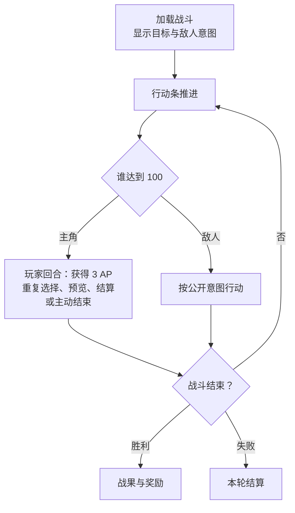
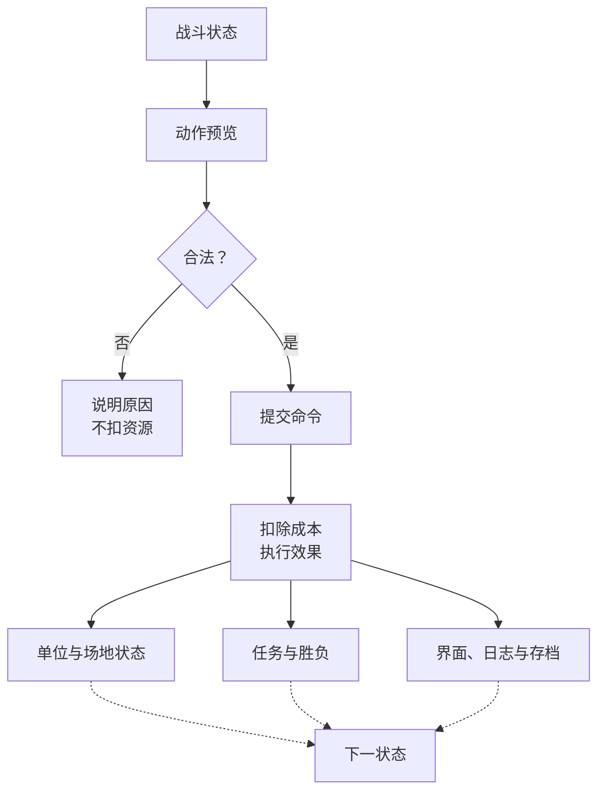

<title>OCC 游戏策划案</title>

| 项目 | 内容 |
|-|-|
| 类型 | 单主角确定性回合制战棋、Roguelite、角色扮演 |
| 平台 | PC |
| 画面 | 正交 2D 像素 |
| 当前内容 | 学院第一阶段 |
| 文档地位 | 项目第一参考、第一准则、唯一活动策划源 |
| 更新时间 | 2026-09-09 |

<callout emoji="💡">
**文档导航**
- 游戏框架系统：第1章
- 地图推进系统：第2章
- 战斗系统：第3章
- 构筑与资源系统：第4章
- 界面与表现系统：第5章
- 首次体验系统：第6章
- 数据索引：第7章
- 美术规范与视觉反馈：附录 A
</callout>

# 1. 游戏框架系统

## 1.1 模式与核心流程

每个新存档先进行一次固定体验：从固定出身三件套开始，到第一场精英战后的商店首次展开，或以精英战死亡结束。之后进入常驻学院轮次，内容池由版本配置决定。

> 固定出身 → 进入首次地图 → 战斗或处理事件 → 领取奖励 → 工坊与医务室 → 第一场精英战 → 商店首次展开 → 常驻学院体验

进入节点前显示危险度、耗时、敌人、任务目标和奖励类型。完成节点后保留生命、魔力、道具消耗和获得的物品。

### 1.1.1 游戏模式

肉鸽模式：地图、敌群和奖励由种子生成。同一种子生成相同内容。生命归零后结束本轮。

剧情模式：使用固定主角与章节。允许回访、补支线、调整装备和重复挑战。不设倒计时、拖延惩罚和永久错过。剧情存档与肉鸽存档分开保存。

## 1.2 完整一局边界

### 1.2.2 一局边界

| 边界 | 定义 |
|-|-|
| 创建 | 确定模式、单轮种子、内容版本与初始状态；生成结果写入存档，读档不重新抽取。 |
| 开始 | 新存档固定首次体验是当前轮次的前导段。离开精英后商店时不重建角色或清空资源，当前生命、货币、学院贡献、装备与背包、术式与配置、法宝及剩余次数、有效餐食和已完成教程状态全部继承到常规学院流程。 |
| 推进 | 选择可达节点，完成战斗、事件或服务，结算资源与奖励，再返回地图。已完成节点可回访但不重复结算。 |
| 首领进入 | 现行基准为学院时序达到 28 后进入首领阶段；完成 12 个节点后允许提前挑战。 |
| 胜利 | 完成首领战及其奖励结算，生成本轮总结并结束单轮状态。 |
| 失败 | 肉鸽模式中主角生命归零，完成当前失败结算后结束单轮状态；不得继续开放未获得的节点或奖励。 |
| 中断恢复 | 只从已确认的保存点恢复。写入失败保留原存档；候选、事件结果、商店库存和节点内容不得因退出或读档刷新。 |

## 1.3 流程状态机

### 1.3.1 总体阶段

> 启动与存档选择 → 新存档固定引导（仅首次） → 单轮创建与出发整备 → 常规学院地图循环 → 首领门槛 → 首领战 → 胜利结算；任一战斗失败或主动放弃 → 失败／放弃结算。

| 阶段 | 进入条件 | 阶段职责 | 唯一正常出口 |
|-|-|-|-|
| P0 存档入口 | 启动完成 | 新建、继续、设置、存档异常处理 | 固定引导或单轮创建 |
| P1 固定引导 | 新存档且未完成引导 | 固定出身、短图、三战、事件、服务、精英与商店 | 标记引导完成并进入常规学院流程 |
| P2 单轮创建 | 引导已完成且当前无活动单轮 | 写入模式、种子、版本、40 节点内容和初始资源 | 出发整备 |
| P3 地图循环 | 单轮有效且未进入首领阶段 | 预览路线并处理战斗、事件和服务节点 | 继续循环、进入首领或失败 |
| P4 首领阶段 | 主动提前挑战或学院时序达到门槛 | 锁定普通路线，完成首领准备与战斗 | 胜利或失败结算 |
| P5 单轮结算 | 首领胜利、生命归零或主动放弃 | 生成总结，关闭活动单轮并保存最终结果 | 返回学院入口 |

### 1.3.2 状态清单

| ID | 状态 | 玩家可执行动作 | 离开条件 |
|-|-|-|-|
| F00 | 学院入口 | 开始新游戏、继续、查看行程与行囊、辅助设置 | 选择有效存档动作 |
| F01 | 新存档确认 | 确认覆盖、取消 | 创建成功或返回 F00 |
| F02 | 固定引导 | 按第 6.2 节完成固定流程 | 精英后商店结算完成；战斗失败可从战斗结果页重新挑战 |
| F03 | 单轮创建 | 确认开始、取消返回入口 | 完整单轮状态写入成功 |
| F04 | 出发整备 | 查看并调整装备、术式、战术栏和背包；确认出发 | 配置合法且保存成功 |
| F10 | 学院地图 | 查看资源、路线与节点；选择可达节点；申请提前挑战首领 | 确认前往节点或首领 |
| F11 | 节点预览 | 查看危险、时序成本、敌人／事件性质、目标和奖励类型；前往或取消 | 确认前往后更新当前位置并保存；取消返回 F10 |
| F20 | 战前准备 | 查看任务、敌人、地形和公开意图；调整允许的战前配置；出发或暂不挑战 | 确认出发创建战斗状态；暂不挑战返回 F10 |
| F21 | 战斗 | 提交合法命令、结束回合、暂停、返回标题、放弃本轮 | 任务完成、主角死亡或放弃 |
| F22 | 战斗结果 | 查看任务结果、战损、资源变化和奖励资格；确认结算 | 成功保存节点结果后进入 F40；死亡进入 F61 |
| F30 | 事件 | 查看公开选项、条件、成本和结果；确认一项或离开 | 选项原子结算后进入 F40 或 F10；未选择可返回 F10 |
| F31 | 工坊 | 锻造、专精、查看结果、退出 | 每次交易单独保存；退出返回 F10 |
| F32 | 医务室 | 治疗、购买餐食、查看持续效果、退出 | 每次交易单独保存；退出返回 F10 |
| F33 | 商店 | 购买、比较、整理背包、退出 | 每次交易单独保存；退出返回 F10 |
| F40 | 奖励领取 | 查看来源和候选；选择奖励；确认领取或明确放弃 | 奖励写入或放弃记录保存成功 |
| F41 | 背包处理 | 移动、装备、调整战术栏、丢弃或放弃待领奖励 | 所有待处理物品有合法去向并保存成功 |
| F50 | 首领门槛 | 查看进入原因、当前资源与不可逆后果；确认或取消提前挑战 | 主动确认，或强制阶段完成所有待结算后进入 F51 |
| F51 | 首领准备 | 查看首领目标与公开阶段信息；完成最后整备；确认挑战 | 配置合法后创建首领战斗状态 |
| F52 | 首领战 | 沿用 F21 战斗命令 | 首领目标完成进入 F60；主角死亡或放弃进入 F61 |
| F60 | 胜利结算 | 领取首领奖励、处理背包、查看本轮总结、返回入口 | 结算保存并关闭活动单轮 |
| F61 | 失败／放弃结算 | 查看失败原因、本轮路线、战斗和资源记录；重新挑战或返回入口 | 重新挑战恢复本场开战前状态；返回入口时结算保存并关闭活动单轮 |
| F70 | 确认弹窗 | 确认或取消覆盖、放弃、丢弃、退出和不可逆进入 | 返回来源状态或执行唯一确认命令 |
| F71 | 保存／版本异常 | 重试、读取安全备份、返回入口 | 完整性校验通过；失败时不得覆盖原存档 |

### 1.3.3 核心状态转换

| 来源 | 动作或条件 | 目标 | 原子结果 |
|-|-|-|-|
| F00 | 新游戏确认 | F02 | 创建新存档并写入固定引导版本；失败留在 F01 |
| F02 | 精英后商店完成 | F10 | 标记固定引导永久完成并归档固定短图；当前轮次全部合法状态原样继承，转入常规学院地图 |
| F00 | 继续且存在活动战斗 | F21／F52 | 恢复最后一个完整命令后的战斗状态 |
| F00 | 继续且存在待领奖励 | F40／F41 | 先解决阻塞状态，不允许绕回地图 |
| F00 | 继续且存在普通活动单轮 | F10 | 由单轮与节点状态重建地图界面 |
| F03 | 确认创建 | F04 | 一次性生成地图、内容池、节点状态和库存并保存 |
| F10 | 选择节点 | F11 | 只生成预览，不移动、不扣除资源 |
| F11 | 确认前往 | F20／F30／F31／F32／F33 | 更新当前位置并保存；节点内容不重新抽取 |
| F21 | 战斗任务完成 | F22 | 停止接受战斗命令，生成只读结果，不提前发奖 |
| F22 | 确认成功结算 | F40 | 一次性写入战损、节点完成、学院时序和待领奖励 |
| F30 | 确认事件选项 | F40／F10 | 先检查条件，再一次写入成本、结果、节点完成和待领奖励 |
| F31／F32／F33 | 确认一次交易 | 原状态 | 合法性、成本、物品去向和库存变化一次保存；失败不扣费 |
| F40 | 奖励确认 | F41／F10／F60 | 空间不足进入 F41；写入成功后才清除待领奖励 |
| 任一节点结果 | 学院时序达到强制门槛 | F50 | 先完成结果、奖励和背包处理，再设置强制首领阶段 |
| F10 | 满足节点数并申请提前挑战 | F50 | 只显示确认；取消不改变状态，确认后不可返回普通路线 |
| F52 | 首领目标完成 | F60 | 写入首领结果与待领奖励；奖励处理后关闭单轮 |
| 常规肉鸽 F21／F52 | 生命归零 | F61 | 记录失败战斗，不结算成功节点、学院时序或胜利奖励；首次固定体验开发阶段进入可重试结算 |

### 1.3.4 保存与恢复规则

- 持久状态包括单轮种子与内容版本、完整地图和节点内容、当前位置、节点状态、学院时序、资源、构筑、库存、事件选项与结果、服务使用记录、待领奖励、首领阶段标记和活动战斗状态。
- 界面页签、悬停、滚动、临时预览和未确认选择不作为玩法存档。继续游戏时，由活动战斗、待领奖励、强制首领或普通单轮等权威阻塞状态决定恢复页面。
- 战斗在创建时保存入口快照，并在每个完整命令结算后保存活动战斗状态。中途返回标题或进程关闭后恢复当前战斗，不把退出当作免费重开。
- 肉鸽模式按 Pixso 战斗结果页保留“重新挑战”，确认后完整恢复到本场开战前状态，不重复结算节点、资源或奖励；选择返回入口才结束本轮。剧情模式是否允许重试由任务配置决定。主动放弃肉鸽战斗等同放弃本轮，进入 F61。
- 节点确认前、节点结果确认后、事件选择、每次服务交易、奖励领取或放弃、背包处理、首领阶段切换及最终结算后保存。任何命令只有在玩法结果与对应保存同时成功后才离开当前阻塞状态。
- 保存失败时保留上一份有效存档和当前内存状态，显示 F71。玩家可以重试；不能通过返回地图绕过未保存的成本、结果或奖励。
- 加载时先验证内容版本和完整性。能够迁移时先建立安全副本再迁移；不能迁移时保留原文件并说明原因，不静默重建地图、刷新内容或覆盖单轮。

### 1.3.5 节点完成合同

| 节点 | 完成条件 | 学院时序 | 回访 |
|-|-|-|-|
| 普通战斗 | 任务目标完成且结果确认 | +2 | 只显示结果摘要并作为通路，不重开战斗或再领奖 |
| 精英战斗 | 任务目标完成且结果确认 | +3 | 只显示结果摘要，不刷新精英奖励 |
| 首领 | 首领任务完成且胜利结算 | 记录 +3 后结束单轮 | 不可在活动单轮内回访 |
| 事件 | 确认一个合法结束选项 | +1 | 显示已选结果，不再选择或领奖 |
| 工坊 | 首次到达即标记访问；交易分别结算 | 0 | 可回访；已用次数和库存不刷新 |
| 医务室 | 首次到达即标记访问；治疗与餐食分别结算 | 0 | 可回访；治疗、餐食选项与次数不刷新 |
| 商店 | 首次到达即标记访问；购买分别结算 | 0 | 可回访；库存、价格与售罄状态不刷新 |

在地图中单击节点只打开 F11。只有确认“前往”才改变当前位置。到达战斗节点后可以在 F20 暂不挑战并返回地图，但角色仍停留在该节点；再次进入不重抽敌人、地形或奖励。

### 1.3.6 阻塞与异常恢复

| 情况 | 必须提供的恢复路径 | 禁止行为 |
|-|-|-|
| 背包空间不足 | 奖励留在待领取区；允许整理、装备、调整战术栏、确认丢弃或明确放弃奖励 | 自动丢弃、自动替换装备、退出后清除奖励 |
| 事件无力支付 | 至少保留一个不产生负余额的合法结束选项，可为空手离开 | 所有选项同时非法形成死路 |
| 服务货币不足 | 保留项目并显示不足原因，允许退出 | 负数资源、部分购买或隐藏价格 |
| 学院时序到达 28 | 先完成当前节点、奖励和背包，再进入 F50；普通节点随后锁定 | 在结算中途打断、吞掉奖励或允许再刷零时序收益 |
| 提前挑战首领 | 显示不可逆确认和当前未完成路线；取消仍可继续 | 误触直接锁图、确认后返回普通路线 |
| 战斗中退出 | 保存最后完整命令后的战斗并返回标题；继续时恢复 | 把退出当重开、结算未发生结果或刷新敌人 |
| 保存失败 | 停留在当前阻塞状态并重试；原存档可用 | 显示成功、继续跳转或覆盖原存档 |
| 版本不兼容 | 安全迁移或拒绝加载并保留原存档 | 静默重置、刷新单轮或删除内容 |

# 2. 地图推进系统

## 2.1 学院地图与节点

学院地图共 40 个节点，分为 6 个区域。

地图使用固定的学院区域结构，每个节点都有明确的区域归属。生成节点内容时，区域特色敌人和区域特色事件的出现概率高于通用内容，但不完全排除其他内容。抽取结果由单轮种子决定并写入存档。

区域只规定内容权重，不把敌人和事件锁死在单一区域。后续世界冒险继续使用同一规则：不同地区配置自己的敌人、事件和奖励权重，地图生成器按所在地区抽取内容。

- 只能前往与当前位置相连的节点。
- 地图显示区域、连线、当前位置、已完成节点和可达节点。
- 单击节点后打开摘要，不立即进入。
- 摘要显示名称、类型、危险度、耗时、奖励和进入按钮。
- 完成节点后更新当前位置和可达节点。
- 顶部显示生命、魔力、金币、学院贡献、阶段进度和已完成节点。

### 2.1.1 节点类型

| 类型 | 内容 | 完成后 |
|-|-|-|
| 普通战斗 | 标准敌群与任务目标 | 发放基础奖励 |
| 精英战斗 | 强敌与复合场地规则 | 发放精英奖励 |
| Boss | 固定首领与阶段规则 | 进入阶段结算 |
| 工坊 | 装备锻造、术式专精 | 消耗材料并保存结果 |
| 医务室 | 按最大生命比例恢复生命；购买随机餐食 | 扣除费用并恢复或获得餐食增益 |
| 商店 | 购买装备、法宝和材料 | 扣除费用并获得内容 |
| 事件 | 选择公开选项 | 修改资源、物品或路线 |

不存在“服务”和“宝藏”节点。原服务按功能拆入工坊、医务室或商店；原宝藏内容拆入事件或商店。

### 2.1.2 首次存档固定地图节点数量

| 内容 | 数量 |
|-|-|
| 普通战斗 | 3 |
| 事件 | 3 |
| 工坊 | 1 |
| 医务室 | 1 |
| 精英战斗 | 1 |
| 精英后商店 | 1 |
| Boss | 0 |

开始节点不计入内容节点。首次存档固定地图共有 10 个内容节点，范围到第一场精英胜利后的商店首次展开；精英前为 8 个内容节点。该固定短图是 40 节点常规学院地图之前的首次体验，不使用随机生成，也不包含首领战。

### 2.1.3 战前餐食

医务室同时提供恢复和战前餐食。每次进入医务室节点时，从餐食池中无重复抽取 3 种。玩家支付金币、材料或学院贡献，选择一种持续 3 场战斗的临时增益。

| 餐食 | 费用 | 持续效果 |
|-|-|-|
| 强攻炖肉 | 3 金币 | 武器直接伤害 +2 |
| 导能热饮 | 1 学院贡献 | [个人魔力](https://jcnlgassfnsm.feishu.cn/docx/Y1KydFPjMocJjYxMmFEcTblcnLf#doxcnA9XrJJNmEP7gSZsoCursUb)上限 +2；进入战斗时恢复满 |
| 岩盐浓汤 | 1 份学院食材 | 每场战斗开始获得 6 护盾 |
| 疾行烤串 | 3 金币 | 每个自己回合第一次移动的[步数](https://jcnlgassfnsm.feishu.cn/docx/Y1KydFPjMocJjYxMmFEcTblcnLf#doxcnPG7pIeIZWtLBO8Rikv69mb) +1 |
| 节流茶 | 1 学院贡献 | 每场战斗第一次施放术式时魔力成本 -1，最低为 0 |
| 坚韧面包 | 1 份学院食材 | 最大生命 +4；每场战斗开始恢复 4 生命 |
| 猎团香汤 | 4 金币 | 每场战斗第一次武器命中额外造成 4 伤害 |
| 清醒粥 | 1 份学院食材 | 每场战斗第一次受到负面状态时，持续时间 -1 回合，最低为 1 回合 |

- 餐食选项由单轮种子和医务室节点决定，生成后写入节点状态。
- 同一医务室节点重新打开或读档时不重新抽取。
- 恢复和购买餐食互不排斥，每个医务室节点各可执行一次。
- 同时只能存在一种餐食增益。
- 有餐食增益时不能购买新餐食。
- 每完成一场战斗，剩余场数减 1。未进入战斗不减少。
- 剩余场数为 0 时移除增益。
- 餐食不是装备、术式或法宝，不占槽位。

## 2.2 奖励、失败与存档

### 2.2.1 奖励

- 节点达到成功条件并完成结果确认后，才创建该节点的奖励状态。进入节点、打开战果或仅完成部分目标都不能提前发放奖励。
- 奖励来源包括金币、学院贡献、装备、术式、卷轴、法宝及节点配置声明的其他内容；普通战、精英、事件和 Boss 分别读取自己的奖励表，不能互相回退抽取。
- 需要抽取的候选由单轮种子、节点 ID、奖励表版本和既有抽取状态决定，生成后立即写入节点状态。重新打开页面或读档必须返回同一组候选，不能重抽。
- 奖励页必须显示来源、全部候选、精确效果、数量或使用次数、占用空间或栏位、与当前构筑的差异，以及不可领取的唯一原因。未冻结的内容必须明确标记待定，不能用临时条目代替。
- 玩家完成配置要求的选择并确认后，系统一次性写入所得内容、奖励已领取状态与相关解锁。写入成功前不能清除候选或离开奖励流程；写入失败时保留原状态并允许重试。
- 背包或栏位不足时，奖励保留在待领取区并进入 F41。玩家必须为每项内容选择合法去向，或在该奖励允许放弃时明确确认放弃；不能自动丢弃、自动替换装备或因退出清除奖励。
- 下一套 Build 的三场普通战和首场精英奖励按 Pixso 保留“放弃奖励”。放弃前必须二次确认，确认后记录放弃、清除待领取状态并继续解锁流程；固定奖励与候选奖励作为同一事务整体放弃。其他奖励是否允许放弃由节点配置声明。
- 已完成节点回访时只显示历史结果，不重复生成或发放奖励。

### 2.2.2 失败与放弃

- 战斗命令结算后若主角生命降至 0，立即锁定战斗输入并进入失败流程；不再推进其他单位、行动条或未发生的触发，也不生成未获得的胜利奖励。
- 肉鸽模式的战败会进入 F61：保留本轮已发生的路线、战斗、资源和构筑记录，生成失败总结，保存后关闭当前单轮状态。失败页只提供结束本轮并返回入口。
- 玩家主动放弃战斗或单轮与战败进入同一结算出口，但总结必须分别记录“死亡”或“主动放弃”及发生位置，不能把两者混为同一原因。
- 剧情模式的失败出口由战前简报明确声明，可以是重伤、撤离或重试；剧情探索不得因失败附加未公开的倒计时、地点永久错过或拖延惩罚。
- 返回标题、暂停或正常关闭游戏只保存并中断当前流程，不等同于主动放弃。继续游戏必须从最近一个成功保存点恢复。
- 主动放弃、覆盖存档、放弃奖励和丢弃高价值物品必须先显示对象、不可逆后果及确认／取消；取消不改变状态。

### 2.2.3 阶段结算

- 阶段结算的输入是已锁定的节点或单轮结果；战斗、事件或服务仍有未完成命令、待领取奖励、待处理物品或保存请求时，不得提前结束阶段。
- 节点结算依次完成：锁定结果→结算节点耗时与资源变化→生成或确认奖励资格→处理奖励去向→写入节点完成状态与解锁→保存→返回地图或进入下一阶段。任何一步失败都保留当前阻塞状态，不重复扣费或重复发奖。
- 单轮结算记录模式、种子与版本、起始和最终路线、完成节点、战斗结果、最终装备与术式、资源变化、剩余物资、人物标签、胜利／死亡／放弃原因和未解锁内容。
- 结算页只读取已保存结果，不再修改玩法数值。玩家确认离开后才关闭活动单轮并返回学院入口；保存失败时保留原单轮与结算页，允许重试。
- 同一结算请求必须幂等：重复点击、网络重试、重新打开或读档不能重复消耗学院时序、服务次数、货币、道具，也不能重复获得奖励或解锁。

# 3. 战斗系统

## 3.1 战斗基础

- 游戏结果只由当前状态、配置数据和玩家或 AI 提交的命令决定。
- 相同状态执行相同命令，必须得到相同结果。
- 肉鸽内容在创建单轮时由种子生成并写入存档。读取存档不重新生成地图、敌群、事件和奖励。
- 战斗不使用命中、闪避和暴击随机。允许效果从一个或多个合法目标中按种子抽取；抽取所需状态写入战斗存档，确保相同存档状态提交相同命令时得到相同目标与结果。
- 界面只读取状态、提交命令和显示结果，不直接修改游戏数值。

### 3.1.1 状态层级

| 层级 | 保存内容 | 规则 |
|-|-|-|
| 单轮状态 | 模式、种子、训练路线、当前位置、已访问节点、已完成节点、资源、生命、魔力、装备、术式、背包、待领奖励 | 贯穿本轮，节点之间持续保存 |
| 节点状态 | 节点类型、进入条件、敌群或事件、玩家选择、完成结果、奖励状态 | 每个节点只完成一次；回访不重复结算 |
| 战斗状态 | 地图、单位、位置、[行动点](https://jcnlgassfnsm.feishu.cn/docx/Y1KydFPjMocJjYxMmFEcTblcnLf#doxcnotsNJZwSylkCxvyvE2c5Qd)、行动条、状态、冷却、任务目标、战斗日志 | 进入战斗时创建，战斗结束后按继承规则写回单轮状态 |
| 界面状态 | 当前页面、选中目标、预览、提示、弹窗 | 由前三层生成，不作为玩法结果来源 |

## 3.2 战斗流程与命令

### 3.2.1 战斗进行流程

一场战斗按下图循环：



### 3.2.2 命令结算流程



- 确认前状态变化时，旧预览失效，须重新预览。
- 命令通过全部检查后一次性写入，不允许部分执行；多段命中逐段结算。
- 效果按配置顺序处理；伤害后结算附带状态、位移与场地，最后检查胜负并刷新界面、日志和存档。

### 3.2.3 合法性检查

| 检查 | 通过条件 |
|-|-|
| 行动单位 | 单位存活，轮到该单位行动，战斗尚未结束 |
| 资源 | [行动点](https://jcnlgassfnsm.feishu.cn/docx/Y1KydFPjMocJjYxMmFEcTblcnLf#doxcnotsNJZwSylkCxvyvE2c5Qd)、魔力、冷却和使用次数满足配置 |
| 空间 | 目标格在地图内，可到达，未被阻挡或占用 |
| 目标 | 阵营、目标类型、射程和攻击线满足配置 |
| 状态 | 束缚、破势等状态没有禁止该动作 |
| 内容 | 对应装备、术式、道具或交互物存在且可用 |

任何一项不通过，界面保留原按钮并直接显示原因。

## 3.3 回合与行动条

- 行动条范围 0～199；每个时间单位增加有效速度值，达到 100 获得回合。
- 单位行动时，战斗时间和其他单位的行动条暂停。
- 回合结束扣 100；溢出保留，但不能超过 199。
- 同时达到阈值时，依次比较行动条、有效速度和固定顺序。
- 加速／减速改变增长；行动提前／延后直接改变当前值，最低为 0。
- 回合开始：清旧护盾→结算新护盾与装备→状态→冷却→死亡／胜负→重置行动点。
- 主角可连续行动或主动结束；敌人执行一次公开意图后结束。结束时清空行动点。
- 死亡或退出的单位移出行动条；目标达成后立即结束战斗。

### 示例


### 3.3.1 行动提前与延后

- 行动提前与行动延后都直接修改目标当前行动条：提前增加，延后减少；数值由动作、术式、装备或状态配置给出。
- 修改后行动条始终限制在 0～199。普通动作不会隐式改变行动条；只有配置明确写出的提前或延后效果才会修改。
- 单位已经获得当前回合后，行动延后不会中断或撤销这个回合，只影响回合结束后的剩余进度；结束回合仍按 3.3 扣除 100，结果最低为 0。
- 当前单位行动期间战斗时间暂停。其他单位若因直接提前效果达到 100，只进入待行动队列，必须等当前回合及其全部结算完成后再按行动条、有效速度、固定顺序裁决。
- 同一命令含有多个行动条效果时，严格按配置顺序逐项结算，每一步都执行 0～199 截断；预览必须显示最终行动条、是否进入待行动状态和预计顺序变化。
- 死亡或退出战斗的单位不再接受行动条效果，并立即从待行动队列移除。

## 3.4 单位与动作

单位是战斗状态中的行动主体。每个单位必须具有稳定单位 ID、阵营、所在格、存活状态、属性、可用动作和当前战斗内效果；界面、AI、预览与结算必须读取同一份单位状态，不能各自维护另一套数值。

### 3.4.1 基础属性

| 属性 | 定义与边界 |
|-|-|
| 生命 | 分为当前生命与生命上限。正式版主角基础生命上限为 50，创建新角色或新存档时当前生命为 50；装备、餐食、状态或模式配置可以显式修改当前上限。当前生命降至 0 时单位死亡，立即失去占位、目标资格和后续回合。治疗不能超过当前生命上限。 |
| 个人魔力 | 分为当前值与当前上限，用于支付术式成本。进入战斗时恢复到当前上限；战斗中不足时对应术式不可提交。统一称为“个人魔力”，不使用“蓝量”。 |
| 护盾 | 只在当前战斗内存在，按伤害结算顺序先于生命承受伤害；生命周期与回合刷新见 3.6.2。 |
| 行动点 | 单位在当前自身回合内支付动作费用的资源。获得回合时重置为 3，结束回合时清空；不能跨回合储存。 |
| 行动条 | 当前战斗中的行动进度，范围为 0～199；达到 100 时进入待行动状态。增长、溢出、排序和移除规则见 3.3。 |
| 速度 | 决定行动条随战斗时间增长的速率。有效速度由基础值和当前修正共同得到，排序与增长均读取有效速度。 |
| 步数 | 一次移动行动最多可经过的路径格数。基础为 5 格；迟缓时为 3 格；临时加成只影响其声明的移动行动。 |

- 生命、个人魔力、行动点和行动条均不得低于 0；有上限的属性不得超过当前上限。
- 动作结算、状态变化或装备变化导致属性改变时，先完成该命令的全部结算，再统一刷新单位状态、可选动作和界面。
- 装备改变生命上限时，当前生命如何变化尚未冻结。在该规则确认前，不投放会在战斗中改变生命上限的装备效果。

### 3.4.2 玩家可提交的动作

| 动作 | 合法性与费用 | 结算结果 |
|-|-|-|
| 移动 | 当前单位可行动、至少有 1 行动点、目标格可达；消耗 1 行动点 | 沿预览路径移动至目标格，逐格处理进入、经过与邻接触发；实际路径不得超过当前步数。 |
| 武器动作 | 满足武器配置的行动点、射程、攻击线、目标和装备条件；不消耗个人魔力 | 按当前装备武器的动作配置结算。没有统一的“四格范围”或固定伤害。 |
| 术式 | 满足术式配置的行动点、个人魔力、冷却、射程、攻击线和目标条件 | 一次性扣除已预览费用，再按配置结算伤害、护盾、位移、状态或场地效果。 |
| 战术道具 | 道具已装入战术栏，使用次数、行动点、射程、攻击线和目标均满足该道具配置 | 扣除配置费用与一次使用次数并结算效果；战术道具不统一设为零行动点。 |
| 搜刮／互动 | 目标是正交相邻且可交互的容器、设备或任务物；满足其配置费用 | 搜索容器默认消耗 1 行动点；揭示内容后，拿取本次已揭示物品不再重复扣行动点。空间不足时进入待处理状态。其他互动按对象配置结算。 |
| 战斗中整理 | 当前规则允许进入且至少有 1 行动点 | 消耗 1 行动点后打开整理界面，可调整装备与战术栏；关闭界面不返还费用。 |
| 结束回合 | 当前单位拥有回合且没有未完成的命令或阻塞结算 | 清空剩余行动点，执行回合结束流程并交还行动权。 |

- 玩家只控制主角。临时友军与敌人由 AI 控制，但使用与玩家相同的移动、目标、费用、场地和伤害规则，不获得隐藏豁免。

### 3.4.3 敌人与友军 AI

- 每个 AI 单位在获得回合前公开本回合的一条完整意图，包括动作类型、目标或目标规则、主要效果和可见费用。
- AI 只从当前合法动作中选择，并按该单位配置的确定性优先级裁决；相同战斗状态与随机种子必须得到相同选择。
- 敌人任一动作结算后耗尽全部剩余行动点并结束自身回合，因此不能先移动再追加攻击。临时友军按已预览意图执行；其每回合动作次数必须由友军配置明确声明，不能沿用敌人规则或由运行时猜测。
- 原意图变得不合法时，AI 按公开的备用优先级重新选择；不存在合法动作时执行停留并结束回合。AI 不得读取玩家未公开的信息，也不能绕过阻挡、射程、攻击线、资源或目标检查。

## 3.5 战场与空间

战场由遭遇配置决定尺寸、边界、初始单位、目标、地形与交互物。12×9 格是下一套 Build 首次战斗的当前规格，不是所有战场的全局固定尺寸。

### 3.5.1 空间与运行规则

- 战场使用正交方格。移动只连接上、下、左、右相邻格；路径长度与无特殊说明的射程均按横纵格距离计算，斜向不视为相邻。
- 边界外坐标始终无效，不能成为移动、放置、生成或目标格。
- 每格固定包含 1 个瓦片层、至多 1 个玩法物块、至多 1 个单位和独立的可见效果层。
- 瓦片层表示地表材料，例如普通地面、水面及其他可进入代价；玩法物块表示轻掩体、重掩体、灯藤、水晶、容器、设备和任务物；单位层只保存主角、友军或敌人的占位；效果层显示火场、警示区等效果，不能替代瓦片或物块。
- 本 Build 不允许同格叠放多个玩法物块。一个格子最多一个单位；被阻挡或已被单位占用的格不能穿过，也不能成为主动移动终点。
- 移动与攻击线先读取瓦片，再读取玩法物块并合并结果。轻掩体可进入且不阻挡攻击线；重掩体不可进入并阻挡移动和攻击线。重掩体只使要求攻击线的动作不合法，不会隐藏后方单位。其他对象是否阻挡、可破坏或可互动由其配置明确声明。
- 遭遇开始前必须验证地图尺寸、出生格、单位占位、目标格和必需交互物。出生格不得越界、阻挡或重叠；配置无合法落点时不得进入战斗，并报告具体对象与原因。
- 初始位置、任务目标、敌群和地形由任务配置。开战后显示全部敌人、任务目标、地形、交互物和敌方公开意图；本规则不引入战争迷雾或隐藏陷阱。
- 玩家只控制主角；临时友军由 AI 控制，其预定目标、路径和主要结果在结算前可预览。
- 地形或物块被创建、破坏、点燃、熄灭或改变后，移动、攻击线、目标合法性、掩体与交互查询立即读取新状态；已经失效的旧高亮和旧预览必须清除。
- 目标格、撤离格与出生格是配置语义，不额外占用单位层；若需要实体物件，必须另以玩法物块配置，并同时满足占位规则。

<grid>
<column width-ratio="0.453051">

</column>
<column width-ratio="0.546949">

</column>
</grid>

### 3.5.2 单位可见、攻击线与灯藤藏身

- 战场没有朝向、正面、背面或视野锥。除进入完整灯藤的敌对单位外，场上所有单位始终互相可见，所在格也始终公开。浅水、轻掩体、晶簇、碎晶、焦痕、重物块和其他单位都不会让单位消失；重物块只阻挡要求攻击线的动作。
- 单位从非灯藤格进入一片正交相连的完整灯藤时，对方记录它进入的第一格为“已知灯藤格”。藤内继续移动不更新已知格。主角进入后仍在己方画面显示，但敌人不得读取其藤内真实格；敌人进入后从玩家画面隐藏，只保留已知灯藤格。
- 搜索方先把已知灯藤格当作候选目标：距离不足时接近，能够攻击时对该格执行一次正常攻击。搜查不是额外技能，沿用该动作原有的射程、攻击线、费用、冷却和伤害，每次只结算一个正常动作。
- 搜查攻击命中后摧毁目标灯藤。若藏身单位仍在该格，同一伤害包同时命中单位，单位显形并结束搜索；若该格为空，则从已搜索区域上下左右相邻、仍完整且未搜索的灯藤中，按当前战斗种子随机选择下一候选格。分支到头时从整个已搜索边界继续，不重复攻击已毁灯藤；结果写入存档，读档不刷新。
- 单位离开完整灯藤、走入已毁灯藤格或脚下灯藤被毁时立即显形。搜索在找到单位、单位显形或该相连藤丛搜完时结束。多名藏身单位各自记录已知格和搜索状态。
- 灯藤原有攻击规则保持不变：完整灯藤阻挡穿过它的攻击线，藤内单位只能攻击正交相邻目标。明确“只破坏物块、不造成单位伤害”的清障动作只使脚下灯藤消失并令单位显形，不会伤害该单位。

### 3.5.3 首次体验特色地块与关卡路径（示例）

- 首次体验的特色地块按战斗逐场冻结：战斗1使用浅水与灯藤，战斗2使用灯藤与蓄能晶簇，战斗3使用浅水与封门晶簇，第一场精英战同时使用浅水、灯藤与精英稳压晶簇；三种材料沿用各自稳定规则，组合只改变空间与行动窗口。
- 特色地块可以由攻击、单位靠近、单位进入、移动经过、消耗行动点交互、受击或被破坏等公开条件触发。触发条件与结果必须由配置定义，不在命令执行过程中临时猜测。
- 特色地块对所有单位遵循同一套规则。玩家可以主动利用，也可以引诱敌人触发；系统不得只对主角生效或为敌人提供隐藏豁免。
- 特色地块不是通关钥匙。忽略特色地块时关卡仍须可完成；利用机制只提供更优解、资源优势或更低战损。
- 每张首次体验战场至少配置 3 条可验证的理想通关路径。路径需要说明入口、关键决策点、利用的机制、风险和预期收益，而不是只记录一条最短路。
- 第二、第三场普通战必须让玩家立即试用刚获得的术式或装备。战斗2固定验证第一组奖励、轻装传令衣、导位罗盘与苗床回流芯；战斗3固定验证第二组奖励、增幅专精、截击铃与学院储能芯；精英战集中验证第三组奖励和两条完整构筑。
- 首次体验地图保持低复杂度：每张普通战只组合两种特色机制，触发条件必须一看就懂，规则说明默认隐藏并可通过悬停查看。
- 悬停说明采用“短标题＋主要效果＋必要关键词解释”的分层结构。敌人公开意图、状态、特色地块和资源术语使用相同的信息密度，不长期占用战斗 HUD。
- 敌人的意图、人设、外观、技能表现与技能效果必须由同一内容身份关联；允许配置战斗台词增强代入感，但台词不得代替公开意图或规则提示。

### 3.5.4 关卡场地设计（示例）

- 先确定场地是什么地方、原本做什么、材料从哪里来，再设计敌人和玩法。不能先放一个效果再替它补故事。
- 每种特色材料先只给一条最容易凭常识理解的规则。材料的流动、燃烧、脆裂、遮挡或重量变化必须有可见来源和结果。
- 敌人必须因场地而改变行动：创造、寻找、穿行、改变、利用或避开材料都可以；把材料移走后，其优先路线、攻击几何或威胁时机应发生变化。
- 玩家和敌人使用同一套场地规则。玩家的反制必须能说清楚物理理由，例如绕开、引开、烧掉、灭火、打碎、隔断或利用同一条路线。
- 首次体验不使用隐藏陷阱、随机命中或敌人全知来制造压力。灯藤藏身时，双方只能依据公开的已知灯藤格和已结算搜查状态行动；除当前候选格与本回合意图外，不显示藏身单位真实格或未来搜索路线。

## 3.6 伤害、防护与状态

### 3.6.1 命中与伤害

- 攻击默认命中。
- 不使用命中率、闪避率和暴击率。
- 同一次命中的伤害合并成一个伤害包。
- 多次命中分别结算。
- 百分比减伤先于护盾结算。同类取最高，异类相乘，总上限 50%，结果向上取整。
- 伤害默认先扣护盾，再扣生命。
- 确认攻击前显示目标、伤害、状态、消耗和行动顺序变化。

### 3.6.2 护盾与掩体

- 普通护盾只在当前战斗有效。
- 自身回合开始时清除旧护盾，再结算新护盾。
- 不同来源的护盾可以叠加。
- 同一来源每回合只触发一次。
- 轻掩体可进入，不阻挡攻击线，每回合结束时提供 2 点护盾。
- 重掩体不可进入，阻挡移动和攻击线。位于正交相邻格时，每回合结束时提供 4 点护盾。
- 同一回合内，换位和折返不会重复触发掩体护盾。
- 破势会清空护盾，并阻止目标获得新护盾，持续到目标下一回合结束。

### 3.6.3 状态

当前有效的单位状态只有燃烧、迟缓、束缚和破势；眩目与显形已删除。火场、烟尘、水面、冰面、强光、暗区、导电路径和任务地形属于瓦片、玩法物块或效果层机制，不是单位状态，但可以按配置施加或移除状态。

| 状态 | 固定语义 | 仍由来源配置的字段 |
|-|-|-|
| 燃烧 | 在声明的触发窗口对单位造成伤害 | 每次伤害、触发窗口、持续时间、重复施加规则 |
| 迟缓 | 生效期间步数变为 3 格 | 持续时间、重复施加规则 |
| 束缚 | 生效期间不能主动移动 | 持续时间、重复施加规则；是否限制特定强制位移必须由效果另行声明 |
| 破势 | 施加时清空护盾，并禁止获得新护盾，持续到目标下一次自身回合结束 | 来源与施加条件 |

- 每个状态实例必须记录状态类型、来源单位或场地、来源内容 ID、施加时机、剩余持续量、触发窗口和重复施加规则。缺少其中任何会影响结果的字段时，该内容配置无效，不能在运行时猜测。
- 重复施加必须明确选择刷新持续时间、增加持续时间、替换、独立并存或无效之一。没有显式规则时不默认叠层，也不默认刷新。
- 持续量只在状态声明的窗口扣减。触发效果、扣减持续量、移除状态与死亡检查的先后顺序必须固定，并同时用于预览和实际结算。
- 状态施加、触发、移除和抵抗结果都写入战斗日志。单位信息与动作预览显示状态名称、主要效果、剩余持续量、来源以及会阻止当前动作的原因。
- 普通状态在战斗结束时清除，不带入下一场战斗。需要跨战斗持续的餐食或其他效果属于单轮增益，必须使用独立数据，不伪装成普通战斗状态。

## 3.7 战斗结束与节点结算

- 达成任务目标后结算，不要求默认清场。
- 肉鸽模式中，主角生命归零后结束本轮。
- 剧情模式按任务配置进入重伤、撤离或重试。
- 选择节点只更新当前位置。节点耗时、奖励和进度在节点结果确认后统一结算。
- 学院时序是肉鸽模式记录节点推进程度的进度值。普通战斗消耗 2，精英战斗和首领战消耗 3，事件消耗 1，其他节点不消耗。
- 学院时序不提供生命自然恢复；生命只能通过治疗、餐食或其他明确公开的效果恢复。
- [学院时序](https://jcnlgassfnsm.feishu.cn/docx/Y1KydFPjMocJjYxMmFEcTblcnLf#doxcnttYlL4FS4wO15V6AQkYiSf)达到 28 时，完整结算当前节点后进入首领阶段。提前挑战首领需要完成 12 个节点。地图通行与首领进入不再检查额外进度凭证；普通节点按连通关系开放。
- 已完成节点可以回访，但不重复消耗[学院时序](https://jcnlgassfnsm.feishu.cn/docx/Y1KydFPjMocJjYxMmFEcTblcnLf#doxcnttYlL4FS4wO15V6AQkYiSf)，不重复获得奖励。
- 战斗结束后保存生命、魔力、道具消耗、背包、装备、术式和战利品；下一场战斗开始时魔力恢复到当前上限。[行动点](https://jcnlgassfnsm.feishu.cn/docx/Y1KydFPjMocJjYxMmFEcTblcnLf#doxcnotsNJZwSylkCxvyvE2c5Qd)、行动条、冷却、普通状态和护盾不带入下一场战斗。
- 创建单轮、选择节点、确认事件选择、战斗结算、领取奖励和修改装备或背包后自动保存。
- 存档写入前必须通过完整性检查。写入失败时保留原存档并提示玩家。

# 4. 构筑与资源系统

## 4.1 局内资源

| 资源 | 规则 |
|-|-|
| 生命 | 战斗间保留；归零后本轮结束 |
| 个人魔力 | 施放术式时消耗；每次进入战斗恢复满 |
| 行动点（行动资源） | 单位在自身回合内使用的行动资源；回合开始时重置为 3 点。主角的移动、攻击、术式、换弹、道具和互动按配置消耗；敌人任一已结算动作会耗尽本回合全部剩余行动点；回合结束时清空未使用点数 |
| 金币 | 商店购买、医务室治疗和餐食消费 |
| 学院贡献 | 用于学院成长与节点服务 |
| 节点耗时 | 计算路线成本 |
| 道具次数 | 使用后扣除；战斗结束不自动补充 |
| 背包 | 下一套 Build 固定为 6×10 格；后续版本由所装备的背包决定容量；物品按实际尺寸占格 |

## 4.2 装备、术式与背包

### 4.2.1 装备

角色有 9 个装备位：头 1、胸 1、鞋 1、背包 1、戒指 2、项链 1、武器 1、施法单元 1。

- 武器位只能装备一件武器。
- 背包位决定背包容量和背包被动。
- 施法单元负责个人魔力上限、术式成本和术式触发效果。
- 没有副手、手部、腿部、魔导核心和独立导具位；现有条目后续按新栏位重归类。

装备没有耐久度。装备配置包括动作、射程、伤害、消耗、状态、词条和使用条件。

#### 4.2.1.1 确定性锻造

装备有主体位和回路位。玩家只能在工坊选择装备、部件位和背包内的材料，确认前显示唯一结果。锻造不随机，不重掷。

| 装备栏位 | 主体位：承力合金 | 回路位：导能晶片 |
|-|-|-|
| 武器 | 基础武器伤害 +2 | 每个自己回合第一次武器命中后获得 2 护盾 |
| 头、胸、鞋 | 自己回合开始获得 2 护盾 | 每场战斗第一次受到负面状态时，持续时间 -1 回合，最低 1 回合 |
| 背包 | 容量增加 1 行 | 每场战斗第一次打开背包不消耗行动点 |
| 施法单元 | 个人魔力上限 +1 | 每场战斗第一次施放术式时魔力成本 -1，最低 0 |

- 下一套 Build 每件装备最多完成一次锻造，只能占用一个部件位，安装后不能更换。
- 戒指和项链保留装备位，下一套 Build 不投放对应装备，也不开放锻造。
- 材料占用背包格，锻造后消耗。

### 4.2.2 术式

- 学院阶段有 8 个术式槽。
- 装备后的术式可直接使用，不抽牌，不随机禁用。
- 术式只能在战斗外更换。
- 进入战斗后锁定当前配置。
- 术式显示[行动点](https://jcnlgassfnsm.feishu.cn/docx/Y1KydFPjMocJjYxMmFEcTblcnLf#doxcnotsNJZwSylkCxvyvE2c5Qd)、魔力、冷却、延时、射程、目标和效果。
- 当前火系术式共 60 个：近战 20、通用 20、远程 20。

#### 4.2.2.1 术式专精

玩家只能在工坊选择术式和背包内的专精材料，确认前显示唯一结果。专精不随机，不重掷。下一套 Build 每个术式只能选择一种专精，安装后不能更换。

| 术式 | 增幅刻墨 | 节流刻墨 |
|-|-|-|
| 灼触 | 伤害 8→10 | 魔力 1→0 |
| 火花 | 伤害 6→8 | 魔力 2→1 |
| 以太护幕 | 护盾 6→8 | 魔力 2→1 |
| 回路调息 | 恢复魔力 2→3 | 冷却 1→0 |
| 热脉增压 | 追加火伤 8→10 | 魔力 3→2 |
| 熔势贯击 | 下次近战命中额外造成 2 点火焰伤害 | 魔力 3→2 |
| 武器热载 | 追加火伤 8→10 | 魔力 2→1 |
| 火弹 | 伤害 12→14 | 魔力 2→1 |

#### 4.2.2.2 被动术式

被动术式与主动术式共用 8 个术式槽。装备一项被动术式占用 1 个术式槽，行动点与魔力消耗均为 0，不生成可点击的战斗指令；进入战斗后随当前配置持续生效，战斗中不能更换。触发次数按每个自己回合分别记录，多目标或多段结算不能重复触发同一次上限。

| 被动术式 | 固定效果 | 边界 |
|-|-|-|
| 回火导流 | 每个自己回合第一次由个人术式对至少一个敌人造成火伤害后，恢复 1 个人魔力。 | 同一伤害包、多目标与多段只触发一次；法宝、武器附加伤害和地形伤害不触发。 |
| 动势点火 | 一次主动移动沿实际路径移动至少 3 格后，本回合下一次武器命中额外造成 4 点火焰伤害。 | 每个自己回合最多一次；强制位移、直接传送和原地失败移动不计，未命中则在回合结束时失效。 |
| 缓冲覆层 | 自己回合开始清除旧普通护盾后，若当前护盾为 0，获得 3 普通护盾。 | 每个自己回合最多一次；遵守普通护盾生命周期，不治疗生命且不在敌方回合补发；与其他“自己回合开始获得普通护盾”效果同时结算时只取最高值，不叠加。 |

### 4.2.3 道具与背包

- 战术栏有 4 格。
- 卷轴通常使用 1 次后销毁。
- 法宝配置独立使用次数和启动方式。
- 下一套 Build 的背包固定为 6×10 格；后续版本由所装备的背包决定容量。
- 空间不足时进入整理界面。整理完成后才能离开节点。
- 允许消耗一点行动点进入整理界面
- 在整理界面允许更换装备，更换战术栏
- 背包只负责存放装备和材料。装备锻造和术式专精只能在工坊完成。
- 法宝获得时即为完整形态，不存在等级、强化位或强化材料。
- 法宝合成不进入下一套 Build，正式版暂不立项。

### 4.2.4 当前内容

| 内容 | 数量 |
|-|-|
| 基础术式 | 4 |
| 被动术式 | 3 |
| 火系术式 | 60 |
| 学院装备 | 33 条数据（含 2 条待重归类、1 条停用待重写） |
| 装备词条 | 13 |
| 通用法宝 | 20 条数据（含 2 条停用待重写） |
| 学院敌人 | 10 |

# 5. 界面与表现系统

## 5.1 界面流程

下面按玩家第一次可能遇到的顺序排列。可选页面放在第一次能打开它的位置；战斗、事件和功能节点再次出现时沿用同一套规则。

### 5.1.1 首启设置（02）


**界面说明：**第一次启动游戏时设置音量、分辨率和显示方式。

**交互规则：**可以调整、恢复默认或继续。继续后保存到本机并进入世界观介绍。

### 5.1.2 世界观介绍（03）


**界面说明：**用四页内容介绍世界背景和以太素。

**交互规则：**可以前后翻页或跳过。看完或跳过后进入学院入口，以后可在档案中重看。

### 5.1.3 学院入口（04）


**界面说明：**游戏的主入口，可以开始新档、继续游戏、查看行程和打开设置。

**交互规则：**没有存档时“继续游戏”不可用。有存档时开始新游戏，会先打开覆盖确认。

### 5.1.4 行程与行囊（20，可选）


**界面说明：**查看角色、路线、资源、装备、术式、战术栏和已读介绍。

**交互规则：**本页只负责查看。需要改装备时进入整备页，改动按整备规则保存。

### 5.1.5 辅助设置（18，可选）


**界面说明：**调整声音、画面、动画、震动、文字大小和键位提示。

**交互规则：**可以逐项修改或恢复推荐值。选择“保存并返回”后写入本机，不影响战斗结果。

### 5.1.6 确认弹窗（19，按需出现）


**界面说明：**用于覆盖存档、放弃本轮、返回标题和丢弃高价值物品等重要操作。

**交互规则：**弹窗会写清对象和后果，默认选中取消。取消不改任何状态；确认后不能重复提交。

### 5.1.7 固定出身三件套（05）


**界面说明：**同页展示首次体验固定的出身、天赋和专属术式。

**交互规则：**可以查看完整说明、返回或确认。确认后创建存档；返回不会创建存档。

### 5.1.8 学院介绍（06）


**界面说明：**介绍六个学院区域、节点状态和地图怎么走。

**交互规则：**读完后继续。每个存档只自动出现一次，以后可在行程与行囊中重看。

### 5.1.9 单轮介绍（07）


**界面说明：**说明本轮目标、学院时序和首领出现条件。

**交互规则：**点击开始后进入出发整备。关闭说明不会重抽地图、敌人、事件或奖励。

### 5.1.10 出发整备：装备与背包（11A）


**界面说明：**整理装备和六行十列背包；四个战术栏位作为背包内的快捷使用区展示，不再单独占用页面或详情区。选中内容的完整效果可在当前 Pixso 详情卡中常驻显示，悬停或键盘／手柄聚焦仍可调用共用内容悬浮窗。

**交互规则：**可以拖动、旋转、装备、卸下和整理。合法改动立即保存；有待领奖励时必须先腾出位置。

### 5.1.11 出发整备：术式编组（11B）


**界面说明：**安排八个术式位。战术栏已并入 11A 的背包，不在术式页面重复展示。

**交互规则：**先选术式，再放进合法槽位。可以替换或移除；按 Pixso 保留页面内术式完整详情，悬停、键盘聚焦或选中术式时同时复用共用内容悬浮窗。离开前会检查并保存。

### 5.1.12 学院地图（08）


**界面说明：**显示节点、路线、当前位置、可达状态、资源和学院时序。

**交互规则：**点击节点只会更新摘要，不会马上前往。缩放、复位和查看地图都不消耗学院时序。

### 5.1.13 节点摘要与出发准备（09）


**界面说明：**显示节点类型、消耗、任务目标、敌人、地形和奖励类型。

**交互规则：**确认前往后保存当前位置；确认出发后进入对应节点。选择先不挑战会返回地图，但角色仍在这个节点。

### 5.1.14 战斗界面（14）


战场、HUD 与指令区见图；操作流程见 3.2.1，快捷键见 5.2。

### 5.1.15 战斗菜单与悬停说明（15）


**界面说明：**显示右键菜单、移动路线、目标预览和对象说明。

**交互规则：**取消预览不扣资源；输入方式见 5.2。

### 5.1.16 战斗背包（23，可选）


**界面说明：**在战斗中整理装备、材料和背包；四个战术栏位嵌在背包工作区内，不另设战术栏面板或独立物品详情栏。

**交互规则：**可整理和换装，并可从背包直接关联四个战术栏位；不能锻造或专精术式。选中物品的完整信息按 Pixso 显示在页面详情区，悬停与焦点仍复用共用内容悬浮窗。费用见 3.4.2。

### 5.1.17 战斗结果（21）


**界面说明：**胜利时显示任务结果和战损，失败时显示失败原因和已经发生的损失。

**交互规则：**胜利继续到奖励；失败时可“重新挑战”并恢复本场开战前状态，也可返回入口结束本轮。重新挑战不重复结算节点、资源或奖励。

### 5.1.18 战后奖励（16）


**界面说明：**三选一奖励按 Pixso 同时显示三个336×260完整候选卡，卡内包含类型、名称、图标、选中状态、风味、完整效果、占用位置和与当前构筑的差别；悬停、键盘聚焦或选中候选时仍可复用共用内容悬浮窗。第一场精英奖励使用同一三候选区展示回火导流、动势点火、缓冲覆层，并在其下方单独列出固定获得的低压回路护额、定锚支架完整4次实例和金币6；固定获得区不可被误解为额外候选。

**交互规则：**三选一先选一个，再确认领取；第一场精英奖励确认被动后，将被动与固定装备、法宝、金币作为同一待领取事务处理。候选卡按 Pixso 保留完整详情，共用内容悬浮窗作为跨页面、跨输入方式的辅助查看入口。前三场普通战和第一场精英奖励均可明确放弃；放弃前二次确认，保存成功后记录放弃并继续流程。空间不足时可先整理背包或战术栏，也可确认放弃，未经确认奖励不会消失。

### 5.1.19 事件节点（10）


**界面说明：**显示事件正文、当前资源，以及每个选项的条件、花费和确定结果。

**交互规则：**先选选项，再确认。付不起的选项会说明原因，并且始终保留一个能结束事件的合法选项。

### 5.1.20 工坊（11C）


**界面说明：**给装备锻造，或给术式选择专精，并显示材料和安装前后差别。

**交互规则：**选目标、位置和材料后确认安装。结果确定、安装后不能更换；每次加工单独保存。

### 5.1.21 医务室（12）


**界面说明：**查看当前生命，完成健康确认，并选择治疗或餐食。

**交互规则：**健康确认免费，但不会回血。治疗和餐食会先显示价格与结果，购买后分别保存，也可以不买直接离开。

### 5.1.22 商店（13）


**界面说明：**显示商品、价格、完整效果、背包占位和售罄状态。

**交互规则：**点击可购买商品后直接扣款并处理去向。钱不够或商品售罄时会说明原因；离开和读档都不会刷新库存。

### 5.1.23 单轮结算（17）


**界面说明：**汇总本轮路线、完成节点、最终构筑、资源和人物记录。

**交互规则：**还有战斗、待领奖励或未完成保存时不能进入。确认结束后保存总结并返回学院入口。

### 5.1.24 提示、说明与键盘焦点（22，全流程共用）


**界面说明：**统一展示轻提示、不能操作的原因、键盘焦点和共用内容悬浮窗。按 Pixso 保留背包、整备、奖励、商店与术式页面中的完整卡片或详情区；共用悬浮窗继续负责鼠标悬停和键盘／手柄焦点下的快速查看，但不再是唯一完整详情形式。后续游戏内百科可独立成页。

**交互规则：**鼠标悬停、键盘聚焦或手柄聚焦同一内容时打开同一悬浮窗，移开或失焦关闭；选中奖励或背包物品时允许悬浮窗保持到下一次选择，具体操作按钮仍留在来源页面。Tab 切换焦点，Enter 确认，Esc 返回。首次教学按实际操作逐条出现，看过的不重复弹；其他提示不改玩法状态，同一时间只显示最重要的一条原因。

## 5.2 战斗操作、快捷键与状态颜色

### 5.2.1 战斗鼠标操作

| 输入 | 作用 |
|-|-|
| 左键 | 选择并查看预览 |
| 双击可达格 | 移动 |
| 右键 | 打开可用操作 |
| 鼠标悬停 | 查看详情 |
| 滚轮 | 缩放战场 |
| 中键拖动／空格＋左键拖动 | 拖动画面 |

### 5.2.2 战斗键盘快捷键

| 按键 | 作用 |
|-|-|
| Tab | 切换焦点 |
| 数字键 1–8 | 主界面：选择术式 |
| B | 开关战斗背包 |
| T | 开关键盘选格 |
| WASD／方向键 | 移动目标光标 |
| Enter／空格 | 确认目标 |
| Ctrl＋Enter | 主角回合：结束回合 |
| Home | 镜头移回主角 |
| Esc | 取消操作或关闭顶层界面 |
| R | 背包：旋转物品 |
| F | 搜索容器或拿取物品 |
| Ctrl＋F | 背包：定位搜索框 |
| 数字键 1–4 | 背包：放入对应战术栏 |

学院地图复位键待定；肉鸽模式没有重开战斗快捷键。

### 5.2.3 状态颜色

| 颜色 | 用途 |
|-|-|
| 冷青 | 选中、可达、可执行 |
| 红色 | 敌人、伤害、非法操作 |
| 绿色 | 治疗、安全、成功 |
| 黄铜 | 物资、维护、交互、战利品 |

颜色只作提示；能否执行以动作预览为准。

# 6. 首次体验系统

> 📌 **阅读顺序：**6.1 看固定内容与不可刷新规则；6.2.1–6.2.3 看约 17 分钟的完整流程；6.2.4 以后只查共用页面、节点和存档合同。战场数值、奖励条目与教程触发以对应数据表为准。

## 6.1 固定内容规格

### 6.1.1 首次体验设计目的

> 🎯 **适用边界：**本章是唯一可直接记录设计目的的产品章节；这些说明不改变其他章节的规则与验收口径，也不外推为其他模式的通用规定。

| 目标 | 要求 |
|-|-|
| 跑通闭环 | 典型首次玩家约 17 分钟经历地图、战斗、奖励、事件、构筑、精英与商店。 |
| 分段学习 | 新概念先单独认识，再尽快放进真实战斗复用；每段只引入少数新认知。 |
| 形成构筑 | 三次奖励与事件至少形成两条可辨认的战斗解法，但不成为通关的唯一钥匙。 |
| 稳定复盘 | 候选、敌方行为、保存点、失败后果与重试入口均可预期，不靠隐藏随机制造失败。 |

### 6.1.2 固定地图拓扑

```text
          事件1          工坊          精英战 ─ 商店
            │             │              │
起点 ── 战斗1 ───── 战斗2 ───── 战斗3
            │             │              │
          事件2          事件3          医务室
```

固定连线：O-B1-B2-B3、B1-EV1、B1-EV2、B2-W、B2-EV3、B3-X、B3-M、X-S。起点不计数；精英前 8 个内容节点，全程共 10 个。

1. **战斗1后：**事件1、事件2可任意访问；两者都结算后开放战斗2。
2. **战斗2后：**开放事件3与工坊；事件3结算后开放战斗3。工坊可在战斗3前后访问。
3. **战斗3后：**开放医务室与精英入口；完成锻造、专精和健康确认后才能挑战精英。治疗与餐食可选。
4. **精英后：**胜利并领取奖励才开放商店；死亡则本轮结束。

- **移动：**已解锁节点可直接点击；跨节点移动不消耗资源，表现不超过 2 秒且可跳过。
- **复访：**完成的战斗只作通路，事件只显示结果摘要；服务节点可复访，但次数、结果与库存不刷新。

### 6.1.3 固定出身三件套

| 类别 | 首轮固定内容 |
|-|-|
| 故事背景 | 护障检修户：主角出身于学院城外环的护障检修家庭，因一次成功的临时分流得到学院推荐。 |
| 出身天赋 | 就地接线 |
| 出身专属术式 | 借障导流 |

固定首次体验不提供其他出身或出身选择；后期转化待定。

### 6.1.4 固定遭遇与奖励结构

四场战斗的地图、敌人、初始位置、目标、行动规则与种子状态均写入首轮数据。

| 阶段 | 固定内容 |
|-|-|
| 战斗1 | 浅水＋灯藤；奖励为焦痕跃进／熔障爆点／炉温护持三选一。 |
| 事件1–2 | 轻装传令衣＋承力合金；导位罗盘＋学院食材，并在学院贡献／金币间选择。 |
| 战斗2 | 灯藤＋蓄能晶簇＋中央藤圈宝箱；奖励为熔障校准／武器热载／兵装退火三选一。 |
| 事件3与战斗3 | 增幅刻墨，并在学院贡献／截击铃（完整 2 次）间选择；战斗使用浅水、封门晶簇、器材匣与燃烧教学；奖励为刻印战锤／接触耦合环／余烬格挡三选一。 |
| 精英 | 浅水＋灯藤＋精英稳压晶簇；从回火导流／动势点火／缓冲覆层中选一项，并固定获得低压回路护额、定锚支架（完整 4 次）和金币 6。 |

三组普通奖励形成 27 条基础路径，并应支持两条完整构筑与交叉保底；精英被动选择不计入该路径数。

### 6.1.5 工坊、医务室与商店

| 节点 | 首轮固定规则 |
|-|-|
| 工坊 | 消耗固定材料，免费完成一次装备锻造和一次术式专精；结果在确认前完整预览。两项均为首轮一次性操作，复访不重置。 |
| 医务室 | 首次进入免费完成健康确认但不恢复生命。治疗支付 1 学院贡献并恢复最大生命的 50%，首轮限一次；餐食与治疗额度独立。 |
| 首轮餐食 | 固定展示强攻炖肉、导能热饮、岩盐浓汤，不随机重抽；三者沿用正式餐食费用与效果，最多购买一种。 |
| 精英后商店 | 固定库存为解构楔 3 金币、移相线轴 6 金币、测距护目镜 4 金币，各限购一件；离开、复访或读档不刷新。 |

### 6.1.6 确定性与存档

- **建档冻结：**写入首轮版本、地图、节点、事件、候选、敌人脚本与服务库存。
- **操作即存：**节点选择、事件确认、加工、治疗／餐食、战斗结算、奖励领取与购买后立即保存。
- **读档不刷新：**候选、材料、法宝、敌人、服务次数、商品及节点状态保持不变。
- **迁移有边界：**旧存档必须区分“尚未开始”与“已处于旧版流程”，不得静默覆盖进行中的轮次。

## 6.2 逐段流程

### 6.2.1 首次流程时间计算

#### 6.2.1.1 计算口径

- 时间轴估算玩家实际观看、阅读、选择和确认的时间，不是倒计时。
- 首次设置按设备记录，世界观动画按游戏记录，基础配置与学院介绍按存档记录。
- 普通战典型耗时包含教学与思考；快速操作另按第 6.2.2 节计时。精英战暂估 120–180 秒，完成关卡后改用实测值。
- 表内采用事件1→事件2、事件3→工坊的默认顺序；同层访问顺序可交换。

#### 6.2.1.2 典型首次玩家累计时间

| 累计时间 | 本段 | 玩家经历 |
|-|-|-|
| 0:00–2:43 | 约 2分43秒 | 品牌、首次设置、世界观、建档、基础配置、学院介绍与战斗1预览。 |
| 2:43–5:23 | 约 2分40秒 | 战斗1、只读战果、第一组三选一与去向处理。 |
| 5:23–6:08 | 约 45秒 | 事件1、事件2；两者顺序可交换。 |
| 6:08–8:45 | 约 2分37秒 | 战斗2、战果与第二组三选一。 |
| 8:45–10:05 | 约 1分20秒 | 事件3；工坊完成首次锻造与专精。 |
| 10:05–12:38 | 约 2分33秒 | 战斗3、状态教学、战果与第三组三选一。 |
| 12:38–15:41～16:41 | 约 3分03秒～4分03秒 | 健康确认与可选服务；精英准备和战斗。 |
| 15:41～16:41 至 16:36～17:36 | 约 55秒 | 精英战果与奖励、首次进入商店、离店并进入常规流程。 |

典型首次玩家总计 16:36～17:36，概括为约 17 分钟；理解和操作较快的玩家约 10 分钟。完整逐项时间见 `OCC_首次体验时间轴_v1.0.csv`。

### 6.2.2 普通战计时范围

- 三场普通战的快速操作时间均为 65–75 秒，基准值最大差不超过 10 秒。
- 从首次开放战斗输入计至目标达成后的必要演出结束；包含命令、移动、攻击、敌方行动与强制演出，排除加载、教学、思考、悬停、暂停、战前准备、战果与奖励。
- 固定合法命令序列不得用空等、倒计时或无玩法意义的动画补时。快速玩家全流程约 10 分钟，典型首次玩家约 17 分钟。

### 6.2.3 玩家顺序

| 阶段 | FR | 必须完成 | 保存与出口 |
|-|-|-|-|
| 进入学院 | FR-00–02 | 建档、查看固定基础配置、展开地图并确认战斗1。 | 设备、存档与战斗状态分别保存。 |
| 建立基础构筑 | FR-03–05 | 战斗1、第一组三选一、事件1与事件2。 | 每项独立结算；两事件完成后开放战斗2。 |
| 扩展构筑 | FR-06–08 | 战斗2、第二组三选一、事件3；工坊可在战斗3前后访问。 | 事件与加工分别保存；事件3开放战斗3。 |
| 精英前验证 | FR-09–12 | 战斗3、第三组三选一、锻造、专精、健康确认与精英战。 | 三项门槛完成后可挑战；失败进入可重试 F61。 |
| 收束并衔接 | FR-13–14 | 精英奖励、首次进入商店、完成提示。 | 离店写入完成标记，继承当前轮次状态进入常规流程。 |

各 FR 的内容、教学与失败条件在下列节点规格及第 6.2.4–6.2.12 节中展开。

#### 6.2.3.1 FR-03｜战斗1：雨后灯庭（正式）

雨后旧校区外庭被用作入学资格验证。主角从左下方进入战场，对抗缚环寻迹兽与高年级陪练生·火矢；任务只是击倒两名对手。战场数值、敌人动作与灯藤搜查裁决均在本阶段内记录；通用藏身规则见第 3.5.2 节。


| 场上内容 | 位置 | 在首次流程中的作用 |
|-|-|-|
| 主角／寻迹兽／火矢陪练生 | B8／H7／I2 | 主角从左下方出发；近战束缚压力在下部，远程火力在右上部。 |
| 浅水 | C7–G7 | 横穿下部，增加主角移动代价并清除燃烧；寻迹兽仍按1格移动代价。 |
| 灯藤 | E1–F5 | 两列相连灯藤形成藏身与攻击线阻隔，按已知第一格开始逐格搜查。 |
| 轻掩体 | C3、H4、C8 | 主角起点旁的 C8 可验证“就地接线”；其余两处改变中后段站位。 |
| 重物块 | A1、B1、L1、A2、L2、A9、B9、C9、H9、I9、J9、K9、L9 | 塑造边界与攻击线，不隐藏其后单位。 |


- **缚环寻迹兽：**12生命、速度10。与未藏身主角相邻时优先使用可用的“缚环扑咬”（造成2点物理伤害并束缚1回合），否则使用“导能撕咬”（造成3点物理伤害）或沿最低成本路线接近。主角藏身后先接近已知灯藤格，再用撕咬搜藤；不使用嗅探停留或外围巡查。


- **高年级陪练生·火矢：**16生命、速度9。主角未藏身且射程与攻击线合法时优先使用“火矢”（造成5点火焰伤害并施加燃烧4、持续目标2个自身回合；燃烧在目标自身回合结束时造成伤害并扣减1次持续量，重复施加刷新至2回合而不叠加强度）。主角藏身后以火矢搜查当前候选藤格；火矢不可用时可用“焚藤开线”只毁藤不伤单位。每回合只执行一项公开动作。

#### 6.2.3.2 FR-04｜战斗1战果与第一组奖励

战斗1胜利后依次经过只读战果、第一组固定三选一与物品去向处理，然后返回地图。第一组奖励不是提前锁定完整流派，而是让玩家在战斗2立刻获得三种不同解法。

**设计目的：**把战后选择立即转化为战斗2可观察的路线差异，让玩家在突进搜刮、破坏引爆与稳健承伤之间作出第一次战术偏好，但不在此时锁死完整流派。

| 固定候选 | 稀有度 | 效果与战斗2用途 |
|-|-|-|
| 焦痕跃进 | 少见 | 2 AP、4魔力、冷却2；沿直线路径跃进最多3格，起点留下每次造成8点伤害、持续4刻的火场，并对路径邻接敌人造成8点武器伤害。可越过灯藤增加的移动距离，第一回合进入中央藤圈。 |
| 熔障爆点 | 少见 | 2 AP、4魔力、冷却2、射程4；对灯藤、晶簇、掩体或设备造成24点物件伤害，并对目标正交邻格单位造成8点火焰伤害。用于等待敌人贴晶后引爆环境。 |
| 炉温护持 | 普通 | 1 AP、3魔力、冷却2、射程3；令自身或可见友军获得12护盾。不打开捷径，但提供承受侧锋、晶簇误伤与普通长路线的稳健解法。 |

#### 6.2.3.3 FR-05A｜事件1：受阻的温室传令

负责向旧温室送交检修单的传令生被雨水和失控植被耽搁，请主角接下下一段勤务。事件固定交付轻装传令衣和承力合金，承担第一次战斗外背包与装备比较教学。

**设计目的：**先在无战斗压力的环境中教学占格、旋转、装备比较与是否换装，降低战斗2首次搜刮时同时理解行动点和背包操作的认知负担。

| 交付 | 固定效果 | 玩家操作与去向 |
|-|-|-|
| 轻装传令衣 | 蓝色胸部装备，2×3、负荷1；不提供回合盾，每个自己回合第一次移动行动的步数+1。 | 必须查看2×3占格并放入6×10背包；允许旋转。紧邻显示它与已装备夹棉练习衣“失去每回合2盾、获得首次移动+1”的差异。玩家可立即装备，也可保留在背包。 |
| 承力合金×1 | 装备主体位的固定锻造材料。 | 放入背包；后续工坊锻造时消耗。确认全部去向后保存事件结果。 |

#### 6.2.3.4 FR-05B｜事件2：温室勤务签领

学院后勤为即将进入温室的学生发放现场工具、餐食和勤务报酬。该事件承担第一次有限次数法宝、战术栏和资源去向教学。

**设计目的：**把有限次数法宝、战术栏和资源取舍拆成独立学习单元；导位罗盘提前展示“改变敌人与环境相对位置”的可能性，但不成为战斗2的必需钥匙。

| 交付或选择 | 固定内容 | 玩家操作与去向 |
|-|-|-|
| 导位罗盘 | 1 AP、3次；选择4格内可见单位，将目标向使用者拉近最多2格，遇阻挡或占用格停止。 | 固定获得并放入一个战术栏格；完整显示剩余次数。战斗2可用于调整敌人与晶簇的相对位置，但不是唯一解。 |
| 学院食材×1 | 首轮餐食的固定材料。 | 作为资源保存，留到精英战前的医务室餐食选择。 |
| 勤务报酬二选一 | 学院贡献+1，或金币+3。 | 贡献可支付一次医务室治疗；3金币达到精英后商店最低商品价格。确认后不能重选或通过读档刷新。 |

事件1和事件2在战斗1奖励结算后同时开放，访问顺序自由；任一事件不得假定另一事件已完成。每个事件独立保存，两者都完成后开放战斗2。

#### 6.2.3.5 FR-06｜战斗2：温室藏品间（已确认设计）

本节为已确认的战斗2设计口径。场景由旧温室调整为学院温室藏品间：中央检修备件箱被失控灯藤包围，两枚蓄能晶簇位于敌方接近路线。任务仍为击倒承压检验偶与高年级陪练生·侧锋；玩家可以抢先进入藤圈搜刮、等待敌人贴晶后引爆，或沿南侧普通路线稳健推进。

**设计目的：**把奖励1与两个事件中刚学到的内容放回真实战斗复用：中央宝箱制造主动冒险的搜刮目标，贴晶敌人制造可等待和引爆的正反馈，南侧普通路线保证未选择对应奖励的玩家仍有完整解法。

> 💡 **本关问题：**是钻入藤心抢先换装，还是等敌人贴近晶簇后引爆环境、先削减战斗压力？

| 场上内容 | 位置或结构 | 固定作用 |
|-|-|-|
| 主角／检验偶／侧锋 | 主角B5；侧锋J3；承压检验偶J7。 | 主角与中央藤圈相距3格；检验偶优先贴近南侧晶簇，侧锋先经过北侧晶簇邻格再转入灯藤路线。 |
| 中央宝箱与灯藤圈 | 宝箱F5；灯藤为E4–G6中除F5外的8格。 | 必须站在E5、F4、F6或G5之一搜刮。焦痕跃进可在第一回合进入藤圈并以剩余1 AP搜刮；普通路线仍可在后续回合到达。灯藤只提供信息差和搜查延迟，不是永久安全区。 |
| 宝箱固定装备 | 苗床回流芯；蓝色施法单元，2×2、负荷1。 | 装备期间每场战斗第一次成功支付至少1魔力施放个人术式后，恢复2魔力，不超过上限；同场卸下再装备不刷新。搜刮消耗1 AP，拿取不重复收费；战斗中打开背包与装备仍按1 AP规则。 |
| 蓄能晶簇 | 两枚，均位于地图内部；各自的十字五格碎晶范围不得与宝箱、灯藤、永久物块或另一晶簇的范围重叠。 | 不可进入、不阻挡攻击线、24点耐久。摧毁时先对正交邻接四格单位造成8点以太伤害，再在中心格和正交四格生成共5格碎晶。爆裂不伤其他晶簇或物块，不连锁。 |
| 碎晶 | 每枚晶簇固定生成中心1格＋正交4格。 | 生成时不对站立单位追加移动费用；此后进入碎晶格消耗2点移动距离。碎晶不叠加、不阻挡攻击线、不持续造成伤害。 |
| 南侧普通路线 | 不经过中央藤圈和晶簇爆裂区的较长通路。 | 不使用第一组奖励、法宝或宝箱装备仍能完成战斗；代价是接敌较慢并承受更多敌方行动。 |


- **承压检验偶：**16生命、速度8。无法攻击主角时优先接近最近的完整晶簇并公开显示“贴晶校准”；邻接晶簇时准备借晶强化下一次重击。晶簇被摧毁后改为正面追击。熔障爆点摧毁晶簇时，其正交邻格的8点火焰伤害与晶簇的8点以太伤害分别结算，贴晶的满生命检验偶合计承受16点伤害。


- **高年级陪练生·侧锋：**16生命、速度11。相邻时优先“钩刃牵制”（造成3点物理伤害并束缚1回合），否则用“限位钩刃”（造成6点物理伤害）。不相邻时选择能通往主角侧面的灯藤入口；进入藤丛后从玩家画面隐藏，保留第一格为已知灯藤格。只在本次移动能出藤贴邻主角时离开藤丛；灯藤路线失效时改为正面追击。

#### 6.2.3.6 FR-07–FR-08｜奖励2、事件3与工坊

战斗2的只读战果与第二组三选一结算后，事件3和工坊同时开放。第二组固定为熔障校准、武器热载、兵装退火：分别补足地形破坏、穿刺突进与通用状态处理。三项同时展示且不按第一组选择自动替换；构筑联动只作为比较提示，玩家仍可交叉选择。

> **当前实施进度（2026-09-09）：** 本节已完成运行时接入：第二组候选为熔障校准、武器热载、兵装退火，领取后写入真实术式；事件3固定发放增幅刻墨，并按选择增加学院贡献或发放完整2次截击铃实例；工坊专精结果已传入战斗运行时，基础术式及焦痕跃进／熔障爆点按冻结增幅值结算。节点解锁、奖励发放、存档往返和正常战斗构建已通过 EditMode 自动回归；尚未进行 Play Mode 的实际操作节奏与视觉验收。

| 方向 | 奖励2 | 固定效果 |
|-|-|-|
| 地形破坏 | 熔障校准 | 1 AP、2魔力；令下一次武器攻击对可破坏物额外造成16物件耐久伤害，对单位不增伤。 |
| 穿刺突进 | 武器热载 | 1 AP、2魔力；令下一次武器命中追加8点火焰伤害。焦痕跃进的命中算一次武器命中，但不读取普通武器动作的基础伤害。 |
| 通用保底 | 兵装退火 | 1 AP、3魔力；清除自身燃烧、迟缓、束缚或破势中的一种；每次只清一种。 |

事件3“折光庭校验签领”固定交付增幅刻墨×1，并在学院贡献+1与截击铃×1之间选择；截击铃沿用2次完整实例，不创建残余次数变体。确认结果后开放战斗3。唯一合法去向自动完成；只有战术栏、背包或装备替换发生冲突时才进入去向处理。

增幅刻墨在本次固定体验中新增两项合法结果：焦痕跃进的跃进命中由8点武器伤害提高至10点，起点火场仍每次造成8点伤害；熔障爆点的物件耐久伤害由24点提高至32点，邻格8点火焰伤害不变。工坊仍可在战斗3前后访问；首次装备锻造和首次术式专精都是精英入口条件，每项只结算一次且复访不重置。

#### 6.2.3.7 FR-09｜战斗3：雨痕晶庭

雨后的旧校区折光庭同时承担晶簇校验与火害处置训练。冷却沟仍在运行，一枚异常膨胀的蓄能晶簇封死器材匣入口；任务是击倒承压检验偶与高年级陪练生·火矢。玩家可以借晶簇爆裂同时开箱和削减检验偶，也可以放弃器材匣，经南侧干路完成战斗。

> **当前实施进度（2026-09-09）：** 本关正式关卡定义、敌人编成、固定坐标、封门晶簇、器材匣及学院储能芯掉落已接入；浅水2点移动代价与入水移除燃烧可执行，三条路线与构筑反馈使用正式标识，正常首次流程可构建本场。相关关卡和流程已通过 EditMode 自动回归；状态教学的完整界面演出、实际操作节奏与视觉效果仍待 Play Mode 验收。


**设计目的：**让第二组奖励与增幅专精在同一场战斗中立刻产生可见差异，并用“被火矢点燃—预览浅水移除—实际入水熄灭—总结四种单位状态”完成状态系统教学。封门晶簇同时连接敌人承伤与额外装备，但D9干路保证不破坏、不搜刮也能通关。

> 💡 **本关问题：**是冒险破坏封门晶簇，同时取得装备并快速解除近战压力，还是先利用浅水熄灭燃烧、沿普通路线稳健推进？

| 场上内容 | 位置 | 正式作用 |
|-|-|-|
| 主角／检验偶／火矢陪练生 | B5／F5／G2 | 检验偶守在封门晶簇西侧；火矢陪练生位于北侧冷却支流末端。 |
| 浅水 | D2–D8；E2–F2 | 进入消耗2点移动距离并立即移除单位燃烧；不清除其他位置的火场。 |
| 器材匣 | H5 | 固定装有学院储能芯；搜刮1 AP，拿取不重复收费。H4、H6、I5为永久重物块，唯一入口为G5。 |
| 封门晶簇 | G5 | 24耐久并沿用蓄能晶簇通用爆裂与碎晶规则；摧毁后开放器材匣入口，爆裂不伤器材匣。 |
| 轻掩体／普通绕行 | B3、B7、I3、J7／D9 | 南侧D9允许不破坏晶簇、不搜刮器材匣完成战斗。 |

- **承压检验偶：**16生命、速度8，沿用现有承压检验偶形象；意图显示相邻攻击目标或最低成本接近终点。优先攻击相邻主角，否则沿最低成本路线追击。它不再脱离战斗去清理整面晶墙；其F5初始位置使熔障爆点摧毁G5时，术式邻格的8点火焰伤害与晶簇邻格的8点以太伤害分别结算，合计16点伤害。
- **高年级陪练生·火矢：**16生命、速度9，沿用战斗1形象、火矢投射物和燃烧反馈。火矢为敌方全回合动作，射程5，造成5点火焰伤害并施加燃烧4、持续目标2个自身回合；燃烧在目标自身回合结束时造成4点火焰伤害并扣减1次持续量，重复施加刷新至2回合而不叠加强度。目标未燃烧且射程、攻击线合法时优先火矢；目标已燃烧时优先移动至能继续封锁冷却沟出口的干燥射击点；意图必须显示射线、伤害、状态或下一干燥射击点。

状态教学在本关完成正式收束：首次实际获得燃烧时高亮状态图标与共用悬浮窗，显示来源、强度、下一触发窗口、剩余持续量和重复规则；预览进入浅水时直接显示“移除燃烧”；首次熄灭后用一张可收入教程档案的总结页介绍燃烧、迟缓、束缚和破势，并明确单位状态与水面、火场、碎晶等场地状态的区别。战斗1保留燃烧与束缚的自然接触，本关是第一次固定、完整的状态系统教学。

三条验证路线为：破坏路线在E5摧毁G5，利用爆裂击倒检验偶并打开器材匣；冷却路线在受到火矢后返回D列浅水熄灭燃烧，再从北侧压制火矢陪练生；普通路线从D9绕行并放弃器材匣。三条路线均可用基础术式与开局装备完成，特色机制只改善节奏、战损或奖励，不是通关钥匙。

**固定回合演示：**主角从B5取得控制权后，可先经D5浅水到E5破坏G5，也可沿上路接近火矢陪练生。检验偶从F5持续施加近战压力，火矢陪练生在形成合法射线后施加燃烧。玩家首次预览进入D列或E2–F2浅水时看到“移除燃烧”，实际熄灭后完成状态总结；晶簇若被摧毁，则先结算邻格单位伤害和碎晶，再开放H5器材匣。敌人、奖励与教学均不额外生成随机分支。

| 验证路线 | 关键动作 | 收益与风险 | 失败后的合法续行 |
|-|-|-|-|
| 破坏开匣 | B5经D5到E5，摧毁G5；双重邻格伤害命中F5检验偶，随后从G5进入H5搜刮。 | 最快解除近战压力并取得学院储能芯；站位过近时也会承受晶簇爆裂。 | 未击倒检验偶则先退回水沟或借掩体继续作战；器材匣仍保持可搜刮。 |
| 冷却反压 | 接近北侧形成火矢射线，承受一次燃烧后进入D列或E2–F2浅水熄灭，再压制G2。 | 完整经历状态教学并降低持续伤害；绕行会让检验偶获得更多接近回合。 | 未及时入水时仍可用兵装退火或直接击倒火矢陪练生，不形成软锁。 |
| 南侧干路 | 从B5向南，经B8–C9–D9绕行；不破坏G5、不搜刮H5。 | 不依赖任何奖励或物块交互；耗时更长、会承受更多公开攻击且放弃装备。 | 可随时回到水沟灭火；击倒两名敌人仍正常胜利。 |

**验收规格：**三条路线都必须使用当前开局装备与四个基础术式完成；封门晶簇、器材匣、碎晶和燃烧的结算顺序可预览且读档不刷新；利用机制只改善节奏、战损或奖励。跳过教程不得跳过真实状态或搜刮动作。快速操作从首次开放输入到胜利必要演出结束为65–75秒。

#### 6.2.3.8 FR-10–FR-13｜奖励3与第一场精英战

战斗3后完成第三组固定三选一：刻印战锤、接触耦合环、余烬格挡分别补足地形破坏、穿刺突进与通用防守。奖励写入后按第6.2.7与6.2.8节完成锻造、专精和健康确认，再进入第一场精英战。

> **当前实施进度（2026-09-09）：** 第三组真实候选与发放已接入；三材承压场、楔角36生命／8盾／速度9、公开锁线、预算5冲压、单位与物件碰撞、浅水冷却、灯藤搜查、干地卸压和回合护盾均已进入运行时。精英胜利后可三选一真实被动，并作为同一事务发放低压回路护额、完整4次定锚支架和金币6；被动占槽与三项常驻效果已实现，商店仅在整包领取后开放。正常首次流程构建、存档与规则已通过 EditMode 自动回归；实际操作节奏、意图视觉刷新与战斗表现仍待 Play Mode 验收。

| 方向 | 奖励3 | 精英前完成形态 |
|-|-|-|
| 地形破坏 | 刻印战锤 | 熔障爆点＋熔障校准＋增幅专精＋刻印战锤；能远程引爆、近距低成本补耐久并稳定处理高耐久物块。 |
| 穿刺突进 | 接触耦合环 | 焦痕跃进＋武器热载＋增幅专精＋接触耦合环；完整一轮为3 AP、5魔力，沿直线移动3格并造成10点武器伤害＋8点火焰伤害。 |
| 通用保底 | 余烬格挡 | 先得12盾，近战命中后再得4盾；为交叉选取、未完成核心联动或炉温护持路线提供容错。 |

##### 第一场精英战：三材承压场

三材承压场是同时校验浅水冷却、灯藤隔离与蓄能晶簇承压的综合训练场。敌人为精英构装体“贯阵承压机·楔角”；本关不配置额外支援敌人，避免三类地形、两套构筑与精英机制同时出现时产生不必要的信息过载。任务为击倒楔角。


**设计目的：**把前三战学到的浅水、灯藤与晶簇放进同一场低敌人数精英战。楔角不只追打主角，而会沿公开锁线损伤晶簇或摧毁灯藤；玩家再利用已改变的耐久、藏身边界与干地卸压窗口反击，验证两条完整构筑和交叉保底选择。

> 💡 **本关问题：**楔角已经公开锁定下一条冲压线。玩家要改线诱导它撞击晶簇、藏入灯藤使它扑向旧位置、隔水缩短冲压，还是承担冲击换取干地卸压后的输出窗口？

| 场上内容 | 位置与规则 | 双方交互 |
|-|-|-|
| 主角／楔角 | B5／H5 | 战斗开始即公开楔角锁定的首条冲压目标格与路线。 |
| 浅水 | D2–D8 | 冲压逐格支付通常移动代价，进入浅水消耗2点路径预算；若楔角在浅水结束冲压，冷却系统生效，不进入卸压。玩家可用更短、更安全的冲压交换掉输出窗口。 |
| 灯藤 | E3–G3、E6–G6 | 玩家进入相连藤丛后，楔角锁定已知入口格而非隐藏后的真实格；冲压抵达该格时用撞击完成一次普通搜查，命中则伤害主角，落空则摧毁该格灯藤。玩家可诱导楔角改造路线，楔角也会逐步压缩藏身空间。 |
| 精英稳压晶簇 | G5；32耐久，其余规则与普通蓄能晶簇一致 | 晶簇阻挡中央冲压线。楔角撞到时停止并造成24物件耐久伤害；玩家可提前引爆，也可等待楔角将其压至8耐久后补刀，使爆裂命中仍在邻格的楔角。 |
| 普通干路 | D9及南侧外圈 | 不依赖三类地形或指定奖励也能绕行接敌，但用时更长并会承受更多公开攻击。 |

##### 贯阵承压机·楔角


> 美术状态：独立原料，`QA_PENDING`，用于设定与姿态参考，不代表正式资产审批。

- **基础：**36生命、初始8盾、速度9；自身回合开始获得4盾。普通撞击对相邻目标造成4点物理伤害。表现为单格精英构装体，正面楔形承压头、侧面稳压环与背部泄压阀构成识别轮廓；蓄压、锁线、撞击物块、浅水冷却和干地卸压必须使用不同且可预览的姿态或灯色。
- **锁线：**贯场冲压可用时，在意图生成阶段锁定主角当前公开格；主角藏身时只锁定该相连藤丛的已知入口格。锁定目标不因玩家之后移动而暗中更换；地形或占位变化会立即刷新实际可行路线、终点与预览。
- **贯场冲压：**敌方全回合动作、冷却2、正交最低成本路径预算5。锁定目标格保持不变，但路线按当前公开地形与占位重算；逐格支付浅水与灯藤移动代价。遇单位时停止，造成6点物理伤害并沿最后一步方向推1格；推位终点非法时只取消位移，伤害照常结算。遇晶簇或其他可破坏物时停止并造成24点物件耐久伤害。
- **干地卸压：**冲压在非浅水格结束后，楔角立即清空护盾，并在下一次自身回合结束前不能获得新护盾。冲压在浅水格结束则由冷却沟泄压，不进入该弱点状态。

这套机制使双方共同改写战场：玩家位置决定楔角锁线，楔角会损伤晶簇或摧毁灯藤；玩家再利用已改变的耐久、藏身边界和卸压状态反击。地形破坏流可在首轮摧毁G5，使邻接楔角分别承受8点火焰伤害与8点以太伤害；穿刺突进流可从E6沿藤带跃进至H6，在避开中央冲压线的同时命中楔角。普通路线可从D9绕行，等待公开的干地卸压窗口。

**固定回合演示：**开战即公开楔角从H5锁定B5的首条冲压路线，G5稳压晶簇在路线中使冲压停止并承受24点耐久伤害。若玩家先毁晶，楔角承受爆裂；若保留晶簇，楔角把它压至剩余8点耐久后留给玩家补刀。玩家进入E3–G3或E6–G6灯藤时，后续锁线只读取已知入口，楔角撞空会摧毁该格灯藤；冲压进入D列浅水会消耗更多路径预算并取消干地卸压。每次意图生成、路线重算、碰撞和终点状态都必须公开。

| 验证路线 | 关键动作 | 收益与风险 | 失败后的合法续行 |
|-|-|-|-|
| 地形破坏 | 用增幅熔障爆点首轮摧毁G5，或等楔角耐久降至8点后补刀；爆裂对邻接楔角结算8点以太伤害，术式另结算8点火焰伤害。 | 最快打开中央线并削盾削血；提前清空晶簇后失去诱导楔角碰撞的机会。 | 转入D9干路，等待公开的干地卸压窗口继续输出。 |
| 穿刺突进 | 进入E6后沿藤带跃进至H6，以10点武器伤害＋8点火焰伤害命中H5楔角并避开中央冲压线。 | 把灯藤的高移动代价转成直达侧翼；若入口被撞毁，藏身空间缩小但格位仍可通行。 | 沿南侧外圈撤到D9，重新等待锁线或卸压。 |
| 诱导卸压／普通路线 | 改变公开位置使楔角撞藤、入水或在干地结束；不依赖指定奖励时从D9外圈接敌。 | 入水使冲压更短更安全但不给输出窗口；干地会清空楔角护盾并禁止得盾至其下个自身回合结束。 | 误导到浅水只损失一次弱点窗口，不造成永久失败；继续依据下一条公开意图行动。 |

**验收规格：**删除浅水、灯藤或晶簇中的任一类都会改变楔角的路线、碰撞对象或弱点窗口；否则该地形不算真正参与战斗。三条路线均不得要求唯一奖励，锁定目标不得暗换，路线变化必须即时刷新预览，非法推位只取消位移而保留伤害。胜利条件只有击倒楔角，D9始终保留非机制通关路线。

##### 第一场精英战奖励

精英胜利后先处理只读战果，再进入固定奖励包。玩家从回火导流、动势点火、缓冲覆层三个被动术式中选择一项，同时固定获得低压回路护额×1、定锚支架×1（完整4次实例）和金币6。被动选择只增加3条分支，不回算到前三场普通战的3×3×3基础路径。

| 奖励 | 获得方式 | 用途与去向 |
|-|-|-|
| 回火导流／动势点火／缓冲覆层 | 三选一 | 所选项进入术式册；只有装备到1个术式槽后才在正常战斗持续生效，可以在奖励页立即调整，也可留待战斗外配置。 |
| 低压回路护额 | 固定1件 | 进入装备去向处理；可装备到头部栏位或放入背包。 |
| 定锚支架 | 固定1件，4次完整实例 | 进入法宝去向处理；可放入战术栏，展示有限次数防强制位移的反应规则。 |
| 金币6 | 固定 | 确保随后固定商店中的解构楔、移相线轴或测距护目镜至少任意一件可购买；允许保留。 |

**结算与界面：**奖励页只把三项被动作为候选卡，固定装备、法宝与金币放在固定获得区；整包作为同一待领取事务处理。精英奖励不新增教学层。共用选择、去向与原子保存规则见第6.2.5节，精英胜败转换按第1.3节 F61 执行，商店与固定体验结束见第6.2.10节。

**验收规格：**每次只能确定一个被动术式，同时准确发放低压回路护额、完整4次定锚支架和金币6；任一装备、背包或战术栏去向未解决时整包保持待领取，不部分发放、不重复发放、不开放商店。保存失败保留当前选择与整包内容；读档恢复同一被动候选、选择状态和未完成去向。整包成功写入后再次提交不产生第二份奖励，随后转入常规学院流程时全部已获内容与剩余次数保持不变。

**设计目的：**被动术式以1个术式槽换取无行动消耗的持续收益，为后续正常战斗增加构筑层；固定装备与法宝让精英胜利有可见的物质回报，6金币则保证商店教学不是只能观看。

### 6.2.4 页面与阻塞规则

| 场景 | 规则 |
|-|-|
| 战斗结算 | 结束演出、只读战果、奖励依次出现，不争夺输入。 |
| 奖励与事件 | 三选一可经二次确认放弃；物品可先解决去向。事件先显示条件、成本和确定结果，并始终保留合法出口。 |
| 服务节点 | 工坊、医务室、商店可退出；未完成门槛继续显示，不自动交易。 |
| 教学与失败 | 教学逐条排队，跳过说明不跳过玩法动作；战斗失败进入可重试 F61，未获内容不开放。 |

#### 6.2.4.1 首次体验战斗教学

| 战斗 | 本场新增教学 |
|-|-|
| 战斗1 | 基础行动与意图；浅水、灯藤、出身效果、状态和战果。 |
| 战斗2 | 可选路线；晶簇耐久与爆裂；搜刮、背包、装备与法宝次数。 |
| 战斗3 | 燃烧的来源、强度、触发、持续与刷新；用浅水移除。 |
| 精英战 | 楔角锁定、实时路线、碰撞、预计终点与干湿地结算。 |

四场战斗都须包含与本场机制对应的教学，只解释已发生或正在预览的真实规则。教学出现时暂停战斗，只接受当前要求的操作；精英奖励不新增教学层。触发、完成和重播规则见《OCC_教程触发数据表_v1.0.csv》，快捷键见 5.2。

### 6.2.5 战果与三选一（FR-04／FR-06／FR-07／FR-09／FR-10）

**界面稿（2026-09-09）**


- **范围：**胜利／失败战果、三选一及共用内容悬浮窗；不再使用旧 ItemDetailCard。
- **交互：**胜利继续至奖励，失败进入本轮结算；奖励先选后确认，空间不足转 F41。

普通战胜利后固定经过“结束演出→只读战果→三选一→去向处理→返回地图”五个状态，三个奖励页面复用同一结构。

1. **结束演出：**锁住输入，播放目标完成、敌人退场与胜利标识；结束后自动进入战果。
2. **只读战果：**显示结果、剩余生命、消耗、固定资源与首次触发记录；只提供“继续”。
3. **三选一：**同时显示 Pixso 完整候选卡与构筑摘要；卡内直接显示完整效果、占位和差异，共用悬浮窗提供相同内容的快速查看。未选择时不能确认领取，但可进入放弃奖励确认。
4. **确认选择：**首次点击只选中；确认前可改选，确认后结果不可逆且读档不刷新。
5. **去向处理：**按类型进入背包、术式库或战术栏；空间不足转 F41，完成前保持待领取。
6. **原子保存：**一次提交战损、节点、候选、选择、去向、教程与解锁；失败保留确认态并允许重试。

第二、第三组复用同一流程，不重复基础教学，只追加构筑比较与精英前最后奖励提示。

### 6.2.6 共用事件页面合同

- 点击节点先看摘要，进入后才显示正文与选项；进入不消耗资源，确认结果才结算。
- 页面左侧显示正文与当前资源，右侧直接列出条件、成本、确定结果和去向。不满足的选项保留可见并说明原因；每个事件始终有一个合法出口。
- 点击只改变选中项；资源支付、唯一物品或不可逆取舍需再次确认。确认后进入反馈与去向处理，不能改选。
- 事件1、2、3的固定交付分别见 6.2.3.3、6.2.3.4、6.2.3.6。每个事件独立原子保存；事件1、2完成后开放战斗2，事件3完成后开放战斗3。

### 6.2.7 工坊（FR-08／FR-11）

**界面稿（2026-09-09）**


- **页面／状态：**工坊首页与加工卡。
- **关键交互：**选择加工类别与目标，核对合法材料和安装前后差异，确认后独立保存；可随时返回地图。
- 首页显示锻造、专精、各自完成标记、材料与精英门槛；结果可回看，但首轮不重置或改装。
- 两类加工都按“选目标→选部位／分支→选材料→核对唯一结果→确认”推进。当前卡直接显示前后差异、消耗、占位和不可更换提示；非法时禁用并显示单一原因。
- 每次确认独立保存并刷新精英门槛。工坊可在战斗3前后访问，离开不刷新材料、候选或次数。
- 可随时返回地图；锻造与专精未各完成一次时，精英入口持续显示缺项。

### 6.2.8 医务室与精英门槛（FR-11）

**界面稿（2026-09-09）**


- **页面／状态：**医务室首页、健康确认与服务卡。
- **关键交互：**免费健康确认只记录状态；治疗与餐食各自购买并单独保存；离开返回地图。
- 首页显示生命、不会自然恢复的说明，以及健康确认、治疗、餐食三区。健康确认只记录状态，不回血或自动购买。
- 服务卡直接显示价格、支付后资源、恢复量或持续范围；可跳过，余额不足时说明差额。具体数值以经济表为准。
- 治疗与餐食分别保存，读档不刷新次数；健康确认写入唯一门槛标记。
- 精英入口始终可查看，但仅在锻造、专精、健康确认全部完成后可出发；治疗、餐食与满生命不是门槛。

### 6.2.10 商店与固定体验结束（FR-13／FR-14）

**界面稿（2026-09-09）**


- **页面／状态：**固定库存商店与 Shop 上下文物品详情。
- **关键交互：**点击可购买商品即进入扣款与去向处理；容量不足转入 F41；离开商店完成固定体验。
- 精英结算后回到地图并高亮商店；首次进入是必做动作，购买可选。
- 商品卡直接显示货币、库存、价格、完整效果、占位和售罄状态；点击可购买商品即进入扣款、去向处理与独立保存。
- 容量不足转 F41；取消去向即取消购买且不扣款。其他不可购买原因贴近商品显示。
- 无未完成交易时离店，写入完成标记并进入 FR-14；完成提示说明继承内容、教程档案和常规流程入口。
- 库存、购买与完成状态读档不刷新。完成后不再生成固定短图；常规学院的首批关卡与接入落点尚未冻结，本节只冻结状态继承。

### 6.2.11 页面层级、返回与输入归属

- 同一时刻只有一个最高输入层；结束演出、战果、奖励、去向、确认与失败结算不叠加抢输入。
- Esc 只关闭最上层可取消界面；只读战果、已确认结果、待领奖励及提交中状态不能越过。
- 取消地图摘要、商品详情或未提交选择，只撤回本地选择，不改变资源与节点。
- 不可用操作原位说明原因；仅覆盖存档、放弃战斗、丢弃高价值物品和高风险挑战使用确认框。教学层逐条显示，跳过说明不代替玩法动作。

### 6.2.12 保存与恢复

- 提交期间阻止重复输入；成功后才播放反馈并开放出口，失败则保留选择并允许重试，不预扣资源或清除候选。
- 读档恢复最近一次已提交状态：奖励保留原候选，事件回到对应选项或去向页；加工与购买只恢复为“已成功”或“未发生”。

# 7. 数据索引

## 7.1 数据表

数值与内容条目保存在 `Worldbuilding/数据表/`：

- `OCC_核心规则数值表_v1.0.csv`
- `OCC_基础术式数据表_v1.0.csv`
- `OCC_火系个人术式数据表_v1.0.csv`
- `OCC_学院装备数据表_v1.0.csv`
- `OCC_通用法宝数据表_v1.0.csv`
- `OCC_学院敌人数据表_v1.0.csv`
- `OCC_学院遭遇编成数据表_v1.0.csv`
- `OCC_首次体验战斗规格数据表_v1.0.csv`
- `OCC_教程触发数据表_v1.0.csv`
- `OCC_首次体验流程数据表_v1.0.csv`
- `OCC_首次体验时间轴_v1.0.csv`
- `OCC_学院节点内容数据表_v1.0.csv`
- `OCC_经济与服务数据表_v1.0.csv`
- `OCC_美术与界面规格表_v1.0.csv`
- `OCC_下一套Build内容表_v1.0.csv`
- `OCC_锻造与专精数据表_v1.0.csv`
- `OCC_餐食增益数据表_v1.0.csv`

# 附录 A 美术规范与视觉反馈

目标：默认看全战场，清楚辨认单位、所属格、地形、可执行操作与结算结果；所有表现必须与真实玩法状态一致。

## A.1 方向与信息层次

首战方向为雨后学院的维护秩序：质朴石材、旧木、锻铁与可维护以太装置，暖纸档案界面。当前焦点与即时危险优先，其次单位，再次玩法物块、普通地面与装饰。冷青用于主动以太及选择可执行，红用于敌对、伤害与非法，黄铜用于维护、交互与物资，绿用于治疗、安全与成功；自然植物与水保留材质色。水不阻挡攻击线或隐藏单位；灯藤在完整时提供藏身与攻击线阻挡。画面显示当前已知灯藤格与本回合搜查意图，不额外展开未来随机搜索路线。

## A.2 像素与布局

1920×1080参考画布，上部地图75%、右HUD25%；底栏1888×200、外边距16，五组宽度200/1100/152/176/204。战场默认64px参考格，提供128px放大档，两档在960×540都保持整数像素倍率；全场默认768×576，位于顶栏下与底栏上安全区。32px地面与64px单位使用同一世界像素倍率，单位画布为逻辑格的两倍，逻辑仍占一格；脚底锚点不漂移，人物和意图按足底与空间分层。默认64px格的血条56×8、护盾56×4，足下分行；128px格按两倍显示。单位越格、相邻遮挡及藤内表现必须实机复核。

语义图16×16最多4色；材质拾取物24×24源稿以(4,4)居中到32×32；装备与单格物块32×32；多格物件(W×32)×(H×32)；单位64×64、人形高44–48、头12–14、脚底Y58、中心X32；VFX原生单帧32×32、最多12色、4–10独立帧；周边背景480×270、最多24色、2倍或4倍显示。各类详细色数、透明边与PPU按同源机器镜像。Point、Clamp、无MipMap、无压缩、源帧硬Alpha；屏幕绘制位置对齐物理像素。

中文使用FusionPixel12正常字形，参考正文24px、标题48px、强反馈72px；无BestFit、假粗体、文字阴影或多重描边。术式卡268×76、4×2共8张，图标64×64、费用60×64；名称最多两行，使用2px 细框，不让文字侵入费用区或边框。九宫格厚框文字至少12px安全区，不足改细框或无框分隔。单位悬停同时可读脚下特殊地形；水面与灯藤不逐格常驻标名，当前操作范围显著，其他范围退出。

## A.3 审核与演出边界

表现只消费真实结算；关闭或跳过动画不得改变生命、魔力、行动点、位置、状态、AI或存档。新美术须依次通过独立原料、manifest、1×／4×／灰阶／棋盘格、实际应用、人工审美、稳定 GUID 与 Importer、运行时复核后才能成为正式资产。机器检查或代码完成不能替代人工审美与实机验收。

## A.4 右侧信息栏安全区

右侧信息栏参考坐标为（1456，80），尺寸448×768，底边与底部指令栏之间保留16px。行动、英雄、序列、记录四区分别为（16，16，416，96）、（16，124，416，244）、（16，380，416，264）、（16，656，416，96），使用2px细框和24px正文。行动摘要最多两行；完整记录与详细状态通过悬停查看。资源数值与20px轨道分行显示，不得交叠。

## A.5 结算来源与延迟触发表现

火术反馈读取结算保存的来源单位、结算前来源格与主动／延迟标记，不从受影响对象或结算后位置反推来源。主动施法播放起手；武器附着、反击、标记追击和入格触发只表现触发结果，不重复起手。状态卡为240×48，伤害反馈区域为168×104；字形保持不透明，只以透明度淡入淡出。反馈全程保留8px视口边距，位置对齐2px参考网格。

## A.6 多段特效时序

特效只表现已经发生的伤害、护盾、状态与地形变化。主动起手120ms；投射、接触、命中、状态和地形余效按格依次播放，每段180ms。只挂载触发器时不得提前播放爆炸；延迟触发不得重复起手。新能力只替换重叠格上的旧能力序列；关闭动画、离开战斗、重开或停用组件时清空待播与运行实例。

## A.7 实际移动路径与单位信息随行

移动表现使用已结算命令中的真实逐格相邻路径，不从终点重新寻路，也不显示敌人未来搜索路线。参考时长为每格80ms，总长限制在120–350ms；连续移动从当前视觉位置接续。路径缺失或发生强制位移时直接对齐最终状态，不编造穿越障碍的路线。角色、生命、护盾、状态共用同一位移；单位按视觉足底排序。

## A.8 动作命中与镜头衔接

命令即时结算，表现层保存结算前显示快照：等待移动结束后播放出手与投射，并在命中时刻更新血盾、状态、死亡和地形。普通攻击接触点约160ms，普通技能约180ms，火术采用第 A.6 节时序。非移动动作期间禁止新的战斗操作、AI推进和结算页覆盖；关闭动画时立即对齐最终状态并保留结果反馈。放大视图只随角色当前视觉位置作最小平移，全场视图保持稳定。法宝反馈必须逐项使用实际生命、护盾、魔力与状态变化，不以合计量替代具体结果。

## A.9 底栏指令可读性

底栏五组宽度为200／1100／152／176／204。武器组两条指令使用184×54上下排列；交互区为136×54，名称与56×32行动费用分区。四条指令与76×54快捷槽使用2px细框。空槽显示槽号与“空”；占用槽分别显示32px图标、槽号和剩余次数，完整名称通过悬停读取。全部布局对齐2px参考网格，并在1920×1080与960×540下保持整数倍率。

## A.10 行动摘要字形边界

右侧行动摘要位于（16，40），尺寸380×52，使用24px FusionPixel12正常字形和26px行距。上行说明当前操作，下行显示行动摘要，每行最多15个显示字符；详细原因通过悬停读取。禁止重复前缀、自动第三行、缩小字号、假粗体和文字阴影，模块底边至少保留4px安全区。

## A.11 行动者定位与敌情避让

当前行动者脚下显示单个角标：友方冷青、敌方红；64px格内宽56、高12、线宽2、角长8，128px档等比放大。角标随真实视觉足底移动，行动者变化或离开视口时转移或隐藏。敌情徽记与角色主体、血盾状态区或其他徽记重叠时，在视口内就近避让，并用不接收输入的短正交引线指回所属格；空间不足时保留信息并选择遮挡最小的位置。

## A.12 步数与实际路径一致

移动高亮、有效格数和失败原因必须使用与实际移动相同的路径查询及当前预算，覆盖束缚、行动点、回合归属、战斗结束、障碍、单位占位、地形进入代价、迟缓和下一次移动加成。当前位置不是移动目标。预览查询不得消耗资源、移动单位或触发地形和配置效果；状态变化后立即清除旧范围。

## A.13 灯藤前后景接触

单格中空灯藤分为后部与前沿：后部位于地形层；前沿与单位按所属格足底深度排序，位于同格角色之后、南侧更近角色之前。空格合成须与原图一致，不拉伸或重复加深；前沿固定在地块上，不随单位移动，并在烧毁或结算显示时刻移除。点击透传至格位。地面附属物位于地板之后、环境和玩法物件之前，不得覆盖灯藤或浮在水面上。

## A.14 越格角色的输入归属

角色已绘制的非透明像素接收悬停、左键和右键，并映射到其玩法格；透明边角穿透至后方角色或地块，重叠角色按绘制深度选择前者。点击角色身体不自动切换攻击模式。命中区域随当前显示矩形、UV、移动和缩放变化，不得用整张透明画布抢占输入；纹理不可读时退回格位操作。

## A.15 战棋遮挡与点选可读性

单位被后绘制单位或灯藤前沿遮挡时，只沿已显示单位的原图边界补一世界像素语义轮廓：友方冷青、敌方红。轮廓位于角色之上、信息栏之下，服从视口裁剪，不扩大点击热区，也不显示未呈现单位或内部搜索目标。生命与护盾条提供所属格的悬停、左键和右键入口；空格、透明像素和装饰轮廓不得拦截操作。

## A.16 同时反馈的可读性

状态卡和伤害反馈为完整上浮轨迹预留空间，在8px视口安全区内选择最近的不重叠位置；空间不足时选择总遮挡最小的位置，不得隐藏结果。状态卡避让角色主体、生命／护盾条、状态图标、敌情和其他反馈；伤害数字只可短暂覆盖受击者身体。位移后的反馈用细正交引线指回原格，引线不接收输入并随反馈淡出。位置对齐2px网格；同格后续状态沿既有状态列排列。
