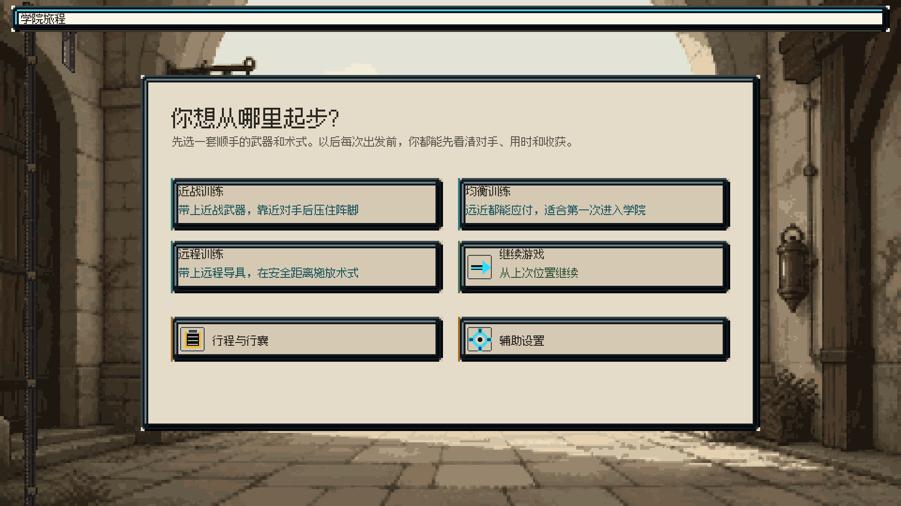
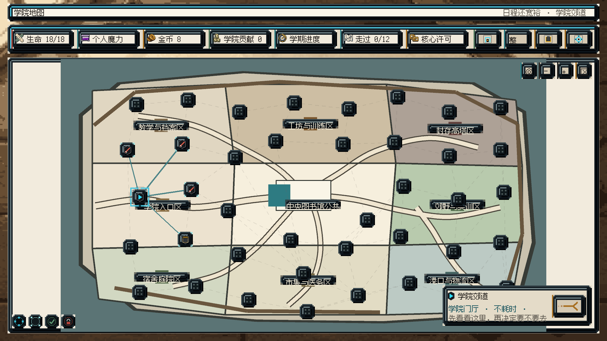
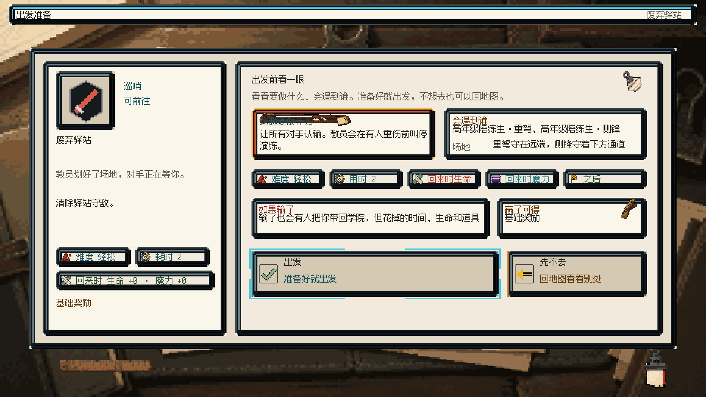
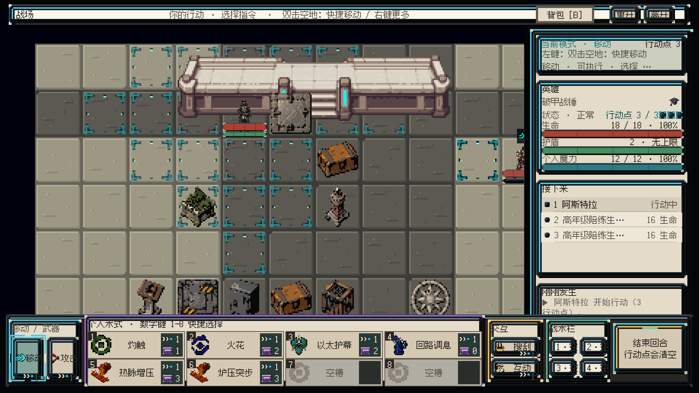

# OCC 游戏策划案

| 项目 | 内容 |
|-|-|
| 类型 | 单主角确定性回合制战棋、Roguelite、角色扮演 |
| 平台 | PC |
| 画面 | 正交 2D 像素 |
| 当前内容 | 学院第一阶段 |
| 文档地位 | 项目第一参考、第一准则、唯一活动策划源 |
| 更新时间 | 2026-09-03 |

## 0. 文档效力

本策划案是 OCC 项目的第一参考、第一准则和唯一活动策划源。

- 玩法、规则、界面、数据表、代码实现和专项文档均以本案为准。
- 发现任何冲突，必须明确指出冲突内容和涉及位置，不得自行取舍或静默覆盖。
- 冲突确认后，先修改本案，再同步数据表、代码实现和飞书文档。
- 归档资料只用于追溯，不构成当前规则。

## 1. 游戏流程

本版本从选择训练路线开始，到击败学院首领并完成阶段结算结束。

> 选择训练路线 → 进入学院地图 → 选择节点 → 战斗或处理事件 → 领取奖励 → 整理装备 → 继续前进 → 挑战首领 → 结算

单轮时长 60–120 分钟。

进入节点前显示危险度、耗时、敌人、任务目标和奖励类型。完成节点后保留生命、魔力、道具消耗和获得的物品。

### 1.1 游戏模式

肉鸽模式：地图、敌群和奖励由种子生成。同一种子生成相同内容。生命归零后结束本轮。

剧情模式：使用固定主角与章节。允许回访、补支线、调整装备和重复挑战。不设倒计时、拖延惩罚和永久错过。剧情存档与肉鸽存档分开保存。

## 2. 资源

| 资源 | 规则 |
|-|-|
| 生命 | 战斗间保留；归零后本轮结束 |
| 个人魔力 | 施放术式时消耗；每次进入战斗恢复满 |
| 行动点（行动资源） | 单位在自身回合内使用的行动资源；回合开始时重置为 3 点；移动、攻击、术式、换弹、道具和互动按配置消耗；回合结束时清空未使用点数 |
| 金币 | 商店购买、医务室治疗和餐食消费 |
| 学院贡献 | 解锁学院成长与许可 |
| 节点耗时 | 计算路线成本 |
| 道具次数 | 使用后扣除；战斗结束不自动补充 |
| 背包 | 暂定6×10 格，正式版本根据装备的背包类型决定；物品按实际尺寸占格 |

## 3. 底层逻辑

### 3.1 运行原则

- 游戏结果只由当前状态、配置数据和玩家或 AI 提交的命令决定。
- 相同状态执行相同命令，必须得到相同结果。
- 肉鸽内容在创建单轮时由种子生成并写入存档。读取存档不重新生成地图、敌群、事件和奖励。
- 战斗不使用命中、闪避和暴击随机。可能会存在攻击单个或多个随机目标导致的随机，但是必须保证每次sl结果相同
- 界面只读取状态、提交命令和显示结果，不直接修改游戏数值。

### 3.2 状态层级

| 层级 | 保存内容 | 规则 |
|-|-|-|
| 单轮状态 | 模式、种子、训练路线、当前位置、已访问节点、已完成节点、资源、生命、魔力、装备、术式、背包、待领奖励 | 贯穿本轮，节点之间持续保存 |
| 节点状态 | 节点类型、进入条件、敌群或事件、玩家选择、完成结果、奖励状态 | 每个节点只完成一次；回访不重复结算 |
| 战斗状态 | 地图、单位、位置、朝向、[行动点](#2-资源)、行动时间、状态、冷却、任务目标、战斗日志 | 进入战斗时创建，战斗结束后按继承规则写回单轮状态 |
| 界面状态 | 当前页面、选中目标、预览、提示、弹窗 | 由前三层生成，不作为玩法结果来源 |

### 3.3 统一命令链

> 读取状态 → 生成预览 → 检查合法性 → 确认命令 → 扣除成本 → 执行动作 → 结算效果 → 检查胜负 → 更新界面与存档

- 合法性检查失败时，命令不执行，不扣除任何资源。
- 确认前如果状态发生变化，旧预览失效，必须重新预览。
- 单个命令先完成全部检查，再一次性写入结果，不允许只执行一部分。
- 多次命中属于同一命令，但每次命中分别结算。
- 命令完成后统一刷新数值、状态、行动条、任务目标和战斗日志。

### 3.4 行动合法性

| 检查 | 通过条件 |
|-|-|
| 行动单位 | 单位存活，轮到该单位行动，战斗尚未结束 |
| 资源 | [行动点](#2-资源)、魔力、冷却和使用次数满足配置 |
| 空间 | 目标格在地图内，可到达，未被阻挡或占用 |
| 目标 | 阵营、目标类型、射程和视线满足配置 |
| 状态 | 束缚、破势等状态没有禁止该动作 |
| 内容 | 对应装备、术式、道具或交互物存在且可用 |

任何一项不通过，界面保留原按钮并直接显示原因。

### 3.5 格子与空间

- 战场使用整数格坐标。一个格子最多容纳一个单位。
- 主动移动只走上下左右相邻格。移动距离按可通行路径的格数计算。
- 阻挡格和被单位占用的格不能穿过，也不能作为移动终点。
- 移动力是一次移动行动最多可走的格数。基础值为 5 格；迟缓时为 3 格；实际范围受可通行路径、地形、单位占位和阻挡影响。
- 一次移动行动只消耗 1 点[行动点](#2-资源)，可移动格数受[移动力](#35-格子与空间)限制。
- 攻击和术式射程按横纵格距离计算；需要视线的动作另行检查阻挡。
- 移动确认时同时确定最终朝向。移动后的免费转向不产生独立命令。

### 3.6 行动条与回合推进

- 行动时间最早的存活单位先行动。时间相同时，按战斗开始时确定的固定顺序行动。
- 回合开始依次处理旧护盾清除、新护盾与装备效果、回合开始状态、冷却、死亡与胜负检查，再重置[行动点](#2-资源)。
- 单位可以连续执行合法动作，直到主动结束回合或无法继续行动。
- 结束回合时清空剩余[行动点](#2-资源)，再计算基础行动间隔和本回合追加的行动延时。
- 死亡单位不再进入行动条。任务目标达成后立即结束战斗，不等待本轮其他单位行动。

### 3.7 效果结算

- 一个命令内的效果按配置顺序结算，不临时改序。
- 同一次命中的伤害分量先合并为一个伤害包。
- 伤害依次经过百分比减伤、护盾和生命。百分比减伤同类取最高、异类相乘，总上限 50%，结果向上取整。
- 多次命中逐包结算。每包结算后立即更新护盾、生命和死亡状态。
- 伤害完成后再结算附带状态、位移和场地效果。
- 每个命令结束时检查任务目标、胜负和后续触发。

### 3.8 节点结算与存档

- 选择节点只更新当前位置。节点耗时、自然恢复、奖励和进度在节点结果确认后统一结算。
- 学院时序是肉鸽模式记录节点推进程度的进度值。普通战斗消耗 2，精英战斗和首领战消耗 3，事件消耗 1，其他节点不消耗。
- 每 1 点[学院时序](#38-节点结算与存档)恢复 4 点生命，均不超过上限。
- [学院时序](#38-节点结算与存档)达到 28 时，完整结算当前节点后进入首领阶段。提前挑战首领需要完成 12 个节点并取得 2 个核心许可。
- 已完成节点可以回访，但不重复消耗[学院时序](#38-节点结算与存档)，不重复获得奖励。
- 战斗结束后保存生命、魔力、道具消耗、背包、装备、术式和战利品；下一场战斗开始时魔力恢复到当前上限。[行动点](#2-资源)、行动时间、冷却、普通状态和护盾不带入下一场战斗。
- 创建单轮、选择节点、确认事件选择、战斗结算、领取奖励和修改装备或背包后自动保存。
- 存档写入前必须通过完整性检查。写入失败时保留原存档并提示玩家。

## 4. 学院地图

学院地图共 40 个节点，分为 6 个区域。

地图使用固定的学院区域结构，每个节点都有明确的区域归属。生成节点内容时，区域特色敌人和区域特色事件的出现概率高于通用内容，但不完全排除其他内容。抽取结果由单轮种子决定并写入存档。

区域只规定内容权重，不把敌人和事件锁死在单一区域。后续世界冒险继续使用同一规则：不同地区配置自己的敌人、事件和奖励权重，地图生成器按所在地区抽取内容。

- 只能前往与当前位置相连的节点。
- 地图显示区域、连线、当前位置、已完成节点和可达节点。
- 单击节点后打开摘要，不立即进入。
- 摘要显示名称、类型、危险度、耗时、奖励和进入按钮。
- 完成节点后更新当前位置和可达节点。
- 顶部显示生命、魔力、金币、学院贡献、阶段进度、已走节点和核心许可。

### 4.1 节点类型

| 类型 | 内容 | 完成后 |
|-|-|-|
| 普通战斗 | 标准敌群与任务目标 | 发放基础奖励 |
| 精英战斗 | 强敌与复合场地规则 | 发放精英奖励 |
| Boss | 固定首领与阶段规则 | 进入阶段结算 |
| 工坊 | 装备锻造、术式专精 | 消耗材料并保存结果 |
| 医务室 | 按最大生命比例恢复生命；购买随机餐食 | 扣除费用并恢复或获得餐食增益 |
| 商店 | 购买装备、法宝和材料 | 扣除费用并获得内容 |
| 事件 | 选择公开选项 | 修改资源、物品或路线 |

不存在“服务”和“宝藏”节点。原服务按功能拆入工坊、医务室或商店；原宝藏内容拆入事件或商店。

### 4.2 下一套 Build 节点数量

| 内容 | 数量 |
|-|-|
| 普通战斗 | 2 |
| 精英战斗 | 1 |
| Boss | 1 |
| 工坊 | 1 |
| 医务室 | 1 |
| 商店 | 1 |
| 事件 | 1 |

开始节点不计入内容节点。下一套 Build 固定地图共有 9 个节点，一轮经过全部 9 个节点。

### 4.3 战前餐食

医务室同时提供恢复和战前餐食。每次进入医务室节点时，从餐食池中无重复抽取 3 种。玩家支付金币、材料或学院贡献，选择一种持续 3 场战斗的临时增益。

| 餐食 | 费用 | 持续效果 |
|-|-|-|
| 强攻炖肉 | 3 金币 | 武器直接伤害 +2 |
| 导能热饮 | 1 学院贡献 | 个人魔力上限 +2；进入战斗时恢复满 |
| 岩盐浓汤 | 1 份学院食材 | 每场战斗开始获得 6 护盾 |
| 疾行烤串 | 3 金币 | 每个自己回合第一次移动的移动力 +1 |
| 节流茶 | 1 学院贡献 | 每场战斗第一次施放术式时魔力成本 -1，最低 0 |
| 坚韧面包 | 1 份学院食材 | 最大生命 +4；每场战斗开始恢复 4 生命 |
| 猎团香汤 | 4 金币 | 每场战斗第一次武器命中额外造成 4 伤害 |
| 清醒粥 | 1 份学院食材 | 每场战斗第一次受到负面状态时，持续时间 -1 回合，最低 1 回合 |

- 同时只能存在一种餐食增益。
- 有餐食增益时不能购买新餐食。
- 一次进入只显示 3 种餐食，且不会出现重复项。
- 餐食选项由单轮种子和医务室节点决定，生成后写入节点状态。
- 关闭再打开同一节点不重抽；读取存档不重抽。
- 恢复和购买餐食互不排斥，每个医务室节点各可执行一次。
- 每完成一场战斗，剩余场数减 1。未进入战斗不减少。
- 剩余场数为 0 时移除增益。
- 餐食不是装备、术式或法宝，不占槽位。

## 5. 战斗

### 5.1 战场

- 地图尺寸为 12×9 格。
- 玩家只控制主角。
- 临时友军由 AI 控制，行动结果可预览。
- 单位占 1 格，并显示朝向。
- 初始位置由任务配置。
- 开战后显示全部敌人、任务目标、地形和交互物。

### 5.2 回合

- 主角和每个敌人分别进入行动条。
- 单位行动时获得 3 点[行动点](#2-资源)。
- 移动一次消耗 1 点[行动点](#2-资源)。
- 攻击、术式、换弹、道具和互动按各自配置消耗[行动点](#2-资源)。
- [行动点](#2-资源)、魔力、冷却和使用次数足够时，可以重复使用同类动作。
- 移动后可以免费转向。原地转向消耗[行动点](#2-资源)。
- 结束回合后清空剩余[行动点](#2-资源)。

### 5.3 行动延时

- 普通动作不改变下次行动时间。
- 强术式、重武器和蓄力动作增加行动延时。延时刻度根据配置执行
- 确认动作前显示更新后的行动顺序。

### 5.4 命中与伤害

- 攻击默认命中。
- 不使用命中率、闪避率和暴击率。
- 同一次命中的伤害合并成一个伤害包。
- 多次命中分别结算。
- 百分比减伤先于护盾结算。同类取最高，异类相乘，总上限 50%，结果向上取整。
- 伤害默认先扣护盾，再扣生命。
- 确认攻击前显示目标、伤害、状态、消耗和行动顺序变化。

### 5.5 护盾与掩体

- 普通护盾只在当前战斗有效。
- 自身回合开始时清除旧护盾，再结算新护盾。
- 不同来源的护盾可以叠加。
- 同一来源每回合只触发一次。
- 轻掩体可进入，不阻挡视线，每回合结束时提供 2 点护盾。
- 重掩体不可进入，阻挡移动和视线。位于正面相邻格时，每回合结束时提供 4 点护盾。
- 同一回合内，换位、折返和转向不会重复触发掩体护盾。
- 破势会清空护盾，并阻止目标获得新护盾，持续到目标下一回合结束。

### 5.6 状态

| 状态 | 效果 |
|-|-|
| 燃烧 | 持续受到伤害 |
| 迟缓 | [移动力](#35-格子与空间)降为 3 |
| 束缚 | 不能主动移动 |
| 破势 | 清空并暂时禁止护盾 |
| 眩目 删除 | 限制视线和远程精确动作   |
| 显形 删除 | 显示隐藏单位、机关或目标 |

可用环境包括火场、烟尘、水面、冰面、强光、暗区、导电路径和任务地形。界面显示持续时间、伤害、阻挡和覆盖关系。

### 5.7 战斗结束

- 达成任务目标后结算，不要求默认清场。
- 肉鸽模式中，主角生命归零后结束本轮。
- 剧情模式按任务配置进入重伤、撤离或重试。
- 战后保存生命、魔力、道具消耗和奖励；下一场战斗开始时魔力恢复到当前上限。

## 6. 装备与术式

### 6.1 装备

角色有 9 个装备位：头 1、胸 1、鞋 1、背包 1、戒指 2、项链 1、武器 1、施法单元 1。

- 武器位只能装备一件武器。
- 背包位决定背包容量和背包被动。
- 施法单元负责魔力上限、术式成本和术式触发效果。
- 没有副手、手部、腿部、魔导核心和独立导具位；现有条目后续按新栏位重归类。

装备没有耐久度。装备配置包括动作、射程、伤害、消耗、状态、词条和使用条件。

#### 6.1.1 确定性锻造

装备有主体位和回路位。玩家只能在工坊选择装备、部件位和背包内的材料，确认前显示唯一结果。锻造不随机，不重掷。

| 装备栏位 | 主体位：承力合金 | 回路位：导能晶片 |
|-|-|-|
| 武器 | 基础武器伤害 +2 | 每个自己回合第一次武器命中后获得 2 护盾 |
| 头、胸、鞋 | 自己回合开始获得 2 护盾 | 每场战斗第一次受到负面状态时，持续时间 -1 回合，最低 1 回合 |
| 背包 | 容量增加 1 行 | 每场战斗第一次打开背包不消耗行动点 |
| 施法单元 | 个人魔力上限 +1 | 每场战斗第一次施放术式时魔力成本 -1，最低 0 |

- 下一套 Build 每件装备最多完成一次锻造，只能占用一个部件位，安装后不能更换。
- 戒指和项链保留装备位，下一套 Build 不投放对应装备，也不开放锻造。
- 材料占用背包格，锻造后消耗。

### 6.2 术式

- 学院阶段有 8 个术式槽。
- 装备后的术式可直接使用，不抽牌，不随机禁用。
- 术式只能在战斗外更换。
- 进入战斗后锁定当前配置。
- 术式显示[行动点](#2-资源)、魔力、冷却、延时、射程、目标和效果。
- 当前火系术式共 60 个：近战 20、通用 20、远程 20。

#### 6.2.1 术式专精

玩家只能在工坊选择术式和背包内的专精材料，确认前显示唯一结果。专精不随机，不重掷。下一套 Build 每个术式只能选择一种专精，安装后不能更换。

| 术式 | 增幅刻墨 | 节流刻墨 |
|-|-|-|
| 灼触 | 伤害 8→10 | 魔力 1→0 |
| 火花 | 伤害 6→8 | 魔力 2→1 |
| 以太护幕 | 护盾 6→8 | 魔力 2→1 |
| 回路调息 | 恢复魔力 2→3 | 冷却 1→0 |
| 热脉增压 | 追加火伤 8→10 | 魔力 3→2 |
| 熔势贯击 | 下次近战命中额外造成 2 火伤 | 魔力 3→2 |
| 武器热载 | 追加火伤 8→10 | 魔力 2→1 |
| 火弹 | 伤害 12→14 | 魔力 2→1 |

### 6.3 道具与背包

- 战术栏有 4 格。
- 卷轴通常使用 1 次后销毁。
- 法宝配置独立使用次数和启动方式。
- 背包为 6×10 格。
- 空间不足时进入整理界面。整理完成后才能离开节点。
- 允许消耗一点行动点进入整理界面
- 在整理界面允许更换装备，更换战术栏
- 背包只负责存放装备和材料。装备锻造和术式专精只能在工坊完成。
- 法宝获得时即为完整形态，不存在等级、强化位或强化材料。
- 法宝合成不进入下一套 Build，正式版暂不立项。

### 6.4 当前内容

| 内容 | 数量 |
|-|-|
| 基础术式 | 4 |
| 火系术式 | 60 |
| 学院装备 | 32 |
| 装备词条 | 14 |
| 通用法宝 | 20 |
| 学院敌人 | 10 |

## 7. 界面

### 7.1 页面顺序

> 启动 → 学院入口 → 学院地图 → 节点摘要 → 出发准备 → 战斗或功能节点 → 奖励与背包 → 学院地图 → Boss → 结算

覆盖存档、丢弃物品、重开战斗和离开战斗时弹出确认框。

### 7.2 学院入口

- 近战训练、均衡训练、远程训练：开始新游戏。
- 继续游戏：读取现有存档；没有有效存档时禁用。
- 行程与行囊：打开档案和背包。
- 辅助设置：打开操作与可访问性设置。
- 开始新游戏前确认是否覆盖存档。

### 7.3 学院地图

- 顶部：当前资源和阶段进度。
- 中部：区域色块、节点和连线。
- 右下：所选节点摘要和进入按钮。
- 右上：地图复位、缩放和关闭。
- 左上：常驻地图说明，显示区域色块与区域名称的对应关系。
- 每个区域使用固定色块。底图和区域边界均由色块表达，玩家通过节点所在色块判断区域归属。
- 色块内可以补充区域名称或区域标识，但只作辅助，不要求制作独立地貌、建筑或区域背景资产。
- 区域色块只表示区域归属。节点类型、当前节点、可达、不可达和已完成状态继续使用节点自身的图标与状态表现。
- 当前节点、可达节点、不可达节点使用不同状态。

### 7.4 出发准备

- 左侧：节点名称、类型、耗时。
- 右侧：任务目标、敌人、场地。
- 出发：进入战斗。
- 先不去：返回地图，不消耗资源。

### 7.5 战斗界面

- 左侧：战场。
- 右侧：当前模式、单位状态、行动条、战斗日志。
- 底部左侧：移动和武器动作。
- 底部中部：1–8 号术式。
- 底部右侧：互动、战术栏、结束回合。
- 顶部：背包、重开、离开。
- 指令不可用时保留按钮，并显示原因。

## 8. 操作

| 输入 | 操作 |
|-|-|
| 左键 | 选择单位、格子或指令 |
| 双击目标格 | 确认快捷移动 |
| 右键 | 打开目标的行动菜单 |
| 鼠标悬停 | 查看术式、状态、意图和地形说明 |
| 数字键 1–8 | 选择术式 |
| B | 打开或关闭背包 |
| Esc | 取消当前操作或关闭最上层界面 |

重开、结束回合和地图复位快捷键待定。

### 8.1 状态颜色

| 颜色 | 用途 |
|-|-|
| 冷青 | 选中、可达、可执行 |
| 红色 | 敌人、伤害、非法操作 |
| 绿色 | 治疗、安全、成功 |
| 黄铜 | 物资、维护、交互、战利品 |

确认动作前显示预览。执行后更新数值、状态图标、动画和战斗日志。常见错误显示在按钮或目标附近，不使用连续弹窗。

## 9. 奖励、失败与存档

### 9.1 奖励

- 完成节点后显示具体奖励。
- 奖励包括金币、贡献、装备、术式、卷轴、法宝
- 背包空间不足时先整理，再领取。
- 精英、事件和 Boss 使用独立奖励表。

### 9.2 失败

- 肉鸽战败后进入本轮结算。
- 剧情任务的失败处理写在战前简报中。
- 退出、覆盖存档、放弃奖励和丢弃高价值物品时弹出确认框。

### 9.3 阶段结算

记录起始路线、最终装备、术式、完成节点、战斗数据、资源变化、伤病（取消伤病系统）、剩余物资和人物标签。

## 10. 下一套 Build

### 10.1 目标

做出一轮 30–40 分钟、可以从新游戏完整打到结算的核心闭环。

- 只开放均衡训练。
- 使用固定地图和固定奖励，不做随机地图。
- 固定 9 个节点，一轮经过全部 9 个节点。
- 完成 4 场战斗：2 场普通、1 场精英、1 场首领。
- 完整覆盖地图、战前、战斗、功能节点、奖励、背包、存档和结算。

### 10.2 固定流程

> 学院入口 → 选择均衡训练 → 开始节点 → 中庭侧锋对练 → 事件 → 医务室 → 学院补给商店 → 护障课程示范 → 校准工坊 → 刻阵工坊高阶考核 → 学院封存塔核心 → 阶段结算

地图连接：

> START → N01 → EV02 → S01 → SHOP01 → N03 → W01 → E01 → B01

- 全部节点按固定顺序连接。
- B01 到达后直接开放，不检查 12 节点、2 个核心许可或 28 时序。
- 两条分支都要能独立通关。

### 10.3 开局内容

| 项目 | 内容 |
|-|-|
| 生命 | 18/18 |
| 个人魔力 | 12/12；每场战斗开始恢复满 |
| 金币 | 8 |
| 学院贡献 | 0 |
| 装备 | 已装备学院练习剑、夹棉练习衣、勘验背架；背包内有猎团短弓 |
| 术式 | 灼触、火花、以太护幕、回路调息 |
| 战术栏 | 4 格，开局为空 |
| 背包 | 固定 6×10 格 |

### 10.4 战斗内容

| 节点 | 敌人 | 目标 | 固定基础奖励 |
|-|-|-|-|
| N01 中庭侧锋对练 | 侧锋、盾术 | 击败全部敌人 | 2 金币、1 贡献、学院食材 1、锻造材料二选一、三选一奖励 |
| N03 护障课程示范 | 护障助教、盾术 | 击败全部敌人 | 3 金币、1 贡献、专精材料二选一、三选一奖励 |
| E01 刻阵工坊高阶考核 | 刻阵教官、护障助教、承压检验偶 | 击败刻阵教官 | 4 金币、2 贡献、三选一奖励 |
| B01 学院封存塔核心 | 核心守卫、护障助教、档案巡查员 | 击败核心守卫 | 进入阶段结算 |

- 四张战场均为 12×9 格。
- B01 不增援，不转阶段。核心守卫初始 36 生命、6 护盾；其他敌人的行动规则沿用敌人数据表。
- 战斗只使用燃烧、迟缓、束缚、破势。眩目和显形不进入本 Build。

### 10.5 功能节点与奖励

| 节点 | 可选内容 |
|-|-|
| EV02 | 支付 1 贡献获得 3 金币；或免费获得 1 贡献 |
| S01 | 恢复页签：支付 1 贡献恢复最大生命的 50%；餐食页签：从 8 种餐食中随机显示 3 种，可购买 1 种 |
| SHOP01 | 移相线轴 6 金币、解构楔 3 金币、测距护目镜 4 金币；各限购 1 件 |
| W01 | 免费完成一次装备锻造和一次术式专精；只消耗对应材料 |

N01 固定掉落 1 份学院食材，并在承力合金、导能晶片中二选一。N03 固定掉落增幅刻墨、节流刻墨二选一。材料立即进入背包。

战斗三选一奖励固定如下：

| 节点 | 选项 A | 选项 B | 选项 C |
|-|-|-|-|
| N01 | 热脉增压 | 火弹 | 石路行靴 |
| N03 | 熔势贯击 | 折盾匣 | 轻装传令衣 |
| E01 | 武器热载 | 缚位框 | 学院储能芯 |

本 Build 的可用内容总量：

| 内容 | 数量 | 条目 |
|-|-|-|
| 基础术式 | 4 | 灼触、火花、以太护幕、回路调息 |
| 火系个人术式 | 4 | 热脉增压、熔势贯击、武器热载、火弹 |
| 装备 | 8 | 学院练习剑、夹棉练习衣、勘验背架、猎团短弓、轻装传令衣、测距护目镜、石路行靴、学院储能芯 |
| 法宝 | 4 | 折盾匣、移相线轴、缚位框、解构楔 |
| 锻造材料 | 2 | 承力合金、导能晶片 |
| 专精材料 | 2 | 增幅刻墨、节流刻墨 |
| 餐食材料 | 1 | 学院食材 |
| 餐食增益 | 8 | 强攻炖肉、导能热饮、岩盐浓汤、疾行烤串、节流茶、坚韧面包、猎团香汤、清醒粥 |
| 敌人 | 6 | 侧锋、盾术、护障助教、承压检验偶、刻阵教官、档案巡查员 |
| 首领 | 1 | 学院封存塔核心守卫 |

### 10.6 玩家操作链

1. 在学院入口选择均衡训练，确认覆盖旧存档。
2. 在地图查看可达节点，单击节点打开摘要，再确认进入。
3. 在战前查看目标、敌人、场地和奖励，选择出发或返回地图。
4. 战斗中选择移动、武器、术式、法宝、互动或结束回合。
5. 提交动作前查看射程、路径、目标、消耗、伤害、状态和行动顺序变化。
6. 动作不合法时查看原因，取消或改选，不扣资源。
7. 需要整理时消耗 1 行动点打开背包，更换装备或战术栏后返回战斗。
8. 战后查看三项奖励和材料，完成选择；空间不足时先整理背包。
9. 在 EV02 读取两个公开选项并确认一个。
10. 在 S01 的恢复页签支付贡献恢复最大生命的 50%。
11. 切换到餐食页签，在随机出现的 3 种餐食中选择 1 种并支付费用。
12. 在 SHOP01 查看商品，支付对应费用后确认购买。
13. 查看餐食效果和剩余战斗场数；三场战斗结束后自动移除。
14. 在 W01 打开工坊的装备锻造页签，选择装备、部件位和背包内材料，查看固定结果后完成一次锻造。
15. 切换到术式专精页签，选择术式和背包内材料，查看固定结果后完成一次专精。
16. 击败 Boss 后查看本轮路线、最终装备、术式、资源和战斗数据。
17. 从地图退出后，使用继续游戏回到最近一次自动保存的位置。

### 10.7 必须具备的界面

- 学院入口。
- 学院地图与节点摘要。
- 出发准备。
- 战斗 HUD、目标预览、非法原因、行动条和战斗日志。
- 事件选择、医务室恢复与餐食、商店。
- 奖励三选一。
- 背包、9 个装备位、术式槽、战术栏、装备锻造和术式专精。
- 阶段结算。
- 覆盖存档、退出、放弃奖励和丢弃高价值物品的确认框。

### 10.8 验收

- 新游戏可以连续完成至阶段结算，不需要开发指令或跳关。
- EV02、S01 和 SHOP01 均能在同一轮中完成。
- 所有动作先预览再确认；非法动作不执行、不扣费并显示原因。
- 战斗结束保留生命与物品消耗；下一场战斗开始时魔力恢复满。
- 奖励、背包、装备、术式和战术栏修改后立即保存。
- 锻造和专精结果完全由材料与部件位决定；读档不改变结果。
- 锻造与专精完成后材料扣除、效果生效并立即保存。
- 医务室的恢复和餐食两个页签可以分别使用一次，互不占用。
- 进入医务室时从 8 种餐食中无重复抽取 3 种；同一节点重新打开和读档不重抽。
- 餐食使用金币、学院贡献或学院食材购买，效果持续接下来 3 场战斗。
- 餐食剩余场数正确保存；读档不刷新持续时间，不重复发放效果。
- 退出到学院入口后，继续游戏回到最近保存位置，节点、奖励和资源不重抽。
- 相同存档执行相同命令，结果一致。
- 1920×1080 下全部必需界面可用；960×540 只保证完整显示，不做第二套布局。

### 10.9 不进入本 Build

- 近战训练、远程训练。
- 40 节点、6 区域随机地图和随机奖励池。
- 其余火系术式、装备、法宝、敌人、事件、工坊、医务室和商店内容。
- 装备重铸、商店完整库存和局外成长。
- 法宝强化与法宝合成。
- 剧情模式、人物档案、伤病、其他元素、下一人生阶段、世界大战。
- 大型多层地图、通用高低差、多人队伍控制。

## 11. 数据表

数值与内容条目保存在 `Worldbuilding/数据表/`：

- `OCC_核心规则数值表_v1.0.csv`
- `OCC_基础术式数据表_v1.0.csv`
- `OCC_火系个人术式数据表_v1.0.csv`
- `OCC_学院装备数据表_v1.0.csv`
- `OCC_通用法宝数据表_v1.0.csv`
- `OCC_学院敌人数据表_v1.0.csv`
- `OCC_学院遭遇编成数据表_v1.0.csv`
- `OCC_学院节点内容数据表_v1.0.csv`
- `OCC_经济与服务数据表_v1.0.csv`
- `OCC_美术与界面规格表_v1.0.csv`
- `OCC_下一套Build内容表_v1.0.csv`
- `OCC_锻造与专精数据表_v1.0.csv`
- `OCC_餐食增益数据表_v1.0.csv`
